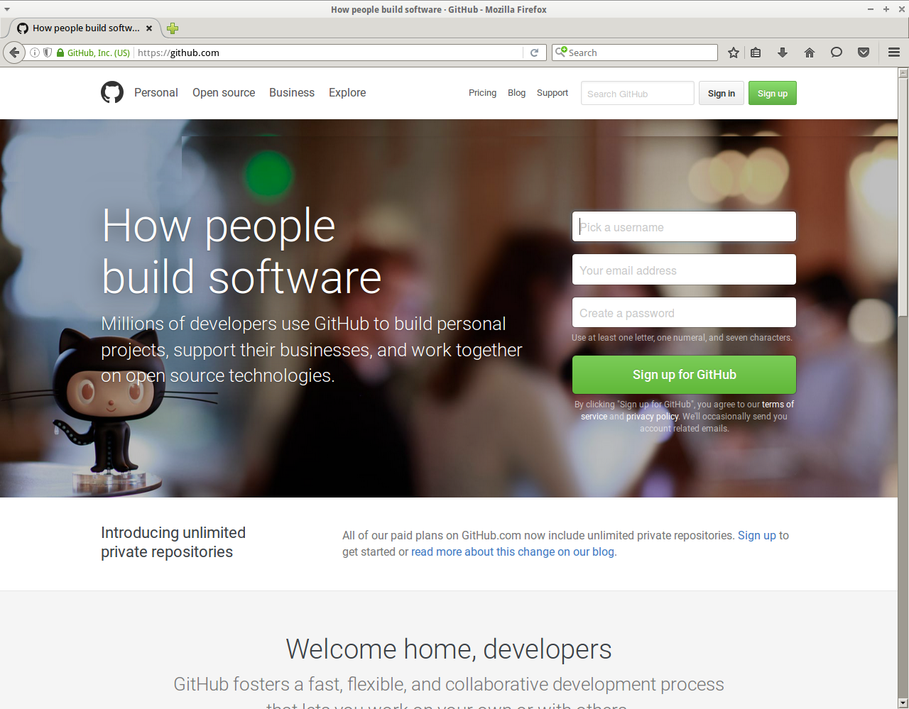

**Als je nog geen GitHub account hebt, doe dan eerst [deze les](GitHub.md)**

#GitHub Pages

GitHub Pages is een service van GitHub waarmee elke gebruiker zijn eigen website kan maken.

Het verschil met een repository is dat die op `www.github.com/gebruiker` staat, terwijl een GitHub Page op `www.gebruiker.github.io` staat.

Een repository gebruik je om:
* Je code te bewaren
* Je code te delen met de wereld
* Samen aan code te werken

Een GitHub Page gebruik je om:
* Mensen jouw spellen te laten spelen
* De wereld te laten zien wat je kan

##GitHub Page aanmaken

* Open een webbrowser
* Ga naar `www.github.com`

Je komt nu op de GitHub homepage:

* Klik op `Sign in` (NL: `Aanmelden`)

* Log in met je GitHub account (Heb je die niet? Doe dan eerst [deze les](GitHub.md)!)

###GitHub Page repository maken

* Klik op het plusje bovenin
* Klik op `New repository`
 

Vul hier in:

 * `Repository name`: de naam van je GitHub Page moet zijn `gebruiker.github.io`, dus bijvoorbeeld `thijsvb.github.io`
 * `Description`: omschrijving van je GitHub Page, bijvoorbeeld `Mijn geweldige website!`
 * Kies `Public`
 * Vink aan: `Initialize this repository with a README`
 * Kies bij `Add a license`: `GNU General Public License v3.0`

Je hebt nu een GitHub Page!

