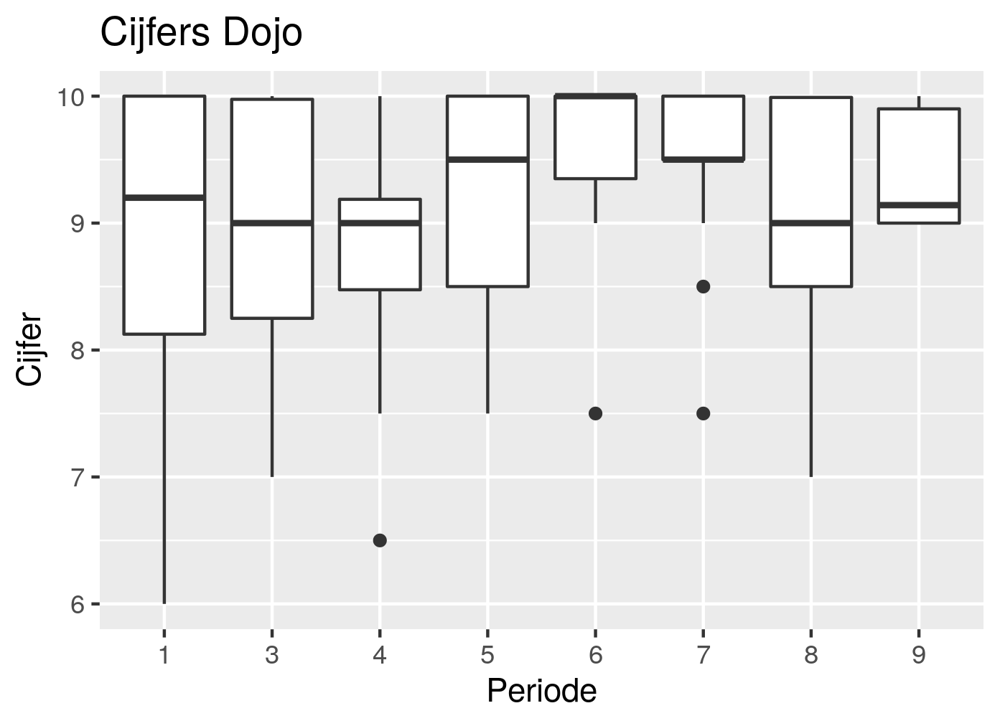
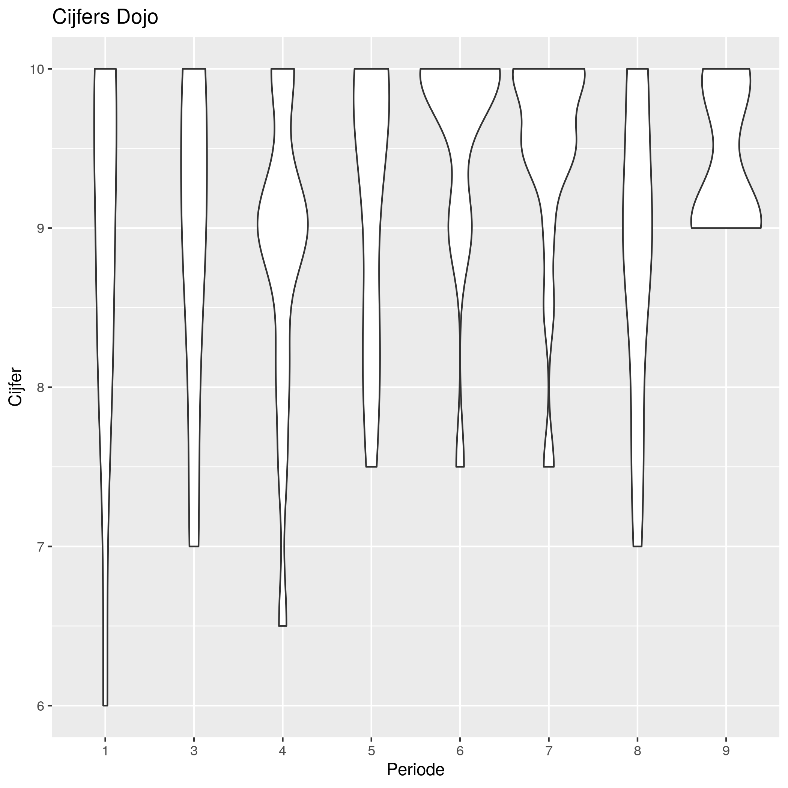

# Evaluatie

Omdat we de meningen van de leerlingen belangrijk vinden, evalueren we twee keer per jaar.

Hierbij vragen we een onbekende om met de leerlingen de cursus anoniem te beoordelen.

#|Datum|Links
---|---|---
6|2018-07-12|[Resultaten](20180712EvaluatieResultaten.md)
5|2017-12-14|[Resultaten](20171214EvaluatieResultaten)
4|2017-07-14|[Resultaten](20170714EvaluatieResultaten.md)
3|2016-12-15|[Resultaten](Evaluatie20161215Vragen.md)
2|2016-06-30|[Resultaten](20160630Resultaten.md)
1|2015-12-10|[Resultaten](20151210Resultaten.md)

In periode 2 hebben de leerlingen geen cijfers gegeven.