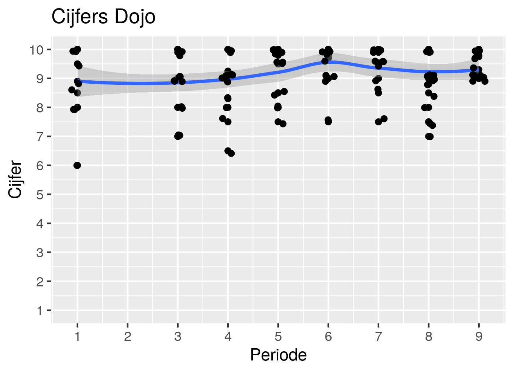

# Evaluatie

Omdat we de meningen van de leerlingen belangrijk vinden, evalueren we twee keer per jaar.

Hierbij vragen we een onbekende om met de leerlingen de cursus anoniem te beoordelen.

#  |Datum   |Links
---|--------|--------------------------------------------
9	 |20191212|[Resultaten](20180712/Resultaten.md)
8	 |20190704|[Resultaten](20190704/README.md)
7	 |20181213|[Resultaten](20181213/20181213EvaluatieResultatenNanos.md) en [Resultaten](20181213/20181213EvaluatieResultatenUnos.md)
6  |20180712|[Resultaten](20180712/20180712EvaluatieResultaten.md)
5  |20171214|[Resultaten](20171214/20171214EvaluatieResultaten.md)
4  |20170714|[Resultaten](20170714/20170714EvaluatieResultaten.md)
3  |20161215|[Resultaten](20161215/20161215EvaluatieVragen.md)
2  |20160630|[Resultaten](20160630/20160630Resultaten.md)
1  |20151210|[Resultaten](20151210/20151210Resultaten.md)

In periode 2 hebben de leerlingen geen cijfers gegeven.

## Team lente 2019

 * Thijs
