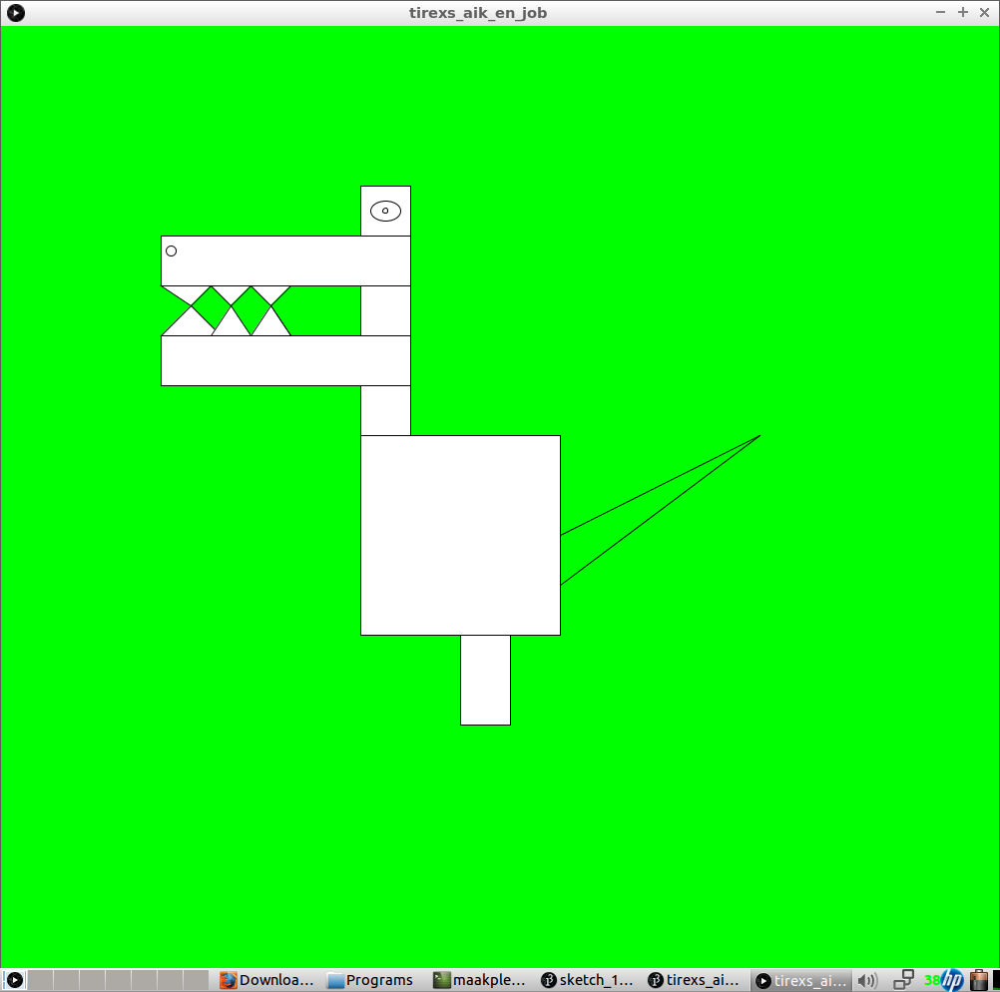
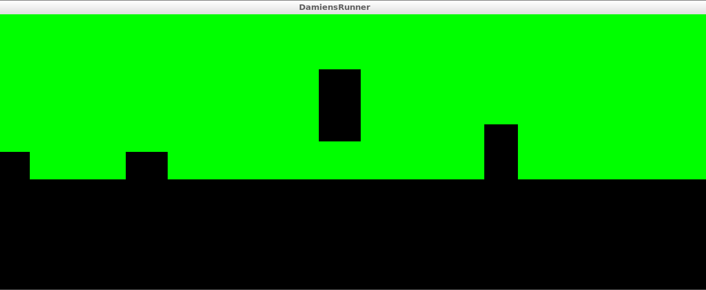
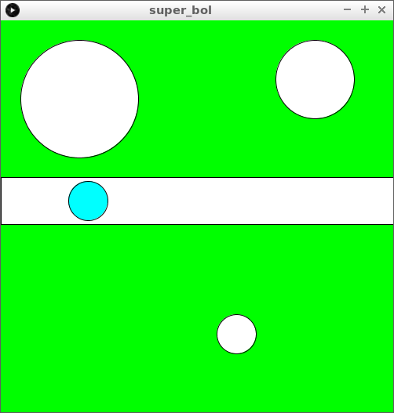
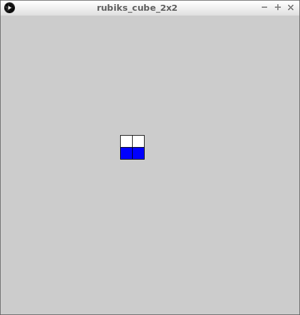
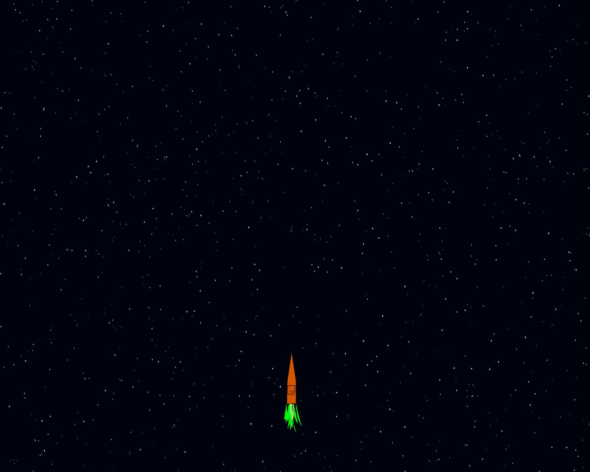

# Leerlingen

##Scorebord
|**Plek**|**Naam**|**Punten**|**Quote**|**Link**|
|:---:|:---|:---:|---:|---:|
|**1**|Jorn|13|*"Winner from last week: 12 year old Jorn!"* ~ seoceojoe|[PWC12](https://redd.it/4meopg), [PWC13](https://redd.it/4nf6q9), [PWC14](https://redd.it/4okwlo)|
|**2**|Dante|8|*"Hey, loving the submissions from your Dojo!"* ~ Introscopia |[PWC13](https://redd.it/4ncey5), [PWC14](https://redd.it/4of3o5)|
|**3**|Jonah|7|*"great effort for a 9 year old! it would be a simple matter to reset the level and position variables when checking for game over state to actually end the game when the player steps out of bounds, making you have to start over! just a suggestion."* ~ Introscopia |[PWC12](https://redd.it/4m8lss), [PWC13](https://redd.it/4nc7q1)|
|**4**|Ruben|5|*"Simple but neat, I like the minimalist look of it."* ~ NakedFluffyBee|[PWC11](https://redd.it/4l6thy)|

## Aik & Job

## Bo & Kevin

## Damian

## Dante

[niks]

## Emre

## Jeroen

[niks]

## Job

## Jonah

)

## Rogier

## Ruben

## Tom

