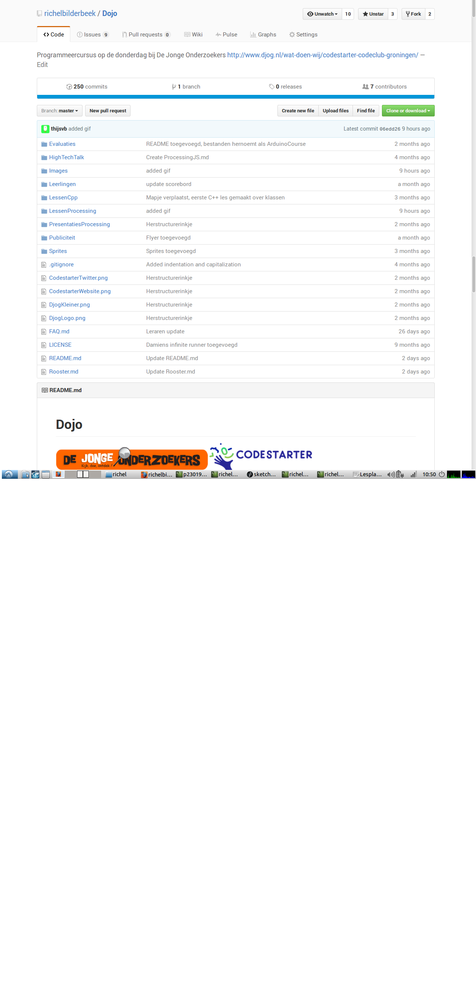

# Lesplan 'Een Mooi Programma'

 * Datum: 8 september
 * Door: Richel

Lesdoelen:
 * Waar staat de GitHub van de cursus?
 * Hoe werkt de cursus?
 * Hoe start ik Processing op een laptop van de cursus?
 * Hoe copy-paste ik?
 * Hoe start ik een programma in Processing?
 * Wat is een programma?

# Waar staat de GitHub van de cursus?

 * Wat: GitHub kunnen vinden
 * Waarom: die zullen de leerlingen vaak nodig hebben
 * Expert: zelfstanding kunnen Googlen, bookmarken 

 * Zet de laptops aan. Google de cursus. 
 * Klaar? Lees de 'Veelgestelde vragen' alvast

# Hoe werkt de cursus?

 * Wat: de regels van de cursus kennen
 * Waarom: dan is het duidelijk hoe we met elkaar omgaan
 * Expert: naar deze regels handelen

 * [TODO: zet dit op de FAQ] Flowchart 'Waar ga ik zitten':
    * nieuwe dingen leren: grote tafel in kantine
    * samenwerken: andere tafel in kantine
    * rustig alleen werken: aquarium
 * [TODO: zet dit op de FAQ] Flowchart 'Wie stel ik een vraag?'
    * de leerling naast je
    * een leraar
 * [TODO: zet dit op de FAQ] Flowchart 'Nieuwe leerling'
    * gastheer vindt iemand die hem/haar wil opstarten. Deze twee gaan aan de grote tafel zitten

 * Beantwoord de volgende vragen:
   * Hoeveel vrijwilligers zijn er?
   * Welke programmeertalen kun je hier leren?
   * Er komt een nieuwe leerling binnenlopen. Wat doen we?
   * Twee leerlingen willen samen iets maken. Waar kunnen ze het beste gaan zitten?
   * Een leerling geeft volgende week een spreekbeurt over Processing en moet nog veel doen. Waar kan deze het best gaan zitten? 
   * Een leerling heeft een game opgezet. Richel vind dat goed. Hoe kan dat? 
   * Een leerling heeft een game opgezet. Richel vond dat eerst goed, maar na tien minuten niet meer. Hoe kan dat? 
 * Klaar? Start Processing alvast

# Hoe start ik Processing?

Dit is afhankelijk van of de leerling een eigen laptop heeft.

 * [Processing opstarten op cursus laptop](../LessenProcessing/ProcessingOpstartenOpCursusLaptop/README.md)
 * [Processing installeren op Linux](../LessenProcessing/ProcessingInstallerenOpLinux/README.md)
 * [Processing installeren op Windows](../LessenProcessing/ProcessingInstallerenOpWindows/README.md)

 * Zoek op de GitHub naar de les 'Een mooi programma' en probeer Processing te starten
 * Gelukt? Help dan de anderen. Iedereen klaar? Start dan 'Een mooi programma'

 
# Hoe start ik een programma? Hoe copy-paste ik?

