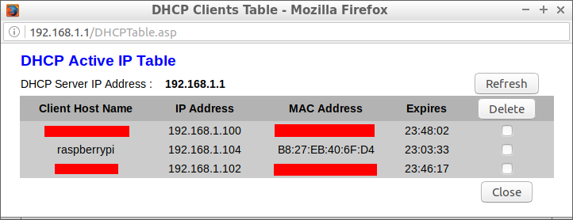
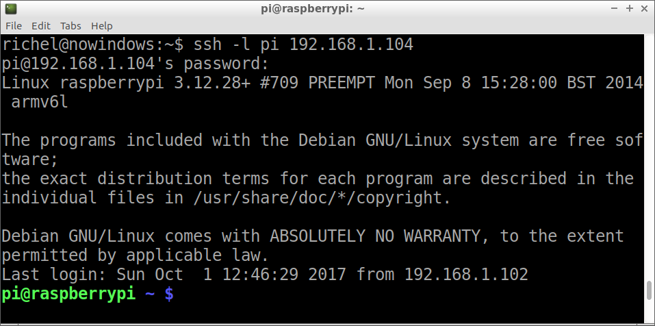

# Login Raspberry

In deze les gaan we inloggen in een Raspberry Pi (vanaf nu: 'Raspberry').

## Eindopdracht

Kom met SSH in een Raspberry Pi.

 1. Brand een SD kaart met het Raspian besturingsyssteem
 2. Sluit een Raspberry aan op netspanning en een ethernet poort van de WiFi router
 3. Ga naar het admin menu van de WiFi router en kijk in de DHCP tabel wat het IP adres
    is van de Raspberry (zie evt. ook figuur `Voorbeeld DHCP tabel`)

 | Het duurt meerdere minuten voordat een Raspberry in de DHCP tabel komt
:-------------:|:----------------------------------------: 

 4. Tunnel met SSH in de Raspberry

Als alles gelukt is, kom je in de Raspberry

