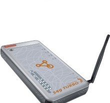
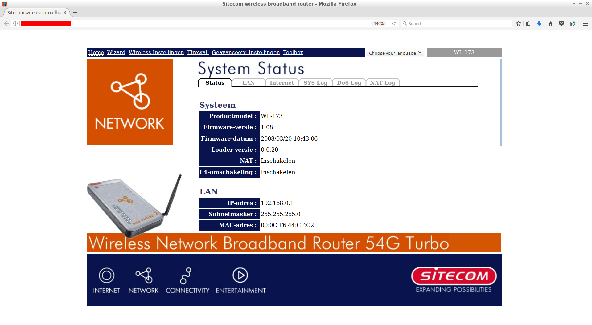

# Login router #2

In deze les gaan we inloggen in een WiFi router die we instellen op een
zwak communicatieprotocol en met een 'onbekend' wachtwoord.

Je werkt met deze WiFi router:

## Opdracht 1

Kom in het WiFi instellingen menu (zie plaatje `WiFi router instellingen menu`).

 | Dit heb je al gedaan in les `Login router #1`
:-------------:|:----------------------------------------: 

## Eindopdracht

 1. Stel het WiFi communicatieprotocol in op `WEP`.

 | WEP is een protocol dat gemakkelijk te kraken is
:-------------:|:----------------------------------------: 

 2. Laat een docent het WiFi wachtwoord veranderen in een onbekend wachtwoord.
    De docent houdt dit wachtwoord geheim
 3. Kom achter dit wachtwoord
 4. Vertel de docent wat zijn/haar wachtwoord was

