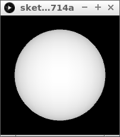

# 3D les 1

In Processing kun je best gemakkelijk 3D programmeren.
3D ziet er vaak mooi uit.
In deze les gaan we hiermee wat dingen doen.
Doe deze les pas als je 2D kunt programmeren!

## Wat is 3D?

'3D' is een afkorting van drie-dimensionaal.
Alles wat je kunt vastpakken is drie dimensionaal:
een tafel, stoel en jezelf. Drie dimensionaal betekent
dat de voorwerpen een breedte, hoogte en diepte hebben.

Tot nu toe heb je vooral 2D geprogrammeerd: platte dingen
als vierkanten en ovalen, die een breedte en hoogte hebben.
Als je een ovaal op het midden van het scherm wilde zetten,
gebruik je twee getallen om de plaats te bepalen: `x` (hoeveel
pixels naar rechts) en `y` (hoeveel pixels omlaag). 

In 3D heb je drie coordinaten nodig:

 * `x`: hoeveel naar rechts
 * `y`: hoeveel naar achter
 * `z`: hoeveel naar omlaag

## Een bol

Als eerste gaan we een bol tekenen.



```
void setup() 
{
  size(200, 200, P3D);
}

void draw() 
{
  background(0);
  lights();
  noStroke();
  translate(100, 100, 0);
  sphere(70);
}
```

Dit betekenen de regels:

 * `void setup() {}`: de setup functie. Dat wat tussen de accolates staat wordt een keer gedaan
 * `size(200, 200, P3D)`: maak een venster van 200 pixels breed en 200 pixel hoog voor een 3D programma
 * `void draw() {}`: de draw functie. Dat wat tussen de accolates staat wordt oneindig keer gedaan
 * `background(0)`: maak de achtergrond zwart
 * `translate(100, 100, 0)`: verplaats alle punten honderd pixels in de x richting, 
   honderd punten in de y richting en nul punten in de z richting. 
   Hierdoor komt coordinaat (0,0,0) in het midden van het venster
 * `sphere(70)` 


