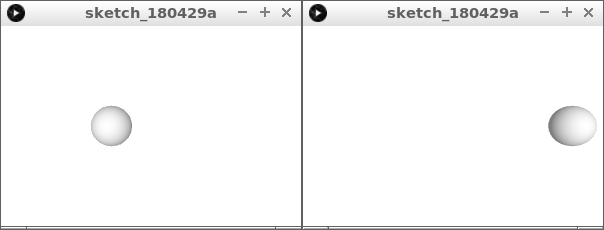
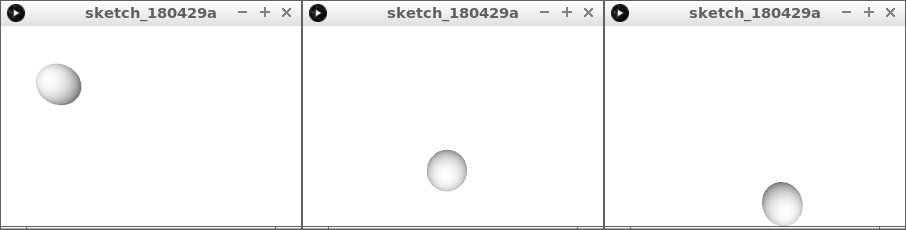
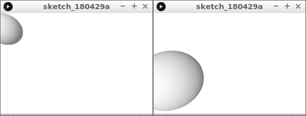

# 3D les 1: bal naar rechts

In deze les gaan we 3D programmeren.

\pagebreak

## 3D 1: opdracht 1 

Type deze code over:

```c++
float x = 0;

void setup() 
{
  size(300, 200, P3D);
  noStroke();
}

void draw() 
{
  background(255, 255, 255);
  translate(x, 100, 0);
  lights();
  sphere(20);
  x = x + 1;
}
```

Wat zie je?

\pagebreak

## 3D 1: oplossing 1 



Je ziet een bal van links naar rechts bewegen.

Als je goed kijkt zie je dat het witste gedeelte van de bal ook van plek verandert.

\pagebreak

## 3D 1: opdracht 2

 * Laat de bal nu naar rechtsonder gaan
 * Maak een nieuwe variabele, bijvoorbeeld `y`



\pagebreak

## 3D 1: oplossing 2 

```c++
float x = 0;
float y = 0;

void setup() 
{
  size(300, 200, P3D);
  noStroke();
}

void draw() 
{
  background(255, 255, 255);
  translate(x, y, 0);
  lights();
  sphere(20);
  x = x + 1;
  y = y + 1;
}
```

\pagebreak

## 3D 1: opdracht 3

 * Laat de bal nu naar voren gaan
 * Maak een nieuwe variabele, bijvoorbeeld `z`

Dit ziet er misschien anders uit dan je verwacht!



\pagebreak

## 3D 1: oplossing 3

```c++
float x = 0;
float y = 0;
float z = 0;

void setup() 
{
  size(300, 200, P3D);
  noStroke();
}

void draw() 
{
  background(255, 255, 255);
  translate(x, y, z);
  lights();
  sphere(20);
  x = x + 1;
  y = y + 1;
  z = z + 1;
}
```


## 3D 1: Eindopdracht

 * Maak de grootte van de bol gelijk aan de `x`
 * Haal `noStroke` weg

Dit ziet er misschien anders uit dan je verwacht!


