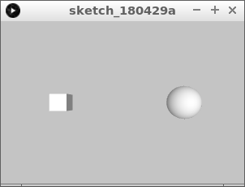
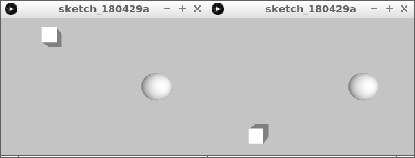
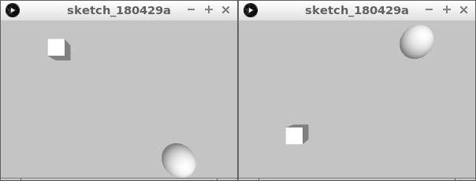

# 3D les 3: bal en kubus bewegen

In deze les gaan we een 3D bal en kubus laten bewegen.

\pagebreak

## 3D 3: opdracht 1 

Type deze code over:

```c++
float x1 = 0;
float x2 = 0;

void setup() 
{
  size(300, 200, P3D);
  noStroke();
  x1 = width * 1 / 4;
  x2 = width * 3 / 4;
}

void draw() 
{
  background(196, 196, 196);
  lights();
  translate( x1,  height / 2, 0);
  box(20);
  translate(-x1, -height / 2, 0);

  translate( x2,  height / 2, 0);
  sphere(20);
  translate(-x2, -height / 2, 0);
}
```

Wat zie je?

\pagebreak

## 3D 3: oplossing 1 



Je ziet een kubus en een bal die stilstaan
\pagebreak

## 3D 3: opdracht 2

 * Zorg dat de kubus nu ook naar onder en boven kan gaan, met de toetsen `w` en `s`
 * Maak een nieuwe variabele, bijvoorbeeld `y1`, met als beginwaarde `height / 2`



\pagebreak

## 3D 3: oplossing 2 

```c++
float x1 = 0;
float x2 = 0;
float y1 = 0;

void setup() 
{
  size(300, 200, P3D);
  noStroke();
  x1 = width * 1 / 4;
  x2 = width * 3 / 4;
  y1 = height / 2;
}

void draw() 
{
  background(196, 196, 196);
  lights();
  translate( x1,  y1, 0);
  box(20);
  translate(-x1, -y1, 0);

  translate( x2,  height / 2, 0);
  sphere(20);
  translate(-x2, -height / 2, 0);
  
  if (keyPressed)
  {
    if (key == 'w') y1 = y1 - 1; 
    if (key == 's') y1 = y1 + 1; 
  }
}
```

\pagebreak

## 3D 3: Eindopdracht

 * Laat de bal nu ook naar voren en achter gaan, met de toetsen `i` en `k`
 * Maak een nieuwe variabele, bijvoorbeeld `y2`, met als beginwaarde `height / 2`




