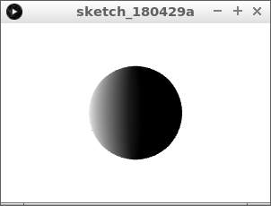
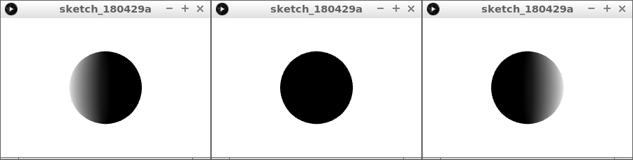
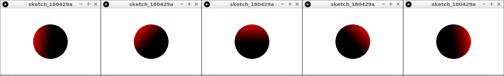
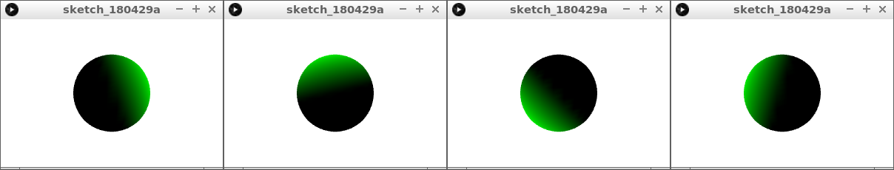

# 3D les 4: belichting

In deze les gaan we een 3D bal belichten.

\pagebreak

## 3D 4: opdracht 1 

Type deze code over:

```c++
float licht_richting_x = 1;

void setup() 
{
  size(300, 200, P3D);
  noStroke();
}

void draw() 
{
  background(255, 255, 255);
  directionalLight(255, 255, 255, licht_richting_x, 0, 0);
  translate(width / 2, height / 2, 0);
  sphere(50);
}
```

Wat zie je?

\pagebreak

## 3D 4: oplossing 1 



Je ziet een bal met een wit licht erop.

\pagebreak

## 3D 4: opdracht 2

 * Zorg dat de `licht_richting_x` lager en hoger kan worden, met de toetsen `w` en `s`

Let op: er zijn maar drie standen mogelijk!



\pagebreak

## 3D 4: oplossing 2 

```c++
float licht_richting_x = 1;

void setup() 
{
  size(300, 200, P3D);
  noStroke();
}

void draw() 
{
  background(255, 255, 255);
  directionalLight(255, 255, 255, licht_richting_x, 0, 0);
  translate(width / 2, height / 2, 0);
  sphere(50);
  if (keyPressed)
  {
    if (key == 'a') licht_richting_x = licht_richting_x - 1;  
    if (key == 'd') licht_richting_x = licht_richting_x + 1;  
  }
}
```

\pagebreak

## 3D 3: opdracht 3

 * Zet het licht y richting op een. 
 * Maak de kleur van het licht rood

Let op: er zijn maar vijf standen mogelijk!



\pagebreak

## 3D 4: oplossing 3 

```c++
float licht_richting_x = 1;

void setup() 
{
  size(300, 200, P3D);
  noStroke();
}

void draw() 
{
  background(255, 255, 255);
  directionalLight(255, 0, 0, licht_richting_x, 1, 0);
  translate(width / 2, height / 2, 0);
  sphere(50);
  if (keyPressed)
  {
    if (key == 'a') licht_richting_x = licht_richting_x - 1;  
    if (key == 'd') licht_richting_x = licht_richting_x + 1;  
  }
}
```


\pagebreak

## 3D 4: Eindopdracht

 * Zorg dat de `licht_richting_y` lager en hoger kan worden, met de toetsen `w` en `s`
 * Maak een nieuwe variabele, bijvoorbeeld `licht_richting_x`, met als beginwaarde nul
 * Maak de lichtkleur groen

Nu kan de lichtbundel mooi draaien.



