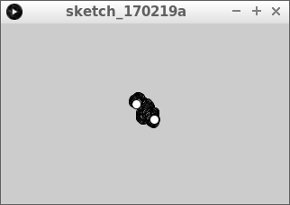

# Arrays1

Met arrays kun je de computer veel waardes laten onthouden:
de coordinaten van kogels, meteorieten, vijanden.

In deze les gaan we leren 

 * waarom je arrays nodig hebt
 * wat arrays zijn
 * hoe je een array met een element gebruikt

Zo gaat het eruit zien:


## Twee ballen die eeuwig naar rechts gaan

Je hebt een bal euuwig horizontaal laten bewegen:

```
float x = 0;

void setup()
{
  size(600, 50);
}

void draw()
{
  ellipse(x,25,50,50);
  x = x + 1;
  if (x > 625)
  {
    x = -25;
  }
}
```

## Vragen

 * 1. Run deze code. Wat zie je?
 * 2. Zorg dat er een tweede bal bijkomt. Tips: 
    * verander de naam `x` naar `x1`
    * maak een nieuwe variabele met de naam `x2`
 * 3. Hoeveel regels code kost het ongeveer om een extra bal te programmeren?

## Oplossing


 * 1. Een bal die horizontaal heen en weer beweegt
 * 2. Zo doe je dat:

```
float x1 = 0;
float x2 = 100;

void setup()
{
  size(600, 50);
}

void draw()
{
  ellipse(x1,25,50,50);
  ellipse(x2,25,50,50);
  x1 = x1 + 1;
  x2 = x2 + 1;
  if (x1 > 625)
  {
    x1 = -25;
  }
  if (x2 > 625)
  {
    x2 = -25;
  }
}
```

 * 3. zeven regels

## Vragen: drie ballen

 * 1. Zorg dat er een derde bal bijkomt
 * 2. Hoeveel regels code kost het ongeveer om een extra bal te programmeren?
 * 3. Hoeveel extra regels kost het om nog eens tien ballen erbij te programmeren? 

## Oplossing


 * 1. Zo doe je dat:

```
float x1 = 0;
float x2 = 100;
float x3 = 200;

void setup()
{
  size(600, 50);
}

void draw()
{
  ellipse(x1,25,50,50);
  ellipse(x2,25,50,50);
  ellipse(x3,25,50,50);
  x1 = x1 + 1;
  x2 = x2 + 1;
  x3 = x3 + 1;
  if (x1 > 625)
  {
    x1 = -25;
  }
  if (x2 > 625)
  {
    x2 = -25;
  }
  if (x3 > 625)
  {
    x3 = -25;
  }
}
```

 * 3. weer zeven regels
 * 4. tien keer zeven is zeventig regels

## Waarom arrays?

Je hebt de code gezien met de drie ballen die eeuwig naar rechts gaan.

Het valt op dat er veel herhaling in zit.
Dit komt omdat we de computer steeds een getal tegelijk laten onthouden:
`float x1 = 300` betekent: 'Lieve computer, onthoudt een gebroken getal met de naam `x1`, met als beginwaarde 300'.
Wat we willen kunnen zeggen is 'Lieve computer, onthoud keiveel gebroken getallen'.
Dit is precies wat een array kan doen!

## Wat is een array?

Een array kun je zien als een kast met laatjes.
In deze les beginnen we met een kast met een laatje:


Elk laatje heeft een nummer en in elk laatje kan een getal.

Hier zie je het nummer van het laatje, en het getal wat erin zit:


Het laatje heeft nummer *nul* (links) en in het laatje zit het
getal tweeenveertig.

Het valt op dat het laatje nummer *nul* heeft.
Je zegt: 'Het eerste laatje heeft index nul'. 
Als je normaal telt, begin je bij een.
Bij indices (het meervoud van index) begin je te tellen bij nul.
De kast heeft een laatje, met index nul.

## Vragen

 * Wat is een array?
 * Wat is een index?
 * Wat is de laagste index?

## Werken met een array met een laatje


Stel we willen een array maken van gebroken getallen (`float`s) met de naam `geheime_getallen`, 
dan moeten we boven de `setup` het volgende typen:

```
float[] geheime_getallen;
```

Hiermee zeg je: 'Lieve computer, onthoud keiveel gebroken getallen met de naam `geheime_getallen`'.

Er is nog niet gezegd *hoeveel* gebroken getallen dat zijn.
Vaak wordt de `setup` functie gebruikt om te zeggen hoeveel getallen er onthouden moeten worden:

```
geheime_getallen = new float[1];
```

Hiermee zeg je: 'Lieve computer, maak `geheime_getallen` groot genoeg om 
een gebroken getal (`float`s) te onthouden'.

Om de kast met de laatjes na te maken, kun je de volgende code gebruiken:

```
geheime_getallen[0] =  42;
```

Hiermee zeg je, in de derde regel: 'Lieve computer, stop in laatje met index nul het getal 
tweeenveertig'. Deze code zou prima in de `setup` functie gedaan kunnen worden.

Je zou ook de waarde in de laatjes kunnen lezen:

```
float x = geheime_getallen[0];
ellipse(x,200,300,400);
```

Hiermee zeg je: 'Lieve computer, kijk wat er in laatje met index nul zit en onthoud dat als `x`. 
Teken dan een ovaal die `x` pixels naar rechts is, 
200 pixels omlaag is, 300 pixels breed is, en 400 pixels hoog is.'.

Alles bij elkaar krijg je dit programma:

```
float[] geheime_getallen;

void setup()
{
  size(400,400);
  geheime_getallen = new float[1];
  geheime_getallen[0] = 42;
}

void draw() 
{
  float x = geheime_getallen[0];
  ellipse(x,200,300,400);
}
```

Dit programma ziet er niet erg mooi uit. Het is bedoeld om je te laten hoe je arrays maakt, vult en leest.

## Vragen

 * Welke foutmelding krijg je als je `float[] geheime_getallen;` in de `setup` functie zet?
 * Welke foutmelding krijg je als je `float geheime_getallen;` (dus zonder blokhaken) gebruikt?
 * Je wilt een array maken van gebroken getallen met de naam `snelheden`. Hoe zeg je dat in code?

## Drie ballen met een array
 
We hebben al de code van drie ballen die eeuwig naar rechts gaan.
Deze gaan we nu in een array stoppen

## Opdracht

 * 1. Verander de code van 'Drie ballen die eeuwig naar rechts gaan' met een array:
   * Het programma moet precies hetzelfde doen
   * Gebruik in plaats van de variabelen `x1`, `x2` en `x3` de naam `xs` (meerdere `x`-en)
   * De array `xs` wordt dus drie groot
 * 2. Hoeveel regels wordt je code korter?


## Oplossing 

 * 1. Zo doe je dat:

```
float[] xs;

void setup()
{
  size(600, 50);
  xs = new float[3];
  xs[0] = 0;
  xs[1] = 100;
  xs[2] = 200;
}

void draw()
{
  ellipse(xs[0],25,50,50);
  ellipse(xs[1],25,50,50);
  ellipse(xs[2],25,50,50);
  xs[0] = xs[0] + 1;
  xs[1] = xs[1] + 1;
  xs[2] = xs[2] + 1;
  if (xs[0] > 625)
  {
    xs[0] = -25;
  }
  if (xs[1] > 625)
  {
    xs[1] = -25;
  }
  if (xs[2] > 625)
  {
    xs[2] = -25;
  }
}
```

 * 2. Je code wordt juist langer!

## Opdracht

 * 1. Maak de code korter door for-loops te gebruiken
 * 2. Wordt de code nu langer of korter?

## Oplossing

```
float[] xs;

void setup()
{
  size(600, 50);
  xs = new float[3];
  for (int i=0; i<3; ++i)
  {
    xs[i] = i * 100;
  }
}

void draw()
{
  for (int i=0; i<3; ++i)
  {
    ellipse(xs[i],25,50,50);
    xs[i] = xs[i] + 1;
    if (xs[i] > 625)
    {
      xs[i] = -25;
    }
  }
}
```

## Vier ballen

Om nu een vier bal erbij te maken, pak je de code van 'Drie ballen'
en maakt van de `3` een `4`

## Opdracht

 * 1. Pak de code van 'Drie ballen' en maakt van de `3` een `4`
 * 2. Op hoeveel plekken moest je een `3` in een `4` veranderen?

## Oplossing

 * 1. Dat ziet er zo uit:


```
float[] xs;

void setup()
{
  size(600, 50);
  xs = new float[4];
  for (int i=0; i<4; ++i)
  {
    xs[i] = i * 100;
  }
}

void draw()
{
  for (int i=0; i<4; ++i)
  {
    ellipse(xs[i],25,50,50);
    xs[i] = xs[i] + 1;
    if (xs[i] > 625)
    {
      xs[i] = -25;
    }
  }
}
```

 * 2. Op drie plekken

## Een rookdeeltje

Je bent bezig een simulatie te maken: je wilt allemaal 
rookdeeltjes laten bewegen op het scherm.


Dit is je code:

```
float x = 160;
float y = 100;

void setup() 
{
  size(320, 200);
}

void draw()
{
  x += random(-1,1);
  y += random(-1,1);
  ellipse(x, y, 10, 10);
}
```

Dit is wat de code betekent:

 * `float x = 160`: 'Lieve computer, onthoudt een gebroken getal met de naam `x`, met als beginwaarde 160'. Dit wordt de x coordinaat van het eerste rookdeeltje
 * `float y = 100`: 'Lieve computer, onthoudt een gebroken getal met de naam `y`, met als beginwaarde 100'. Dit wordt de y coordinaat van het eerste rookdeeltje
 * `void setup() {}`: de klaarzet functie. Bij het opstarten wordt de code tussen de accolates een keer uitgevoerd
 * `size(320, 200)`: maak een venster van 320 pixels breed en 200 pixels hoog
 * `void draw() {}`: de teken functie. De code tussen de accolates wordt oneindig vaak uitgevoerd
 * `x += random(-1,1)`: verander de waarde van `x` met een willekeurige waarden van -1 tot 1. Dit laat rookdeeltje 1 willekeurig horizontaal bewegen
 * `y += random(-1,1)`: verander de waarde van `y` met een willekeurige waarden van -1 tot 1. Dit laat rookdeeltje 1 willekeurig verticaal bewegen
 * `ellipse(x, y, 10, 10)`: teken een ovaal met als middelpunt (`x`, `y`) met breedte 10 en hoogte 10. Teken het eerste rookdeeltje

## Vragen

 * 1. Zorg dat er een tweede rookdeeltje bijkomt
 * 2. Hoeveel regels code kost het ongeveer om honderd rookdeeltjes te programmeren?

## Oplossing

 * 1. Dit ziet er zo uit:



```
float x1 = 160;
float y1 = 100;
float x2 = 160;
float y2 = 100;

void setup() 
{
  size(320, 200);
}

void draw()
{
  x1 += random(-1,1);
  y1 += random(-1,1);
  ellipse(x1, y1, 10, 10);
  x2 += random(-1,1);
  y2 += random(-1,1);
  ellipse(x2, y2, 10, 10);
}
```

 * 2. Dit kostte vijf regels

## Eindopdracht

Maak nu de code zo dat er honderd rookdeeltjes komen


