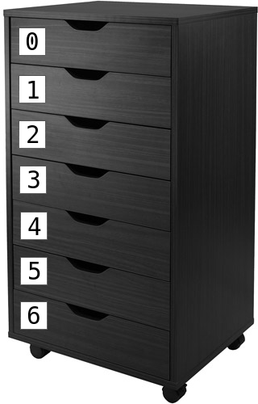

# Arrays1

Met arrays kun je de computer veel waardes laten onthouden:
de coordinaten van kogels, meteorieten, vijanden. 
Met een for loop kun je door een array heen gaan.

In deze les gaan we leren 

 * waarom je arrays nodig hebt
 * wat arrays zijn
 * hoe je arrays met een for loop gebruikt 

Zo gaat het eruit zien:


## Rooksimulator

Je bent bezig een simulatie te maken: je wilt allemaal 
rookdeeltjes laten bewegen op het scherm.

Dit is je code:

```
float x1 = 160;
float y1 = 100;
float x2 = 160;
float y2 = 100;

void setup() 
{
  size(320, 200);
}

void draw()
{
  x1 += random(-1,1);
  y1 += random(-1,1);
  ellipse(x1, y1, 10, 10);
  x2 += random(-1,1);
  y2 += random(-1,1);
  ellipse(x2, y2, 10, 10);
}
```

Dit is wat de code betekent:

 * `float x1 = 160`: 'Lieve computer, onthoudt een gebroken getal met de naam `x1`, met als beginwaarde 160'. Dit wordt de x coordinaat van het eerste rookdeeltje
 * `float y1 = 100`: 'Lieve computer, onthoudt een gebroken getal met de naam `y1`, met als beginwaarde 100'. Dit wordt de y coordinaat van het eerste rookdeeltje
 * `float x2 = 160`: 'Lieve computer, onthoudt een gebroken getal met de naam `x2`, met als beginwaarde 160'. Dit wordt de x coordinaat van het tweede rookdeeltje
 * `float y2 = 100`: 'Lieve computer, onthoudt een gebroken getal met de naam `y2`, met als beginwaarde 100'. Dit wordt de y coordinaat van het tweede rookdeeltje
 * `void setup() {}`: de klaarzet functie. Bij het opstarten wordt de code tussen de accolates een keer uitgevoerd
 * `size(320, 200)`: maak een venster van 320 pixels breed en 200 pixels hoog
 * `void draw() {}`: de teken functie. De code tussen de accolates wordt oneindig vaak uitgevoerd
 * `x1 += random(-1,1)`: verander de waarde van `x1` met een willekeurige waarden van -1 tot 1. Dit laat rookdeeltje 1 willekeurig horizontaal bewegen
 * `y1 += random(-1,1)`: verander de waarde van `y1` met een willekeurige waarden van -1 tot 1. Dit laat rookdeeltje 1 willekeurig verticaal bewegen
 * `ellipse(x1, y1, 10, 10)`: teken een ovaal met als middelpunt (`x1`, `y1`) met breedte 10 en hoogte 10. Teken het eerste rookdeeltje
 * `x2 += random(-1,1)`: verander de waarde van `x2` met een willekeurige waarden van -1 tot 1. Dit laat rookdeeltje 2 willekeurig horizontaal bewegen
 * `y2 += random(-1,1)`: verander de waarde van `y2` met een willekeurige waarden van -1 tot 1. Dit laat rookdeeltje 2 willekeurig verticaal bewegen
 * `ellipse(x2, y2, 10, 10)`: teken een ovaal met als middelpunt (`x2`, `y2`) met breedte 10 en hoogte 10. Teken het tweede rookdeeltje

## Vragen

 * Run deze code
 * Zorg dat er een derde rookdeeltje bijkomt
 * Hoeveel regels code kost het ongeveer om honderd rookdeeltjes te programmeren?

## Arrays

Dit is de code met drie rookdeeltjes:

```
float x1 = 160;
float y1 = 100;
float x2 = 160;
float y2 = 100;
float x3 = 160;
float y3 = 100;

void setup() 
{
  size(320, 200);
  x1 = 160;
  y1 = 100;
  x2 = 160;
  y2 = 100;
  x3 = 160;
  y3 = 100;
}

void draw()
{
  x1 += random(-1,1);
  y1 += random(-1,1);
  ellipse(x1, y1, 10, 10);
  x2 += random(-1,1);
  y2 += random(-1,1);
  ellipse(x2, y2, 10, 10);
  x3 += random(-1,1);
  y3 += random(-1,1);
  ellipse(x3, y3, 10, 10);
}
```

Het valt op dat er veel herhaling in zit.
Dit komt omdat we de computer steeds een getal tegelijk laten onthouden:
`float x1 = 160` betekent 'Lieve computer, onthoudt een gebroken getal met de naam `x1`, met als beginwaarde 160'.
Wat we willen kunnen zeggen is 'Lieve computer, onthoud keiveel gebroken getallen'.
Dit is precies wat een array kan doen.

Een array kun je zien als een kast met laatjes:


Elk laatje heeft een nummer en in elk laatje kan een getal.

Hier zie je de nummers van de laatjes:



Het valt op dat het eerste laatje nummer *nul* heeft. 
Mensen beginnen vaak te tellen vanaf een, bij arrays telt
Processing vanaf nul.
De kast heeft zeven laatjes, met nummers nul tot en met zes.


