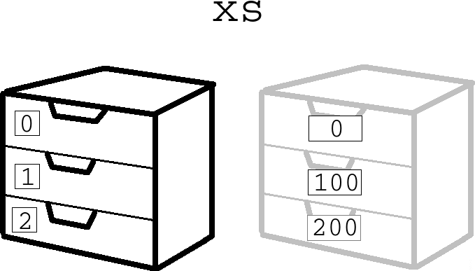
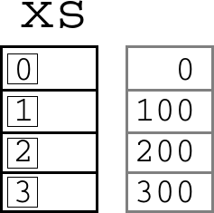

# Arrays1

Met arrays kun je de computer veel waardes laten onthouden:
de coordinaten van kogels, meteorieten, vijanden.

## Opdracht 1

Run deze code. Wat doet het?

```c++
float x = 0;

void setup()
{
  size(600, 50);
}

void draw()
{
  ellipse(x,25,50,50);
  x = x + 1;
  if (x > 625)
  {
    x = -25;
  }
}
```

## Oplossing 1

Een bal die eeuwig naar rechts gaat!


## Opdracht 2

Zorg dat er een tweede bal bijkomt.


 | Tip: verander de naam `x` naar `x1`
:-------------:|:----------------------------------------: 

 | Maak dan een nieuwe variabele met de naam `x2`
:-------------:|:----------------------------------------: 


## Oplossing 2

```c++
float x1 = 0;
float x2 = 100;

void setup()
{
  size(600, 50);
}

void draw()
{
  ellipse(x1,25,50,50);
  ellipse(x2,25,50,50);
  x1 = x1 + 1;
  x2 = x2 + 1;
  if (x1 > 625)
  {
    x1 = -25;
  }
  if (x2 > 625)
  {
    x2 = -25;
  }
}
```

 | Dit was zeven regels extra werk
:-------------:|:----------------------------------------: 

## Opdracht 3

Zorg dat er een derde bal bijkomt.


## Oplossing 3

```c++
float x1 = 0;
float x2 = 100;
float x3 = 200;

void setup()
{
  size(600, 50);
}

void draw()
{
  ellipse(x1,25,50,50);
  ellipse(x2,25,50,50);
  ellipse(x3,25,50,50);
  x1 = x1 + 1;
  x2 = x2 + 1;
  x3 = x3 + 1;
  if (x1 > 625)
  {
    x1 = -25;
  }
  if (x2 > 625)
  {
    x2 = -25;
  }
  if (x3 > 625)
  {
    x3 = -25;
  }
}
```

 | Dit was weer zeven regels extra werk
:-------------:|:----------------------------------------: 

 | Dit kan slimmer, met arrays!
:-------------:|:----------------------------------------: 

## Wat is een array?

Een array is als een kast met laatjes.


Elk laatje heeft een nummer en in elk laatje kan een getal.

Hier zie je het nummer van het laatje, en het getal wat erin zit:


 | Het eerste laatje van een array heeft nummer nul
:-------------:|:----------------------------------------: 

Het laatje heeft nummer *nul* (links) en in het laatje zit het
getal tweeenveertig.

 | 
:-------------:|:----------------------------------------: 
`plek in array met index nul`|'het eerste plekje in de array'


## Werken met een array met een laatje


Stel we willen een array maken van gebroken getallen (`float`s) met de naam `geheime_getallen`, 
dan moeten we boven de `setup` het volgende typen:

```
float[] geheime_getallen;
```

Met deze regel maak je array met de naam `geheime_getallen`

 | 
:-------------:|:----------------------------------------: 
`float[] geheime_getallen`|'Lieve computer, onthoud keiveel gebroken getallen met de naam `geheime_getallen`'


Er is nog niet gezegd *hoeveel* gebroken getallen dat zijn.
Vaak wordt de `setup` functie gebruikt om te zeggen hoeveel getallen er onthouden moeten worden:

```
geheime_getallen = new float[1];
```

Hiermee maak je de array `geheime_getallen` 1 laatje groot.


 | 
:-------------:|:----------------------------------------: 
`geheime_getallen = new float[1]`|'Lieve computer, maak `geheime_getallen` 1 laatje groot`'


Om de kast met de laatjes na te maken, kun je de volgende code gebruiken:

```
geheime_getallen[0] = 42;
```

Hierdoor stop je het getal 42 op het eerste plekje in de array.

 | 
:-------------:|:----------------------------------------: 
`geheime_getallen[0] = 42`|'Lieve computer, stop het getal `42` in het eerste plekje van de array `geheime_getallen`'

Je zou ook de waarde in de laatjes kunnen lezen:

```
float x = geheime_getallen[0];
```

Hiermee lees je het eerste plekje (het laatje met index nul) en stop je dat in `x`.

 | 
:-------------:|:----------------------------------------: 
`float x = geheime_getallen[0]`|'Lieve computer, kijk wat er in laatje met index nul zit en onthoud dat als `x`'


Alles bij elkaar krijg je dit programma:

```c++
float[] geheime_getallen;

void setup()
{
  size(400,400);
  geheime_getallen = new float[1];
  geheime_getallen[0] = 42;
}

void draw() 
{
  float x = geheime_getallen[0];
  ellipse(x,200,300,400);
}
```


Dit programma ziet er niet erg mooi uit. Het is bedoeld om je te laten hoe je arrays maakt, vult en leest.

## Vragen

 * Welke foutmelding krijg je als je `float[] geheime_getallen;` in de `setup` functie zet?
 * Welke foutmelding krijg je als je `float geheime_getallen;` (dus zonder blokhaken) gebruikt?
 * Je wilt een array maken van gebroken getallen met de naam `snelheden`. Hoe zeg je dat in code?

## Drie ballen met een array
 
We hebben al de code van drie ballen die eeuwig naar rechts gaan.
Deze gaan we nu in een array stoppen

## Opdracht



 * 1. Verander de code van 'Drie ballen die eeuwig naar rechts gaan' met een array:
   * Het programma moet precies hetzelfde doen
   * Gebruik in plaats van de variabelen `x1`, `x2` en `x3` de naam `xs` (meerdere `x`-en)
   * De array `xs` wordt dus drie groot
 * 2. Hoeveel regels wordt je code korter?


## Oplossing 

 * 1. Zo doe je dat:

```
float[] xs;

void setup()
{
  size(600, 50);
  xs = new float[3];
  xs[0] = 0;
  xs[1] = 100;
  xs[2] = 200;
}

void draw()
{
  ellipse(xs[0],25,50,50);
  ellipse(xs[1],25,50,50);
  ellipse(xs[2],25,50,50);
  xs[0] = xs[0] + 1;
  xs[1] = xs[1] + 1;
  xs[2] = xs[2] + 1;
  if (xs[0] > 625)
  {
    xs[0] = -25;
  }
  if (xs[1] > 625)
  {
    xs[1] = -25;
  }
  if (xs[2] > 625)
  {
    xs[2] = -25;
  }
}
```

 * 2. Je code wordt juist langer!

## Opdracht

 * 1. Maak de code korter door for-loops te gebruiken
 * 2. Wordt de code nu langer of korter?

## Oplossing

```
float[] xs;

void setup()
{
  size(600, 50);
  xs = new float[3];
  for (int i=0; i<3; ++i)
  {
    xs[i] = i * 100;
  }
}

void draw()
{
  for (int i=0; i<3; ++i)
  {
    ellipse(xs[i],25,50,50);
    xs[i] = xs[i] + 1;
    if (xs[i] > 625)
    {
      xs[i] = -25;
    }
  }
}
```

## Vier ballen



Om nu een vier bal erbij te maken, pak je de code van 'Drie ballen'
en maakt van de `3` een `4`

## Opdracht

 * 1. Pak de code van 'Drie ballen' en maakt van de `3` een `4`
 * 2. Op hoeveel plekken moest je een `3` in een `4` veranderen?

## Oplossing

 * 1. Dat ziet er zo uit:


```
float[] xs;

void setup()
{
  size(600, 50);
  xs = new float[4];
  for (int i=0; i<4; ++i)
  {
    xs[i] = i * 100;
  }
}

void draw()
{
  for (int i=0; i<4; ++i)
  {
    ellipse(xs[i],25,50,50);
    xs[i] = xs[i] + 1;
    if (xs[i] > 625)
    {
      xs[i] = -25;
    }
  }
}
```

 * 2. Op drie plekken

## Eindopdracht

Maak de code nu zo dat:

 * Er zes ballen zijn
 * De ballen eeuwig naar links gaan
