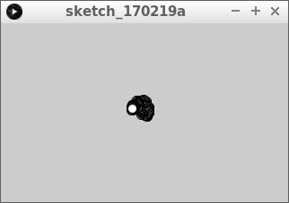
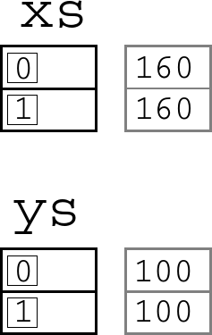
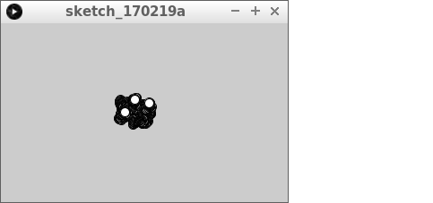
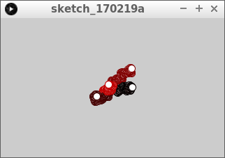
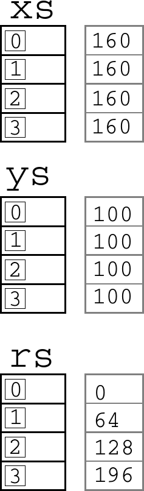
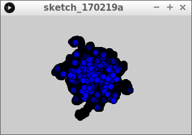

# Arrays2

Met arrays kun je de computer veel waardes laten onthouden:
de coordinaten van kogels, meteorieten, vijanden.

In deze les gaan we leren 

 * waarom je arrays nodig hebt
 * wat arrays zijn
 * hoe je een array met een element gebruikt

Zo gaat het eruit zien:


## Een rookdeeltje

Je bent bezig een simulatie te maken: je wilt allemaal 
rookdeeltjes laten bewegen op het scherm.



Dit is je code:

```
float x = 160;
float y = 100;

void setup() 
{
  size(320, 200);
}

void draw()
{
  x += random(-1,1);
  y += random(-1,1);
  ellipse(x, y, 10, 10);
}
```

Dit is wat de code betekent:

 * `float x = 160`: 'Lieve computer, onthoudt een gebroken getal met de naam `x`, met als beginwaarde 160'. Dit wordt de x coordinaat van het eerste rookdeeltje
 * `float y = 100`: 'Lieve computer, onthoudt een gebroken getal met de naam `y`, met als beginwaarde 100'. Dit wordt de y coordinaat van het eerste rookdeeltje
 * `void setup() {}`: de klaarzet functie. Bij het opstarten wordt de code tussen de accolates een keer uitgevoerd
 * `size(320, 200)`: maak een venster van 320 pixels breed en 200 pixels hoog
 * `void draw() {}`: de teken functie. De code tussen de accolates wordt oneindig vaak uitgevoerd
 * `x += random(-1,1)`: verander de waarde van `x` met een willekeurige waarden van -1 tot 1. Dit laat rookdeeltje 1 willekeurig horizontaal bewegen
 * `y += random(-1,1)`: verander de waarde van `y` met een willekeurige waarden van -1 tot 1. Dit laat rookdeeltje 1 willekeurig verticaal bewegen
 * `ellipse(x, y, 10, 10)`: teken een ovaal met als middelpunt (`x`, `y`) met breedte 10 en hoogte 10. Teken het eerste rookdeeltje

## Vragen

 * 1. Zorg dat er een tweede rookdeeltje bijkomt
 * 2. Hoeveel regels code kost het ongeveer om honderd rookdeeltjes te programmeren?

## Oplossing

 * 1. Dit ziet er zo uit:


```
float x1 = 160;
float y1 = 100;
float x2 = 160;
float y2 = 100;

void setup() 
{
  size(320, 200);
}

void draw()
{
  x1 += random(-1,1);
  y1 += random(-1,1);
  ellipse(x1, y1, 10, 10);
  x2 += random(-1,1);
  y2 += random(-1,1);
  ellipse(x2, y2, 10, 10);
}
```

 * 2. Dit kostte vijf regels

## Twee rookdeeltjes met een array, zonder for loop

Om naar honderd rookdeeltjes te komen, gaan we eerst de code omschrijven.

## Opdracht



Verander de code van 'Twee rookdeeltjes':

 * gebruik een array `xs`, in plaats van `x1` en `x2`
 * array `xs` is twee laatjes groot
 * gebruik een array `ys`, in plaats van `y1` en `y2`
 * array `ys` is twee laatjes groot
 * In arrays `xs` zit een `160` in het eerste en tweede laatje
 * In arrays `ys` zit een `100` in het eerste en tweede laatje
 * gebruik nog geen for loop

## Oplossing

```
float[] xs;
float[] ys;

void setup() 
{
  size(320, 200);
  xs = new float[2];
  ys = new float[2];
  xs[0] = 160;
  xs[1] = 160;
  ys[0] = 100;
  ys[1] = 100;
}

void draw()
{
  xs[0] += random(-1,1);
  ys[0] += random(-1,1);
  ellipse(xs[0], ys[0], 10, 10);
  xs[1] += random(-1,1);
  ys[1] += random(-1,1);
  ellipse(xs[1], ys[1], 10, 10);
}
```

## Drie rookdeeltjes

Nu laten we de code een for loop gebruiken.

## Opdracht



Verander de code van 'Twee rookdeeltjes met een array, zonder for loop':

 * Gebruik een for-loop
 * Maak er drie rookdeeltjes van

## Oplossing

```
float[] xs;
float[] ys;

void setup() 
{
  size(320, 200);
  xs = new float[3];
  ys = new float[3];
  for (int i=0; i<3; ++i)
  {
    xs[i] = 160;
    ys[i] = 100;
  }
}

void draw()
{
  for (int i=0; i<3; ++i)
  {
    xs[i] += random(-1,1);
    ys[i] += random(-1,1);
    ellipse(xs[i], ys[i], 10, 10);
  }
}
```

## Vier rookdeeltjes

We gaan weer een stapje verder: nu geven we de randen van de rookdeeltjes een rode kleur



## Opdracht



 * Gebruik nu vier rookdeeltjes
 * Maak een derde array genaamd `rs`
 * In `rs` zit de roodheid van de rookdeeltjes
 * In `rs` moeten de getallen `0`, `64`, `128` en `196` komen. Tip: dit is de tafel van `64`. Om te vermenigvuldigen, gebruik een sterretje (`*`)
 * De roodheid moet ook steeds een meer of minder worden
 * De rand van het eerste rookdeeltje, moet de eerste roodheid krijgen. Tip: gebruik `stroke`

## Oplossing

```
float[] xs;
float[] ys;
float[] rs; //Roodwaarden

void setup() 
{
  size(320, 200);
  xs = new float[4];
  ys = new float[4];
  rs = new float[4];
  for (int i=0; i<4; ++i)
  {
    xs[i] = 160;
    ys[i] = 100;
    rs[i] = i * 64;
  }
}

void draw()
{
  for (int i=0; i<4; ++i)
  {
    xs[i] += random(-1,1);
    ys[i] += random(-1,1);
    rs[i] += random(-1,1);
    stroke(rs[i], 0, 0);
    ellipse(xs[i], ys[i], 10, 10);
  }
}
```

## Eindopdracht



Maak nu de code zo dat:

 * er 256 rookdeeltjes komen.
 * elk rookdeeltje heeft en eigen *blauw*waarde
 * het eerste rookdeeltje heeft een blauwwaarde van nul. Het tweede rookdeeltje heeft een blauwwaarde van een. Het derde rookdeeltje heeft een blauwwaarde van twee. Enzovoorts
 * noem de array waarin de blauwwaarden staan `bs`
 * niet de rand, maar de vulkleur is blauw (tip: `fill`)
