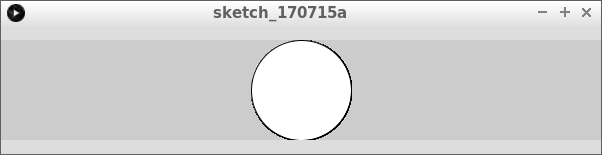
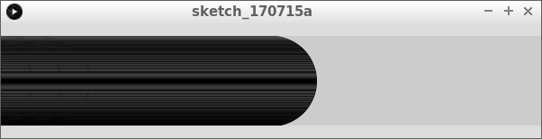
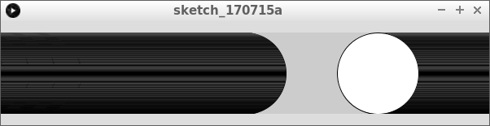
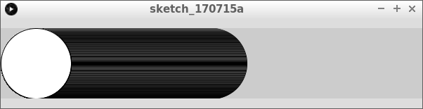
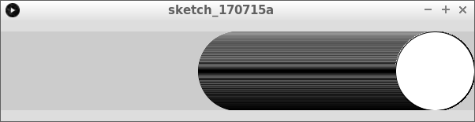
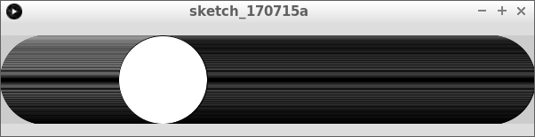
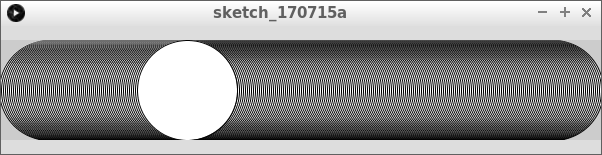
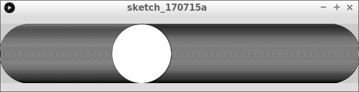

# Bal die horizontaal stuitert


In deze les gaan we een bal horizontaal laten stuiteren.

## Een bal met een snelheid

```c++
float x = 300;
float snelheid = 2;

void setup()
{
  size(600, 100);
}

void draw()
{
  ellipse(x,50,100,100);
  x = x + snelheid;
  if (x > 650)
  {
    x = -50;
  }
}
```

## Opdracht 1

Type de code van `Een bal met een snelheid` over. 
Zet de waarde van `snelheid` op `1`. Wat zie je?

## Antwoord

Je ziet dat de bal rusig naar rechts beweegt. Als de bal
rechts het beeld uit gaat, komt deze vanaf links weer in het beeldscherm.

```c++
float x = 300;
float snelheid = 1;

void setup()
{
  size(600, 100);
}

void draw()
{
  ellipse(x,50,100,100);
  x = x + snelheid;
  if (x > 650)
  {
    x = -50;
  }
}
```


## Opdracht 2

Zet de waarde van `snelheid` op `0`. Wat zie je?

## Antwoord 2

De bal staat nu stil

```c++
float x = 300;
float snelheid = 0;

void setup()
{
  size(600, 100);
}

void draw()
{
  ellipse(x,50,100,100);
  x = x + snelheid;
  if (x > 650)
  {
    x = -50;
  }
}
```



## Opdracht 3

Zet de waarde van `snelheid` op `-1`. Wat zie je?

 | Het getal `-1` spreek je uit als 'min een'. Het is het getal een lager dan nul.
:-------------:|:----------------------------------------: 

## Antwoord 3

De bal gaat nu naar links en komt niet meer in beeld.

```c++
float x = 300;
float snelheid = -1;

void setup()
{
  size(600, 100);
}

void draw()
{
  ellipse(x,50,100,100);
  x = x + snelheid;
  if (x > 650)
  {
    x = -50;
  }
}
```



## Opdracht 4



Zorg dat als de bal links uit beeld gaat, deze weer rechts verschijnt.
Doe dit door een tweede `if` te maken

## Oplossing 4

```c++
float x = 300;
float snelheid = -1;

void setup()
{
  size(600, 100);
}

void draw()
{
  ellipse(x,50,100,100);
  x = x + snelheid;
  if (x > 650)
  {
    x = -50;
  }
  if (x < -50)
  {
    x = 650;
  }
}
```

## Opdracht 5

Denk na: wat moet er met de `snelheid` gebeuren om de bal te laten stuiteren (van links naar rechst)? 

Als je durft: probeer dit zonder verder te lezen!

## Oplossing 5

Als tegen de linkerkant komt, moet de bal de bal naar rechts gaan. Als tegen de rechterkant komt, moet de bal de bal naar links gaan.

|Als de bal ...|dan moet deze ...
:---:|:---:|:---:
|aan de linkerkant komt|naar rechts gaan
|aan de rechtkant komt|naar links gaan

|`if (...)` | `{ }`
:---:|:---:|:---:
|`x < 50`|`snelheid = 1;`
|`x > 550`|`snelheid = -1;`

## Opdracht 6



Laat de bal nu van links naar rechts stuiteren

## Oplossing 6

```c++
float x = 300;
float snelheid = 1;

void setup()
{
  size(600, 100);
}

void draw()
{
  ellipse(x,50,100,100);
  x = x + snelheid;
  if (x > 550)
  {
    snelheid = -1;
  }
  if (x < 50)
  {
    snelheid = 1;
  }
}
```

## Opdracht 7



Laat de bal nu met een snelheid van 2 pixels per keer bewegen.

## Oplossing 7

```c++
float x = 300;
float snelheid = 2;

void setup()
{
  size(600, 100);
}

void draw()
{
  ellipse(x, 50, 100, 100);
  x = x + snelheid;
  if (x > 550)
  {
    snelheid = -2;
  }
  if (x < 50)
  {
    snelheid = 2;
  }
}
```

## Opdracht 8


Verander in de code:

van|naar
---|---
`snelheid = 2;`|`snelheid = -snelheid;`
`snelheid = -2;`|`snelheid = -snelheid;`

 | 
:-------------:|:----------------------------------------: 
`snelheid = -snelheid;`|'Lieve computer, verander het (min of plus)teken van snelheid'

 | Het getal `-1` heeft een minteken. Het getal `1` (ook goed: `+1`) heeft een plusteken.
:-------------:|:----------------------------------------: 

## Oplossing 8



```c++
float x = 300;
float snelheid = 2;

void setup()
{
  size(600, 100);
}

void draw()
{
  ellipse(x, 50, 100, 100);
  x = x + snelheid;
  if (x > 550)
  {
    snelheid = -snelheid;
  }
  if (x < 50)
  {
    snelheid = -snelheid;
  }
}
```

## Eindopdracht


Laat de bal nu omhoog en omlaag stuiteren.
