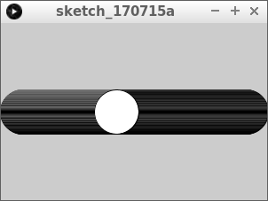
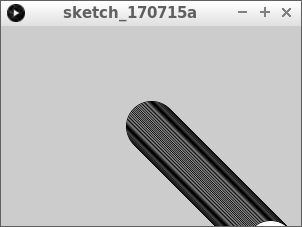
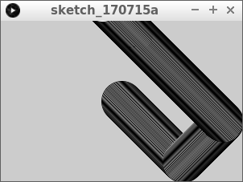
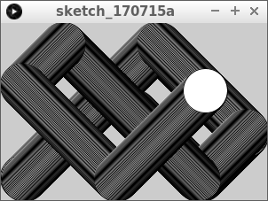

# Bal die schuin stuitert

In deze les gaan we een bal schuin laten stuiteren.

## Bal die schuin stuitert: intro

```c++
float x = 150;
float snelheid_naar_rechts = 1;

void setup()
{
  size(300, 200);
}

void draw()
{
  ellipse(x, 100, 50, 50);
  x = x + snelheid_naar_rechts;
  if (x > 275)
  {
    snelheid_naar_rechts = -snelheid_naar_rechts;
  }
  if (x < 25)
  {
    snelheid_naar_rechts = -snelheid_naar_rechts;
  }
}
```

## Bal die schuin stuitert: opdracht 1


Maak een nieuwe variable aan met de naam `y`.
Teken de ovaal op coordinaat `(x, y)`.
Zorg dat de code hetzelfde blijft doen

 | 
:-------------:|:----------------------------------------: 
`float y = 50;`|'Lieve computer, onthoud het getal `y` met een beginwaarde van vijftig.'

\pagebreak

## Bal die schuin stuitert: oplossing 1

```c++
float x = 150;
float y = 100;
float snelheid_naar_rechts = 1;

void setup()
{
  size(300, 200);
}

void draw()
{
  ellipse(x, y, 50, 50);
  x = x + snelheid_naar_rechts;
  if (x > 275)
  {
    snelheid_naar_rechts = -snelheid_naar_rechts;
  }
  if (x < 25)
  {
    snelheid_naar_rechts = -snelheid_naar_rechts;
  }
}
```

## Bal die schuin stuitert: opdracht 2



Maak een nieuwe variable aan met de naam `snelheid_omlaag`. 
Geef deze de beginwaarde van `1`. De bal hoeft nog niet te bewegen.

\pagebreak

## Bal die schuin stuitert: oplossing 2

```c++
float x = 150;
float y = 100;
float snelheid_naar_rechts = 1;
float snelheid_omlaag = 1;

void setup()
{
  size(300, 200);
}

void draw()
{
  ellipse(x, y, 50, 50);
  x = x + snelheid_naar_rechts;
  if (x > 275)
  {
    snelheid_naar_rechts = -snelheid_naar_rechts;
  }
  if (x < 25)
  {
    snelheid_naar_rechts = -snelheid_naar_rechts;
  }
}
```

## Bal die schuin stuitert: opdracht 3



Laat de bal nu ook naar onder bewegen. Hij hoeft nog niet te stuiteren.

\pagebreak

## Bal die schuin stuitert: oplossing 3

```c++
float x = 150;
float y = 100;
float snelheid_naar_rechts = 1;
float snelheid_omlaag = 1;

void setup()
{
  size(300, 200);
}

void draw()
{
  ellipse(x, y, 50, 50);
  x = x + snelheid_naar_rechts;
  y = y + snelheid_omlaag;
  if (x > 275)
  {
    snelheid_naar_rechts = -snelheid_naar_rechts;
  }
  if (x < 25)
  {
    snelheid_naar_rechts = -snelheid_naar_rechts;
  }
}
```

## Bal die schuin stuitert: opdracht 4



Laat de bal nu omhoog stuiteren als de bal de onderkant van het scherm raakt.

\pagebreak

## Bal die schuin stuitert: oplossing 4

```c++
float x = 150;
float y = 100;
float snelheid_naar_rechts = 1;
float snelheid_omlaag = 1;

void setup()
{
  size(300, 200);
}

void draw()
{
  ellipse(x, y, 50, 50);
  x = x + snelheid_naar_rechts;
  y = y + snelheid_omlaag;
  if (x > 275)
  {
    snelheid_naar_rechts = -snelheid_naar_rechts;
  }
  if (x < 25)
  {
    snelheid_naar_rechts = -snelheid_naar_rechts;
  }
  if (y > 175)
  {
    snelheid_omlaag = -snelheid_omlaag;
  }
}
```

\pagebreak

## Bal die schuin stuitert: eindopdracht



Laat nu de bal ook stuiteren als deze de bovenkant raakt.
