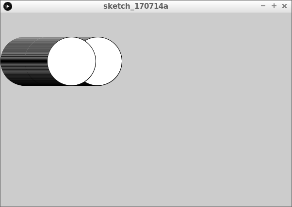
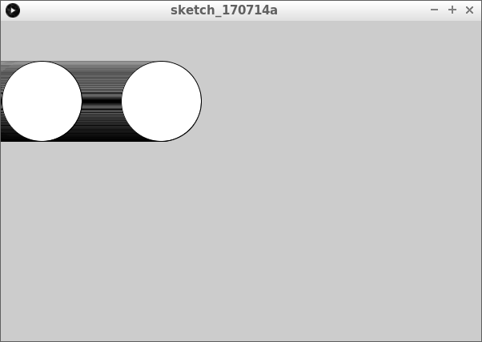

# Bal die eeuwig naar rechts gaat

In deze les gaan we een bal eeuwig naar rechts laten gaan.

Het ziet er zo uit:





We leren in deze les wat `if`-statement is.
Je kunt (bijna) niet programmeren zonder `if`-statements.

## Wat weten we al?

Als je de vorige lessen hebt gedaan, weet
je wat deze code doet:

```
float x = 50;

void setup()
{
  size(600, 400);
}

void draw()
{
  ellipse(x,50,50,50);
  x = x + 1;
}
```

## Vragen 

 * Wat doet dit programma?
 * In welke richting beweegt de ovaal
 * Blijft de ovaal zichtbaar op het scherm?
 * Kopieer de code en bekijk het programma. Klopt wat je dacht?

## Een `if`-statement

We willen kunnen zeggen: 'Lieve computer, *als* de bal te ver naar rechts is, dan teleporteer je de bal naar rechts'. `if` is Engels voor 'als'.

Zo zou dit kunnen:

```
if (x > 200)
{
  x = 100;
}
```

Dit betekent:

 * `if`: begin van een if statement. Een if-statement heeft dan twee gedeeltes:
   * `()`: tussen de ronde haken staat een test; iets wat waar of niet waar is
   * `{}`: tussen de accolades staat wat de computer moet doen als de test waar is
 * `x > 200`: dit staat tussen de ronde haken. Dit is de test 'x is groter dan 200'. Het `>` tekentje betekent 'groter dan'
 * `x = 100`: dit staat tussen de accolades. Als 'x is groter dan 200' waar is, dan krijgt `x` de waarde 100

Preciezer zeg je: 'Lieve computer, *als* x meer is dan 200, zet x dat op 100'. `if` is Engels voor 'als'.

## Vragen

 * Kopieer het `if`-statement tussen de accolades van de `draw` functie
 * Wat doet het programma?

Als het kopieren niet is gelukt, gebruik dan deze code:

```
float x = 50;

void setup()
{
  size(600, 400);
}

void draw()
{
  ellipse(x,100,100,100);
  x = x + 1;
  if (x > 200)
  {
    x = 100;
  }
}
```

 * Kun je ervoor zorgen dat de ovaal helemaal naar de linkerkant van het scherm springt?
 * Kun je ervoor zorgen dat de ovaal helemaal naar rechst beweegt, voordat deze naar de linkerkant van het scherm springt?


## Antwoord

Dit is een eeuwig naar rechts gaande bal:

```
float x = -50;

void setup()
{
  size(600, 100);
}

void draw()
{
  ellipse(x,50,100,100);
  x = x + 1;
  if (x > 650)
  {
    x = -50;
  }
}
```

Het lijkt al een beetje op [Lonelier Pong](https://github.com/richelbilderbeek/LonelierPong). Dit is geen toeval :-)

## Verder

Je zou nu kunnen doen:

 * [Bal die horizontaal stuitert](../BalDieHorizontaalStuitert/README.md)
