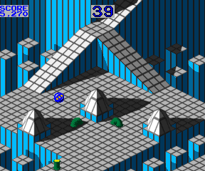
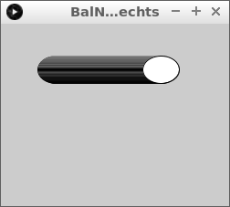
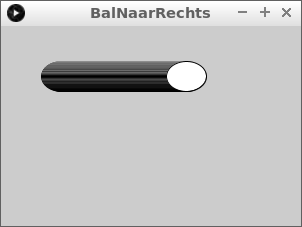
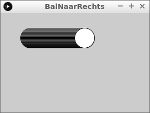
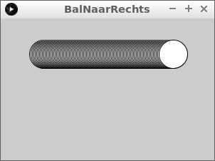
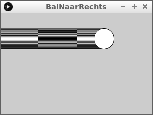
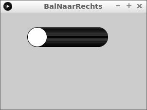
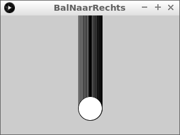
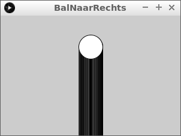
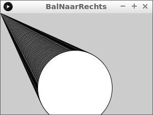

# Bal naar rechts

In deze les gaan we een bal naar rechts laten bewegen.

Ook leren in deze les wat een variabele is.
Je kunt bijna niet programmeren zonder variabelen.



\pagebreak
  
## Bal naar rechts: intro

Type de volgende code over:

```c++
float x = 60;

void setup()
{
  size(250, 200);
}

void draw()
{
  ellipse(x, 50, 40, 30);
  x = x + 1;
}
```

Druk dan op 'Run' (zie figuur `Druk op 'Run'`). 

Als er rode letters komen, heb je een typefout gemaakt. Kijk goed en verbeter de typefouten.

Als alles goed gaat, zie je een bal die naar rechts beweegt (zie figuur `Bal naar rechts: intro`).



\pagebreak

## Bal naar rechts: opdracht 1



Het scherm is nu 250 pixels breed. Maak deze nu 300 pixels breed. 

Verander de code en druk op 'Run'.

\pagebreak

## Bal naar rechts: oplossing 1

Er zit een `250` in de code. Deze naar `300` veranderen is genoeg:

```c++
float x = 60;

void setup()
{
  size(300, 200);
}

void draw()
{
  ellipse(x, 50, 40, 30);
  x = x + 1;
}
```

 | 
:-------------:|:----------------------------------------: 
`size(300, 200);`|'Lieve computer, maak een venster van 300 pixels breed en 200 pixels hoog.'

\pagebreak

## Bal naar rechts: opdracht 2



De bal is nu ei-vorming: hij is nu 40 pixels breed en 30 pixels hoog. 
Maak de bal nu rond: 40 pixels breed en 40 pixels hoog.

\pagebreak

## Bal naar rechts: oplossing 2

`ellipse(x, 50, 40, 30);` tekent de bal. 
De `40, 30` zorgt ervoor dat de bal eiv-ormig is. 
Door dit `40, 40` te maken, wordt de bal rond.

```c++
float x = 60;

void setup()
{
  size(300, 200);
}

void draw()
{
  ellipse(x, 50, 40, 40);
  x = x + 1;
}
```

 | 
:-------------:|:----------------------------------------: 
`ellipse(x,50,40,30);`|'Lieve computer, teken een ovaal `x` pixels naar rechts, 50 pixels omlaag, die 40 pixels wijd en 30 pixels hoog is.'

\pagebreak

## Bal naar rechts: opdracht 3



De bal gaat nu met een snelheid van 1 pixel per keer naar rechts. 
Laat de bal twee keer zo snel naar rechts gaan

\pagebreak

## Bal naar rechts: oplossing 3

`x = x + 1;` beweegt de bal. Verander dit naar `x = x + 2;`. De code wordt dan:

```c++
float x = 60;

void setup()
{
  size(300, 200);
}

void draw()
{
  ellipse(x, 50, 40, 40);
  x = x + 2;
}
```

 | 
:-------------:|:----------------------------------------: 
`x = x + 1;`|'Lieve computer, maak `x` een hoger.'
`x += 1;`|'Lieve computer, maak `x` een hoger.'
`x++;`|'Lieve computer, maak `x` een hoger.'
`++x;`|'Lieve computer, maak `x` een hoger.'

\pagebreak

## Bal naar rechts: opdracht 4



In het begin zit het midden van de bal 60 pixels naar rechts. 
Kun je de cirkel ook 0 pixels naar rechts laten beginnen?

\pagebreak

## Bal naar rechts: oplossing 4

`float x = 60;` bepaalt dit. Verander dit naar `float x = 0;`. De code wordt dan:

```c++
float x = 0;

void setup()
{
  size(300, 200);
}

void draw()
{
  ellipse(x, 50, 40, 40);
  x = x + 2;
}
```

 | 
:-------------:|:----------------------------------------: 
`void setup() { }`|'Lieve computer, doe wat tussen accolades staat een keer.'


\pagebreak

## Bal naar rechts: opdracht 5

Haha, deze les heet 'Bal naar rechts', toch gaan we ook een bal naar links laten bewegen!



Laat de bal nu aan de rechterkant van het scherm beginnen en naar links gaan.

\pagebreak

## Bal naar rechts: oplossing 5

Om de bal aan de rechtkant te krijgen moet je `float x = 500;` gebruiken (of een ander hoog getal).
Om de bal naar links te laten bewegen, moet je `x = x - 1;` gebruiken. De code wordt dan:

```c++
float x = 200;

void setup()
{
  size(300, 200);
}

void draw()
{
  ellipse(x, 50, 40, 40);
  x = x - 1;
}
```

 | 
:-------------:|:----------------------------------------: 
`void draw() { }`|'Lieve computer, doe de hele tijd wat tussen accolades staat.'

\pagebreak

## Bal naar rechts: wat is een variabele?

In de eerste regel gebruiken we een variabele:

```c++
float x = 50;
```

In mensentaal is dit: 'Lieve computer, onthoud het getal `x` met een beginwaarde van vijftig.'.

 | 
:-------------:|:----------------------------------------: 
`float x = 50;`|'Lieve computer, onthoud het getal `x` met een beginwaarde van vijftig.'

Een variabele is een stukje computergeheugen met een naam. 
De computer kan aan die naam bepalen waar in het geheugen hij moet kijken.


  
Variabelen die bij jou (en bijna elk mens) horen, zijn: naam, leeftijd, 
geboortedatum, adres, telefoonnummer, emailadres, en nog veel meer. 
Als iemand je je leeftijd vraagt, dan weet je welk getal je moet zeggen.

 | 
:-------------:|:----------------------------------------: 
`geld`|'Lieve computer, zeg hoeveel geld ik op de bank heb.'
`1000000`|

\pagebreak

Terug naar de eerste regel van onze code:

```c++
float x = 50;
```

Het woord `x` is de naam van een variable. In dit geval van hoe ver de cirkel naar rechts staat.
Het woord `float` betekent dat 'x' een (komma)getal is.
Het symbool `=` betekent 'wordt vanaf nu'.
Het getal `50` is de beginwaarde.
De puntkomma (`;`) geeft het einde van een zin aan (zoals de punt in een Nederlandse tekst).


 | 
:-------------:|:----------------------------------------: 
`float`|'Een komma getal'
`=`|'is vanaf nu'
`;`|'.'

\pagebreak

## Bal naar rechts: opdracht 6

Haha, deze les heet 'Bal naar rechts', toch gaan we ook een bal naar onder laten bewegen!



 * Verander de naam van de variabele `x` in `y`
 * Laat een bal aan de bovenkant van het scherm beginnen
 * De bal moet 150 pixels naar rechts komen te staan
 * De bal moet in een rechte lijn naar onder gaan. Tip: de bal staat nu op 50 pixels omlaag

\pagebreak

## Bal naar rechts: oplossing 6

```c++
float y = 0;

void setup()
{
  size(300, 200);
}

void draw()
{
  ellipse(150, y, 40, 40);
  y = y + 1;
}
```

\pagebreak

## Bal naar rechts: opdracht 7



Nu gaan we de bal sneller en omhoog laten bewegen

 * Laat een bal aan de onderkant van het scherm beginnen
 * De bal moet in een rechte lijn naar boven gaan
 * De bal moet twee keer zo snel gaan

\pagebreak

## Bal naar rechts: oplossing 7

```c++
float y = 200;

void setup()
{
  size(300, 200);
}

void draw()
{
  ellipse(150, y, 40, 40);
  y = y - 1;
}
```

\pagebreak

## Bal naar rechts: eindopdracht



 * de bal moet schuin naar rechts-omlaag gaan
 * de bal moet groter worden in de breedte en hoogte
 * zie ook figuur `Eindopdracht 'Bal naar rechts'`

## Bal naar rechts: links (naar websites)

 * Eerste gedeelte: [YouTube](https://www.youtube.com/watch?v=fZDsZgqxBM0) [mp4](http://www.richelbilderbeek/bal_naar_rechts_1.mp4)
 * Wat is een variabele: [YouTube](https://youtu.be/3cXH3LrBGrA), [mp4](http://www.richelbilderbeek/bal_naar_rechts_variabele.mp4)
 * Tweede gedeelte: [YouTube](https://youtu.be/KxtQ00ugBvw), [mp4](http://www.richelbilderbeek/bal_naar_rechts_2.mp4)
