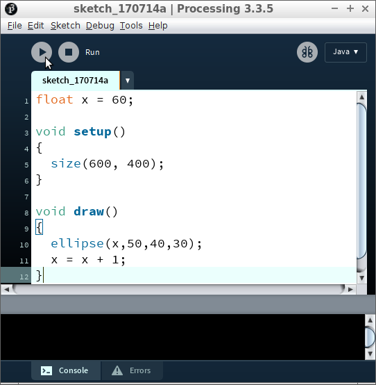
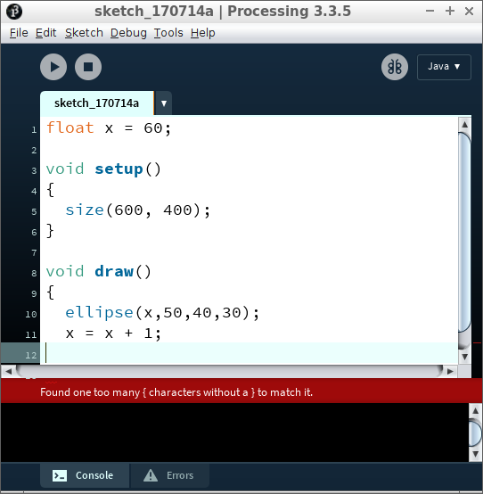
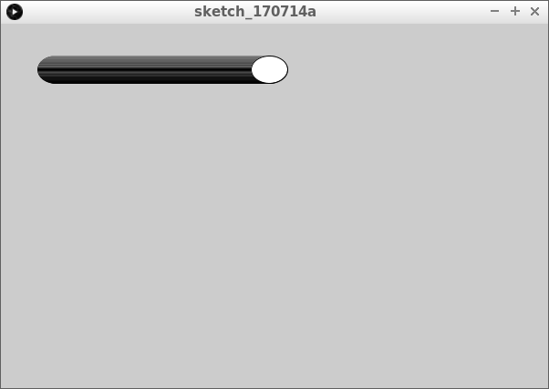
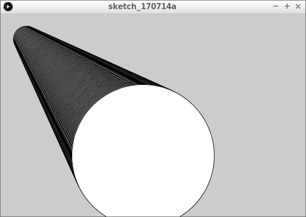

# Bal naar rechts

In deze les gaan we een bal naar rechts laten bewegen.
Ook leren in deze les wat een variabele is.
Je kunt bijna niet programmeren zonder variabelen.

## Bal naar rechts

Type de volgende code over:

```c++
float x = 60;

void setup()
{
  size(600, 400);
}

void draw()
{
  ellipse(x,50,40,30);
  x = x + 1;
}
```

Druk dan op 'Run' (zie figuur `Druk op 'Run'`). 



Als er rode letters komen, heb je een typefout gemaakt (zie figuur `Een error`). Kijk goed en verbeter de typefouten.



Als alles goed gaat, zie je een bal die naar rechts beweegt (zie figuur `Een bal die naar rechts beweegt`).



### Opdracht

 1. Het scherm is nu 600 pixels breed. Kun je deze 800 pixels breed krijgen? Verander de code en druk op 'Run'

### Oplossing

 1. Er zit een `600` in de code. Deze naar `800` veranderen is genoeg:

```c++
float x = 60;

void setup()
{
  size(800, 400);
}

void draw()
{
  ellipse(x,50,40,30);
  x = x + 1;
}
```

### Opdracht

 1. De bal is nu een ellips- is niet rond, maar ovaal. Maak deze rond. Hint: de bal is nu 40 pixels breed en 30 pixels hoog

### Oplossing

 1. `ellipse(x,50,40,30);` tekent de bal. De `40,30` zorgt ervoor dat de bal niet rond is. Door dit `40,40` of `30,30` te maken, wordt de bal rond:

```c++
float x = 60;

void setup()
{
  size(800, 400);
}

void draw()
{
  ellipse(x,50,40,40);
  x = x + 1;
}
```

## Opdracht

 1. De bal gaat nu met een snelheid van 1 pixel per keer naar rechts. Laat de bal twee keer zo snel naar rechts gaan

## Oplossing

 1. `x = x + 1;` beweegt de bal. Verander dit naar `x = x + 2;`. De code wordt dan:

```c++
float x = 60;

void setup()
{
  size(800, 400);
}

void draw()
{
  ellipse(x, 50, 40, 40);
  x = x + 2;
}
```

## Opdracht

 1. In het begin zit het midden van de bal 60 pixels naar rechts. Kun je de cirkel ook 0 pixels naar rechts laten beginnen?

## Oplossing

 1. `float x = 60;` bepaalt dit. Verander dit naar `float x = 0;`. De code wordt dan:

```c++
float x = 0;

void setup()
{
  size(800, 400);
}

void draw()
{
  ellipse(x, 50, 40, 40);
  x = x + 2;
}
```

## Bal naar links

Haha, deze les heet 'Bal naar rechts', toch gaan we ook een bal naar links laten bewegen!

## Opdracht

 1. Laat de bal nu aan de rechterkant van het scherm beginnen en naar links gaan

## Oplossing

 1. Om de bal aan de rechtkant te krijgen moet je `float x = 500;` gebruiken (of een ander hoog getal).
    Om de bal naar links te laten bewegen, moet je `x = x - 1;` gebruiken. De code wordt dan:

```c++
float x = 500;

void setup()
{
  size(600, 400);
}

void draw()
{
  ellipse(x,50,40,40);
  x = x - 1;
}
```

## Wat is een variabele?

In de eerste regel gebruiken we een variable:

```c++
float x = 50;
```

In mensentaal is dit: 'Lieve computer, onthoud het getal `x`. `x` heeft een beginwaarde van vijftig.'.

:computer:|:smiley:
---|--- 
`float x = 50;`|'Lieve computer, onthoud het getal `x`. `x` heeft een beginwaarde van vijftig.'

|
---|--- 
`float x = 50;`|'Lieve computer, onthoud het getal `x`. `x` heeft een beginwaarde van vijftig.'

Een variabele is iets dat onthouden moet worden. Een kassa onthoudt bijvoorbeeld de hoeveelheid geld
die alle boodschappen bij elkaar zijn. Variabelen die jij weet, zijn: je naam, je leeftijd, je
geboortedatum, je adres, je telefoonnummer, je emailadres, en nog veel meer. Als iemand je je leeftijd
vraagt, dan weet je welk getal je moet zeggen.

Het woord `x` is de naam van een variable. In dit geval van hoe ver de cirkel naar rechts staat.
Het woord `float` betekent dat 'x' een getal is.
Het symbool `=` betekent 'wordt vanaf nu'.
Het getal `50` is de beginwaarde.
De puntkomma (`;`) geeft het einde van een zin aan (zoals de punt in een Nederlandse tekst).

## Bal naar onder

Haha, deze les heet 'Bal naar rechts', toch gaan we ook een bal naar onder laten bewegen!

## Opdracht

 * Verander de naam van de variabele `x` in `y`
 * Laat een bal aan de bovenkant van het scherm beginnen
 * De bal moet 60 pixels naar rechts komen te staan
 * De bal moet in een rechte lijn naar onder gaan. Tip: de bal staat nu op 50 pixels omlaag

## Oplossing

```c++
float y = 50;

void setup()
{
  size(600, 400);
}

void draw()
{
  ellipse(60,y,40,40);
  y = y + 1;
}
```

## Bal snel omhoog

Nu gaan we de bal sneller en omhoog laten bewegen

## Opdracht

 * Laat een bal aan de onderkant van het scherm beginnen
 * De bal moet in een rechte lijn naar boven gaan
 * De bal moet twee keer zo snel gaan

## Oplossing

```c++
float y = 50;

void setup()
{
  size(600, 400);
}

void draw()
{
  ellipse(50, y, 50, 50);
  y = y - 2;
}
```

## Eindopdracht

 * gebruik een variabele `t` (van tijd)
 * de bal moet schuin naar rechts-omlaag gaan
 * de bal moet groter worden in de breedte en hoogte
 * zie ook figuur `Eindopdracht 'Bal naar rechts'`


