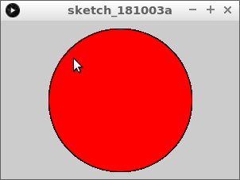
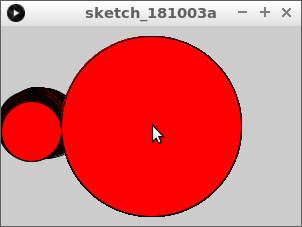
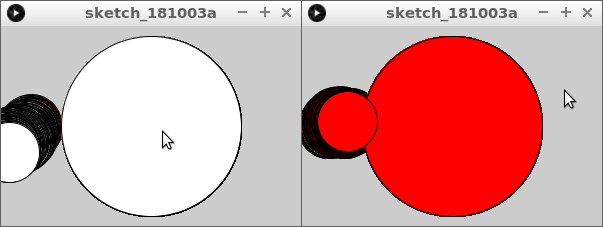
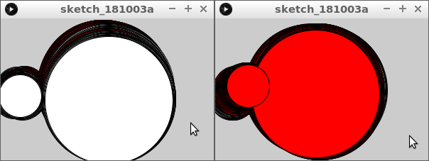

# Cirkels botsen

In deze les gaan we leren hoe je kunt meten of twee cirkels botsen

\pagebreak

## Cirkels botsen: opdracht 1

Type deze code over:

```c++
float x1 = 150;
float y1 = 100;
float d1 = 180;
float r1 = d1 / 2;

void setup()
{
  size(300, 200);
}

void draw()
{
  fill(255, 255, 255);
  if (dist(mouseX, mouseY, x1, y1) < r1)
  {
    fill(255, 0, 0);  
  }
  ellipse(x1, y1, d1, d1);  
}
```

Wat zie je?

\pagebreak

## Cirkels botsen: oplossing 1

Een cirkel. Als je met je muiscursor erin gaat, dan wordt deze rood.



\pagebreak

## Cirkels botsen: opdracht 2

Voeg een tweede cirkel toe. 
Maak vier nieuwe variabelen:

```
float x2 = 30;
float y2 = 100;
float d2 = 60;
float r2 = d1 / 2;
```

Teken een tweede cirkel met als middelpunt `(x2, y2)` en een breedte en
hoogte van `d2`.

\pagebreak

## Cirkels botsen: oplossing 2

```c++
// ...
float x2 = 30;
float y2 = 100;
float d2 = 60;
float r2 = d2 / 2;

void setup()
{
  size(300, 200);
}

void draw()
{
  // ...
  ellipse(x2, y2, d2, d2);  
}
```

Wat zie je?

\pagebreak

## Cirkels botsen: opdracht 3

Voeg toe aan de `draw` functie:

```c++
x2 = x2 + random(-1, 1);
y2 = y2 + random(-1, 1);
```

Wat zie je?

\pagebreak

## Cirkels botsen: oplossing 3

Je ziet de kleine cirkel bewegen.



\pagebreak

## Cirkels botsen: opdracht 4

Verander aan de `draw` functie het `if` statement naar:

```
  if (dist(x1, y1, x2, y2) < r1 + r2)
  {
    fill(255, 0, 0);  
  }
```

Wat zie je?

## Cirkels botsen: oplossing 4

Je ziet de cirkels rood worden als ze botsen:



## Cirkels botsen: Eindopdracht

Laat ook de grote cirkel bewegen. Als ze botsen, moeten ze rood worden.

