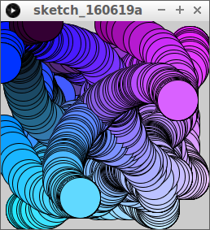
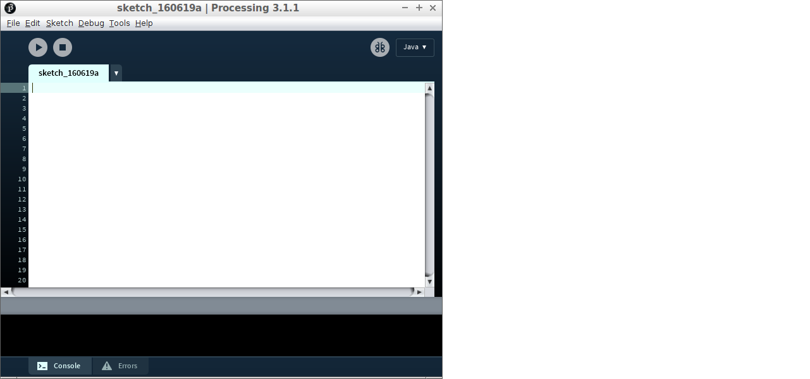
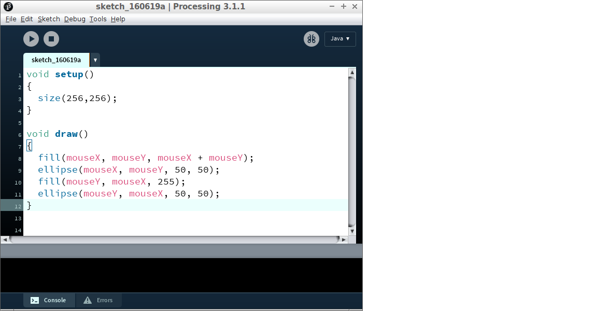
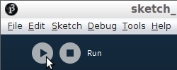

# Een Mooi Programma

Processing is een programmeertaal ontwikkeld voor kunstenaars
en erg geschikt om games en mooie dingen mee te maken.

In deze les gaan we leren 

 * hoe we Processing opstarten
 * hoe je code naar Processing kopieert
 * hoe je het programma start

Zo ziet het programma eruit:



## Wat je nodig hebt

Je moet Processing op kunnen starten. 
Hoe dat moet, hangt af van het besturingssysteem:

 * [Processing opstarten op cursus laptop](../ProcessingOpstartenOpCursusLaptop/README.md)
 * Processing installeren op eigen laptop met GNU/Linux
 * Processing installeren op eigen laptop met Windows

## Code kopieeren

Processing begint met een leeg programma zonder code:



Dit is de programmeercode die we gaan gebruiken:

```
void setup()
{
  size(256,256);  
}

void draw() 
{
  fill(mouseX, mouseY, mouseX + mouseY);
  ellipse(mouseX, mouseY, 50, 50);  
  fill(mouseY, mouseX, 255);
  ellipse(mouseY, mouseX, 50, 50);  
}
```

Wat de code precies doet, leggen we later uit.
Voor nu is het genoeg te weten dat het iets moois doet. 

Om code te kopieeren gebruik je sneltoetsen:

 * `SHIFT + pijltjes`: selecteren
 * `CTRL + A`: alles selecteren
 * `CTRL + C`: kopieren van selectie
 * `CTRL + X`: knippen van selectie
 * `CTRL + V`: plakken van selectie


 * Start Processing
 * Kopieer deze code naar Processing



## Programma uitvoeren

 * Klik op de 'Run' knop



Als het goed is, zie je nu het programma!

## Sneltoetsen oefenen

 * Werk met iemand samen. Hussel de code van de andere door de war, door deze te kopieren en te plakken. Repareer dan de code op je eigen computer