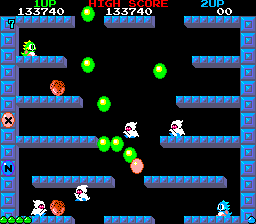

# `ellipse`

Cirkels en ovalen worden veel gebruikt in games.

Hier zie je een beroemde game, Bubble Bobble,
dat veel met cirkels werkt:



Je kunt een ovaal tekenen met heel veel puntjes,
maar de `ellipse` functie werkt gemakkelijker.

In deze les gaan we leren hoe je ovalen tekent.

Zo gaat het eruit zien:


Kun je nog geen rechthoeken tekenen? Ga dan 
[naar de les waarin je rechthokeen leert tekenen](../Rect/README.md)

## Ovalen

Een ovaal heeft een middelpunt, breedte en hoogte.
Om een ovaal te tekenen, 
moet je een coordinaat, breedte en hoogte geven.

Om in Processing een ovaal te tekenen, gebruik je de functie `ellipse`.
De functie `ellipse` heeft vier getallen nodig.
De eerste twee getallen zijn de coordinaat van het midden van de ovaal.
Het derde getal is de breedte van de ovaal.
Het vierde getal is de hoogte van de ovaal.

Hier zie je een ovaal met middelpunt (3,2), een breedte van vijf pixels en hoogte van drie pixels:


In Processing teken je deze ovaal met:

```c++
ellipse(3,2,5,3);
```

Hier is nog een ovaal:


Het middelpunt heeft coordinaat (2,4), hij is vijf pixels breed en negen pixels hoog.

## Vragen


  1. Je wilt bovenstaande plaatje namaken. Het venster is 100 pixels breed en 100 pixels hoog. Wat is het middelpunt van de cirkel? Hoe breed is de cirkel? En hoe hoog? Hoe maak je dit in Processing?
 


  2. Je wilt bovenstaande plaatje namaken. Het venster is 200 pixels breed en 100 pixels hoog. Wat is het middelpunt van de cirkel? Hoe breed is de cirkel? En hoe hoog? Hoe maak je dit in Processing?


  3. Je wilt bovenstaande plaatje namaken. Het venster is 200 pixels breed en 100 pixels hoog. Wat zijn de middelpunten van de cirkels? Hoe breed zijn de cirkels? En hoe hoog? Hoe maak je dit in Processing?
 


  4. Hierboven staat een tekening. Maak deze tekening na in Processing

## Oplossing

  1. Zie hieronder:

```c++
void setup() 
{
  size(100, 100);
}

void draw() 
{
  ellipse(50, 50, 100, 100);  
}
```

  2. Zie hieronder:

```c++
void setup() 
{
  size(200, 100);
}

void draw() 
{
  ellipse(100, 50, 200, 100);  
}
```

  3. Zie hieronder:

```c++
void setup() 
{
  size(200, 100);
}

void draw() {
  ellipse( 50, 50, 100, 100);  
  ellipse(150, 50, 100, 100);  
}
```

  4. Zie hieronder:

```c++
void setup()
{
  size(100, 100);
}

void draw()
{
  ellipse(15,15, 20, 20);  
  ellipse(15,35, 20, 20);  
  ellipse(15,55, 20, 20);  
  ellipse(15,75, 20, 20);  

  ellipse(35, 15, 20, 20);  
  ellipse(55, 35, 20, 20);  
  ellipse(35, 55, 20, 20);  
  ellipse(55, 75, 20, 20);  
}
```

## Eindopdracht

Maak een cirkel die door twaalf kleinere cirkels volledig omringd en afgesloten is.
