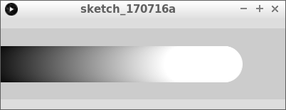
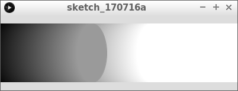
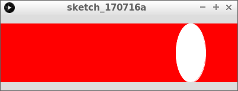
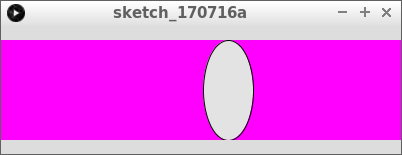
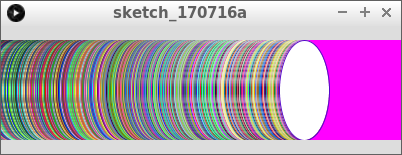

# `ellipse` en `background`

In deze les gaan we leren hoe je ovalen tekent.

Hier zie je een beroemde game, Bubble Bobble,
dat veel met cirkels werkt:


## Opdracht 1

Run deze code

```c++
float x = -50;
float snelheid = 1;

void setup()
{
  size(400, 100);
}

void draw()
{
  stroke(x, x, x);
  fill(x, x, x);
  ellipse(x, height / 2, 50, 50);
  x = x + snelheid;
  if (x > width + 50)
  {
    x = -50;
  }
}
```

\pagebreak

## Oplossing 1



## Opdracht 2



Verander het derde en vierde getal van `ellipse` (de `100`s), 
zodat de ovaal twee keer zo hoog wordt.

\pagebreak

## Oplossing 2

```c++
float x = -50;
float snelheid = 1;

void setup()
{
  size(400, 100);
}

void draw()
{
  stroke(x, x, x);
  fill(x, x, x);
  ellipse(x, height / 2, 50, 100);
  x = x + snelheid;
  if (x > width + 50)
  {
    x = -50;
  }
}
```

## Opdracht 3



Voeg als eerste regel van `draw` toe: 

```c++
background(255, 0, 0);
```

\pagebreak

## Oplossing 3

```c++
float x = -50;
float snelheid = 1;

void setup()
{
  size(400, 100);
}

void draw()
{
  background(255, 0, 0);
  stroke(x, x, x);
  fill(x, x, x);
  ellipse(x, height / 2, 50, 100);
  x = x + snelheid;
  if (x > width + 50)
  {
    x = -50;
  }
}
```

## Opdracht 4



Maak de achtergrond nu magenta.
Maak de rand van de cirkel zwart

\pagebreak

## Oplossing 4

```
float x = -50;
float snelheid = 1;

void setup()
{
  size(400, 100);
}

void draw()
{
  background(255, 0, 255);
  stroke(0, 0, 0);
  fill(x, x, x);
  ellipse(x, height / 2, 50, 100);
  x = x + snelheid;
  if (x > width + 50)
  {
    x = -50;
  }
}
```

## Opdracht 5

Zet de regel met `background` nu na `size` (binnen `setup`).

\pagebreak

## Oplossing 5


```c++
float x = -50;
float snelheid = 1;

void setup()
{
  size(400, 100);
  background(255, 0, 255);
}

void draw()
{
  stroke(0, 0, 0);
  fill(x, x, x);
  ellipse(x, height / 2, 50, 100);
  x = x + snelheid;
  if (x > width + 50)
  {
    x = -50;
  }
}
```

## Opdracht 6



Maak de lijnkleur van de ovaal een willekeurige kleur: de rood, groen en
blauw waarde moeten alledrie willekeurig zijn.

\pagebreak

## Oplossing 6

```c++
float x = -50;
float snelheid = 1;

void setup()
{
  size(400, 100);
  background(255, 0, 255);
}

void draw()
{
  stroke(random(256), random(256), random(256));
  fill(x, x, x);
  ellipse(x, height / 2, 50, 100);
  x = x + snelheid;
  if (x > width + 50)
  {
    x = -50;
  }
}
```

## Eindopdracht


Maak de ovaal rond, even hoog als het scherm, magenta, en met een rode rand. 
De achtergrond moet oranje zijn (oranje is vol rood, halfvol groen en geen blauw).
Er mag geen sliert komen van oude ovalen.
