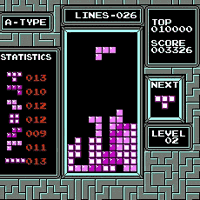

# fill

Een rechthoek of een ovaal kan ook ingekleurd worden.

Een van de beroemdste games ooit heeft bijvoorbeeld
veel ingekleurde vierkanten:



In deze les gaan we leren 

 * hoe we de invulkleur van vierkanten en ovalen instellen

Zo gaat het eruit zien:


Weet je nog niet hoe je een lijn een kleur kan geven?
Ga dan naar [stroke](../Stroke/README.md)

## Kleuren

De lampjes hebben de kleuren rood, groen en blauw.

Omdat de lampjes zo klein zijn, ziet ons oog van afstand de menging van deze drie lampjes.
Zo zien de lampjes rood en groen er samen uit als geel.
Hier zie je hoe de kleuren mengen:


Om wit te krijgen, heb je alledrie de kleuren nodig.

## Vragen

 * 1. Welke drie kleuren lampjes heeft een pixel?
 * 2. Met welke lampjes samen maak je geel?
 * 3. Met welke lampjes samen maak je cyaan/lichtblauw?
 * 4. Met welke lampjes samen maak je magenta/paars?
 * 5. Met welke lampjes samen maak je wit?
 * 6. Met welke lampjes samen maak je zwart?
 * 7. Met welke lampjes samen maak je grijs?
 * 8. Met welke lampjes samen maak je oranje?

## Antwoorden

 * 1. Rood, groen en blauw
 * 2. Rood en groen
 * 3. Groen en blauw
 * 4. Rood en blauw
 * 5. Rood en groen en blauw
 * 6. Met geen lampjes: als alle lampjes uit zijn, is het zwart
 * 7. Met rood en groen en blauw, maar dan moeten ze niet op hun hardst branden
 * 8. Met rood op z'n hardst en groen op halve kracht

## `background`

In Processing is er een functie om de achtergrond een kleur te geven.
Deze functie heet `background`.
`background` is Engels voor 'achtergrond'.
`background` is een functie die drie getallen nodig heeft.
Deze drie getallen bepalen hoe hard de rode, groene en blauwe lampjes gaan schijnen.
Deze drie getallen noemen we de RGB waarde.
Met het getal nul zeg je dat een lampje uit staat.
Met het getal 255 zeg je dat een lampje aan staat.
Met getallen tussen nul en 255 kun je het lampje ertussenin laten branden. 
 
Met deze Processing code krijg je een rode achtergrond:

```
void setup()
{
  size(100,100);
}

void draw()
{
  background(255,0,0);
}
```

## Opdracht

 * 1. Kopieer deze code in Processing en start de code
 * 2. Wat is een RGB waarde?
 * 3. Wat is de RGB waarde van groen? Maak in Processing een groene achtergrond
 * 4. Wat is de RGB waarde van blauw? Maak in Processing een blauwe achtergrond
 * 5. Wat is de RGB waarde van geel? Maak in Processing een gele achtergrond
 * 6. Wat is de RGB waarde van cyaan/lichtblauw? Maak in Processing een cyane/lichtblauwe achtergrond
 * 7. Wat is de RGB waarde van magenta/paars? Maak in Processing een magenta/paarse achtergrond
 * 8. Wat is de RGB waarde van wit? Maak in Processing een witte achtergrond
 * 9. Wat is de RGB waarde van zwart? Maak in Processing een zwart achtergrond
 * 10. Wat is de RGB waarde van grijs? Maak in Processing een grijze achtergrond
 * 11. Wat is de RGB waarde van donkerrood? Maak in Processing een donkerrode achtergrond
 * 12. Wat is de RGB waarde van oranje? Maak in Processing een oranje achtergrond

## Oplossingen

 * 1. OK
 * 2. De Rood-Groen-Blauw waarde. Dit zijn drie getallen van nul tot en met 255 die bepalen hoe hard de drie kleurenlampjes branden
 * 3. background(0,255,0)
 * 4. background(0,0,255)
 * 5. background(255,255,0)
 * 6. background(0,255,255)
 * 7. background(255,255,0)
 * 8. background(255,255,255)
 * 9. background(0,0,0)
 * 10. background(128,128,128), maar andere getallen tussen 0 en 255 zijn ook goed. Als ze maar alledrie gelijk zijn
 * 11. background(128,0,0), maar het eerste getal mag ook een ander getal tussen de 0 en 255 zijn
 * 12. background(255,128,0), maar het tweede getal mag ook een ander getal in de buurt van 128 zijn
