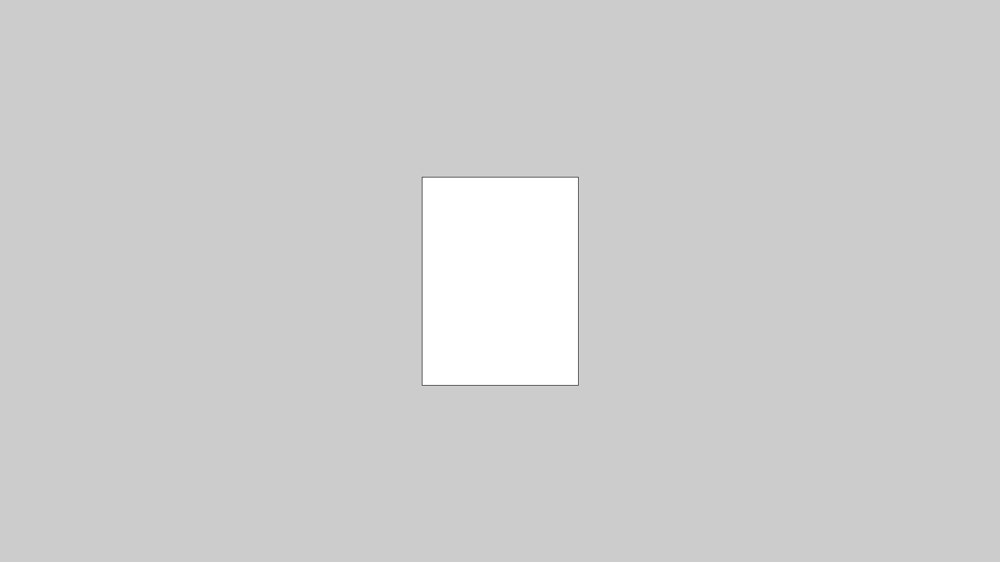

# `fullScreen`

`fullScreen` is een functie waarmee je het venster van je programma net zo groot maakt als het beeldscherm van je computer.

## Opdracht 1

Run deze code. Wat zie je?

```c++
void setup() 
{
  fullScreen();
}

void draw() 
{
  rect(100, 200, width / 4, height / 4);
}
```

 | 
:------------------------:|:---------------------------------------------------: 
`rect(100, 200, 300, 400)`|'Lieve computer, teken een rechthoek met `(100, 200)` als linkerbovenhoek, 300 pixels breed en 400 pixels hoog is.'
`width / 4`|'Lieve computer, vul hier het aantal pixels dat het scherm breed is, gedeeld door vier'
`height / 4`|'Lieve computer, vul hier het aantal pixels dat het scherm hoog is, gedeeld door vier'

## Oplossing 1


## Opdracht 2

Maak een rechthoek met de linkerbovenhoek in het midden, 
met een breedte van 200 en een hoogte van 100 pixels.


## Oplossing 2

```c++
void setup() 
{
  fullScreen();
}

void draw() 
{
  rect(width / 2, height / 2, 200, 100);
}
```

## Opdracht 3

Zet nu de rechthoek in het midden van het scherm. 


 | De rechthoek moet 100 naar links en 50 omhoog
:-------------:|:----------------------------------------: 

## Oplossing 3

```c++
void setup() 
{
  fullScreen();
}

void draw() 
{
  rect(width / 2 - 100, height / 2 - 50, 200, 100);
}
```

## Opdracht 4

Zet een rechthoek in het midden van het scherm, met een breedte van 300 pixels
en een hoogte van 400 pixels.



## Oplossing 4

```c++
void setup() 
{
  fullScreen();
}

void draw() 
{
  rect(width / 2 - 150, height / 2 - 200, 300, 400);
}
```

## Opdracht 5

Zet een rechthoek in het midden van het scherm, die half zo breed is als het scherm,
en 500 pixels hoog is.


## Oplossing 5

```c++
void setup() 
{
  fullScreen();
}

void draw() 
{
  rect(width / 4, height / 2 - 250, width / 2, 500);
}
```

## Eindopdracht

Zet een rechthoek in het midden van het scherm, die half zo breed en hoog is als het scherm.

