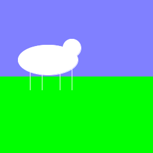

# Functies les 2: Argumenten

**Als je nog niet weet wat functies zijn, doe dan eerst [deze les](../FunctiesTekening/README.md)**

In deze les gaan we kijken hoe een functie met argumenten werkt. Dat doen we door een schaap te tekenen.

We beginnen met deze code:

```
void setup() {
  size(256, 256);
}

void draw() {
    //Teken lucht
    background(128, 128, 255);
    //Teken grond
    fill(0, 255, 0);
    noStroke();
    rect(0, 128, 256, 128);
    //Teken schaap
    stroke(255);
    line(50, 100, 50, 150);
    line(70, 100, 70, 150);
    line(100, 100, 100, 150);
    line(120, 100, 120, 150);
    fill(255);
    ellipse(80, 100, 100, 50);
    ellipse(120, 80, 30, 30);
}
```

Deze code tekent dit:



Stel dat ik de kleur van het schaap wil veranderen in grijs of zwart. Dat kan natuurlijk door elke keer de regels `stroke(255)` en `fill(255)` te veranderen, maar we kunnen het ook met een functie doen.

Eerst gaan we het schaap tekenen in de functie `void tekenSchaap()` die er zo uit ziet.

```
void tekenSchaap() {
  //Teken schaap
  stroke(255);
  line(50, 100, 50, 150);
  line(70, 100, 70, 150);
  line(100, 100, 100, 150);
  line(120, 100, 120, 150);
  fill(255);
  ellipse(80, 100, 100, 50);
  ellipse(120, 80, 30, 30);
}
```

Onze `void draw()` ziet er nu zo uit:
```
void draw() {
    //Teken lucht
    background(128, 128, 255);
    //Teken grond
    fill(0, 255, 0);
    noStroke();
    rect(0, 128, 256, 128);
    //Teken schaap
    tekenSchaap();
}
```
