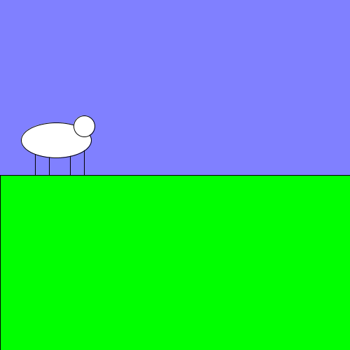
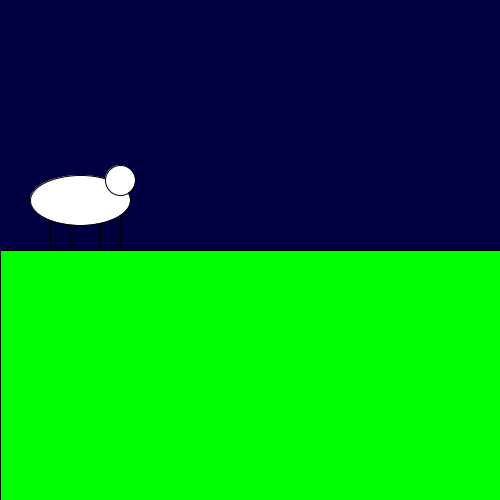

# Functies les 1: Tekening
In deze les gaan we leren wat een functie is en waarom het handig is om functies te gebruiken. We doen dat met een mooie tekening van een schaap, bij dag of nacht.

</img> of
</img>

## Code
Dit is de code voor de tekening, als je de muis indrukt wordt het dag.

```
void setup() {
  size(500, 500);
}

void draw() {
  if (mousePressed) {
    //Dag
    background(128, 128, 255);
    //Teken grond
    fill(0, 255, 0);
    rect(0, 250, 500, 250);
    //Teken schaap
    line(50, 200, 50, 250);
    line(70, 200, 70, 250);
    line(100, 200, 100, 250);
    line(120, 200, 120, 250);
    fill(255);
    ellipse(80, 200, 100, 50);
    ellipse(120, 180, 30, 30);
  } else {
    //Nacht
    background(0, 0, 64);
    //Teken grond
    fill(0, 255, 0);
    rect(0, 250, 500, 250);
    //Teken schaap
    line(50, 200, 50, 250);
    line(70, 200, 70, 250);
    line(100, 200, 100, 250);
    line(120, 200, 120, 250);
    fill(255);
    ellipse(80, 200, 100, 50);
    ellipse(120, 180, 30, 30);
  }
}
```

Je ziet dat een groot gedeelte van de code er twee keer staat. Dat is het stukje met de grond en het schaap.

Dit stukje dus:

```
//Teken grond
fill(0, 255, 0);
rect(0, 250, 500, 250);
//Teken schaap
line(50, 200, 50, 250);
line(70, 200, 70, 250);
line(100, 200, 100, 250);
line(120, 200, 120, 250);
fill(255);
ellipse(80, 200, 100, 50);
ellipse(120, 180, 30, 30);
```

## Functies
We kunnen bij deze code goed een functie gebruiken. Een functie kan er zo uit zien:

```
void naamVanDeFunctie(){
  //doe iets
}
```

* `void` betekent dat deze functie niets terug geeft
* `naamVanDeFunctie` is naam van de functie
* `()` tussen deze haakjes kan je argumenten zetten, dat doen we nu niet. Deze functie heeft dus geen argumenten!
* `//doe iets` hier kan je zetten wat de functie moet doen, deze code wordt uitgevoerd elke keer als de functie aangeroepen wordt

Om onze tekening code korter te maken kunnen we deze functie maken:

```
void tekenGrondEnSchaap(){
  //Teken grond
  fill(0, 255, 0);
  rect(0, 250, 500, 250);
  //Teken schaap
  line(50, 200, 50, 250);
  line(70, 200, 70, 250);
  line(100, 200, 100, 250);
  line(120, 200, 120, 250);
  fill(255);
  ellipse(80, 200, 100, 50);
  ellipse(120, 180, 30, 30);
}
```

De code wordt dan:

```
void setup() {
  size(500, 500);
}

void draw() {
  if (mousePressed) {
    //Dag
    background(128, 128, 255);
    tekenGrondEnSchaap();
  } else {
    //Nacht
    background(0, 0, 64);
    tekenGrondEnSchaap();
  }
}

void tekenGrondEnSchaap() {
  //Teken grond
  fill(0, 255, 0);
  rect(0, 250, 500, 250);
  //Teken schaap
  line(50, 200, 50, 250);
  line(70, 200, 70, 250);
  line(100, 200, 100, 250);
  line(120, 200, 120, 250);
  fill(255);
  ellipse(80, 200, 100, 50);
  ellipse(120, 180, 30, 30);
}
```

Je kan zien dat we de functie `tekenGrondEnSchaap` aanroepen met de regel `tekenGrondEnSchaap();`

Omdat we een functie gebruiken is onze code een stuk korter geworden. Ook is de code een stuk overzichtelijker en leesbaarder geworden, het lijkt bijna Nederlands!

##Opdrachten
1. Kopieer de code en deel de functie 'tekenGrondEnSchaap' op in twee functies; 'tekenGrond' en 'tekenSchaap'
2. Teken een zon als het dag is
3. Teken een maan als het nacht is
4. Maak nu de functies 'tekenDag' en 'tekenNacht' en zorg dat je de kleur van de lucht en de zon of maan in die functies tekent
5. Check of 'void draw' er nu zo uit ziet:
  
```
  void draw() {
    if (mousePressed) {
      //Dag
      tekenDag()
      tekenGrond();
      tekenSchaap();
    } else {
      //Nacht
      tekenNacht();
      tekenGrond()
      tekenSchaap();
    }
  }
```
