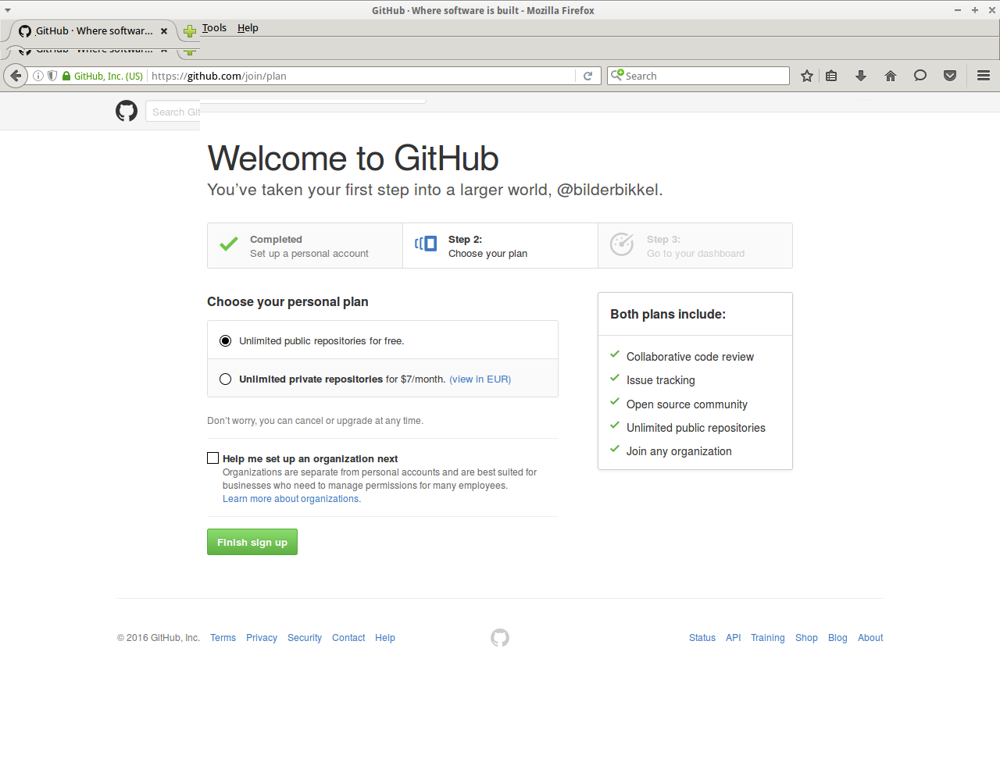
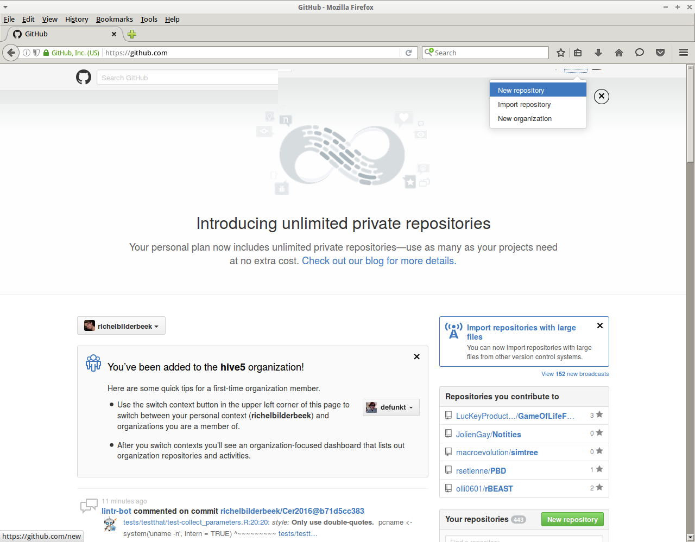

# GitHub

GitHub is een site waar programmeurs samen aan programma's werken.
Dit doen ze, omdat ze dan nooit meer hun code kwijtraken.

Wij gaan vandaag GitHub gebruiken om:

 * Nooit meer code kwijt te raken
 * Altijd bij onze code te kunnen

Wij gaan later GitHub gebruiken om:

 * Samen te kunnen werken
 * Onze games online to kunnen zetten

# :exclamation: Waarschuwing :exclamation:

GitHub is openbaar. Iedereen kan zien wat je doet. Doe dus alleen slimme dingen op GitHub:

 * Blijf altijd vriendelijk
 * Blijf altijd netjes
 * Grappen zijn prima, maar nooit als iemand zich beledigd voelt

## GitHub aanmaken

In deze les maken we een GitHub account en gaan we onze code er op zetten.

### Ga naar GitHub

 * Start een webbrowser, zoals Firefox, Chromium, Chrome, Edge, Internet Explorer, Opera
 * Ga naar `www.github.com`

Je komt nu op de GitHub homepage:

GitHub homepage](GitHubHomepage.png)

De kat heet Octocat en is de mascotte van GitHub.

### Maak jezelf lid

 * Klik op `Sign Up` (NL: `Inschrijven`)

Vul hier je gegevens in:

 * `Username`: je gebruikersnaam. Kies geen gebruikersnaam waar je later spijt van gaat krijgen
 * `Email address`: je emailadres. Dit moet je echte emailadres zijn
 * `Password`: je wachtwoord. Deze moet een cijfer bevatten, bijvoorbeeld `iloverichel4ever` is een goede

 * Klik `Create an account` om een account aan te maken.

### Kies je account

In het volgende scherm moet je je soort account kiezen.

Wij gebruiken gewoon een gratis account

 * Klik `Finish sign up` en je hebt een GitHub account!

## Vrienden maken

Nu je een account hebt, kun je vrienden maken

 * Ga naar `https://github.com/richelbilderbeek` en klik op `Follow` om Richel te volgen
 * Ga naar `https://github.com/thijsvb` en klik op `Follow` om Thijs te volgen
 * Ga naar `https://github.com/LJK1991` en klik op `Follow` om Lucas te volgen
 * Ga naar `https://github.com/Modanung` en klik op `Follow` om Frode te volgen

## Bevestig je emailadres

 * Ga naar je email toe
 * Open het mailtje van GitHub
 * Klik op `Confirm` om te bevestigen dat je een GitHub account hebt

## Een eigen GitHub website aanmaken

:exclamation: Dit kan alleen als je je emailadres bevestigd hebt

### Maak een nieuwe GitHub website

In bijna elk scherm, is er een kruis rechts bovenaan:

 * Klik op `Create New Repository` om een nieuwe GitHub webpagina aan te maken

### Stel de nieuwe GitHub website in

Vul hier in:

 * `Repository name`: de naam van je GitHub website, bijvoorbeeld `Mijncraft`
 * `Description`: omschrijving van je GitHub website, bijvoorbeeld `Minecraft-achtig spel, gemaakt in Processing`
 * Kies `Public`
 * Vink aan: `Initialize this repository with a README`
 * Kies bij `Add .gitignore`: `Processing`
 * Kies bij `Add a license`: `GNU General Public License v3.0`

Nu heb je je eigen GitHub website!

### Zet dingen op je eigen GitHub website

Op je eigen GitHub website kun je veel dingen doen.

 * Klik op `Upload file` om een bestand op de website te zetten. Zet een mooi plaatje op de website.

Het bestand `README.md` bevat de welkomsttekst van je website. Dit gaan we aanpassen.

 * Klik op het woord `README.md`

 * Klik op het potloodje met de tekst `Edit this file`

 * Zet hier iets leuks. Je kunt ook je plaatje laten zien, met bijvoorbeeld ``
 * Zet je code op GitHub

