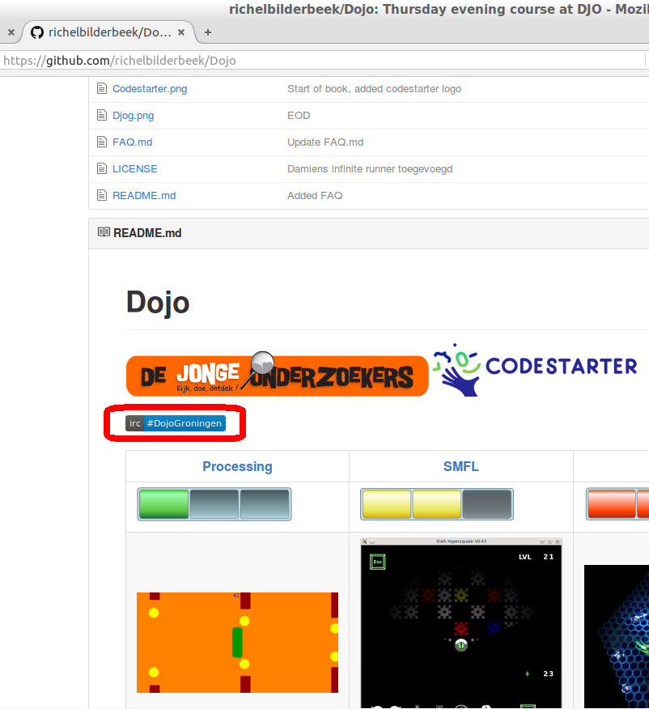
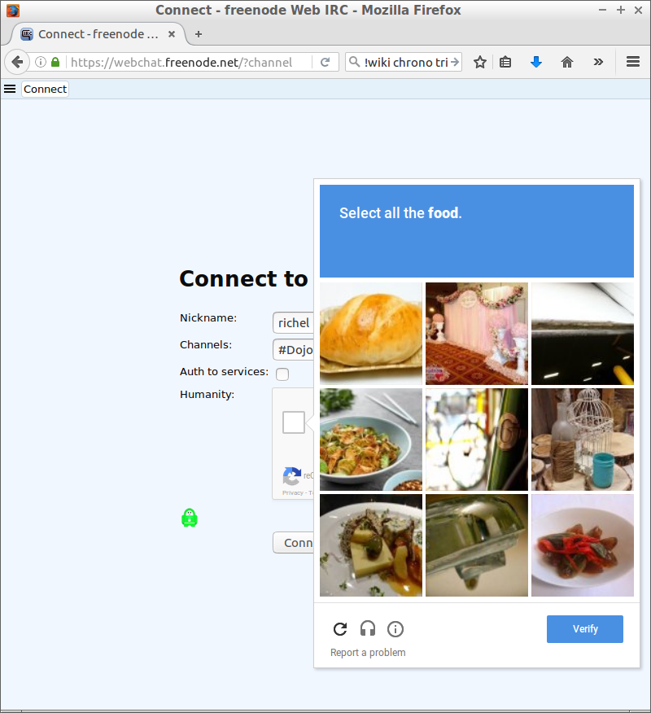
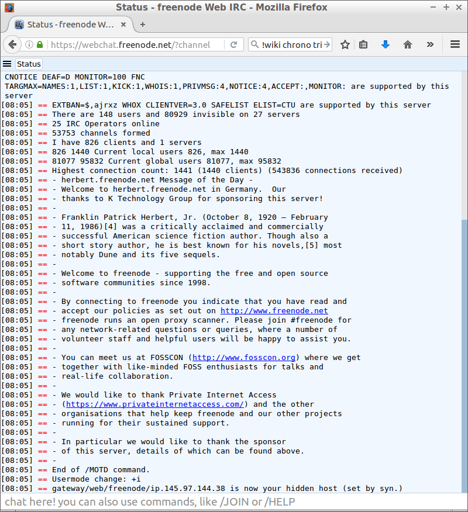
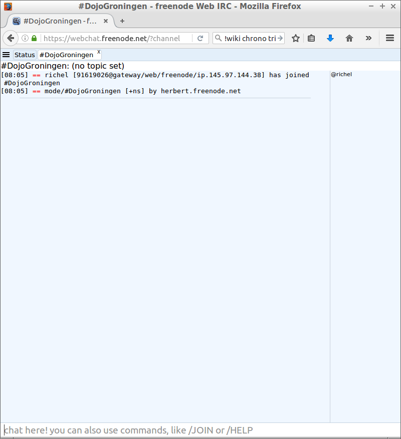
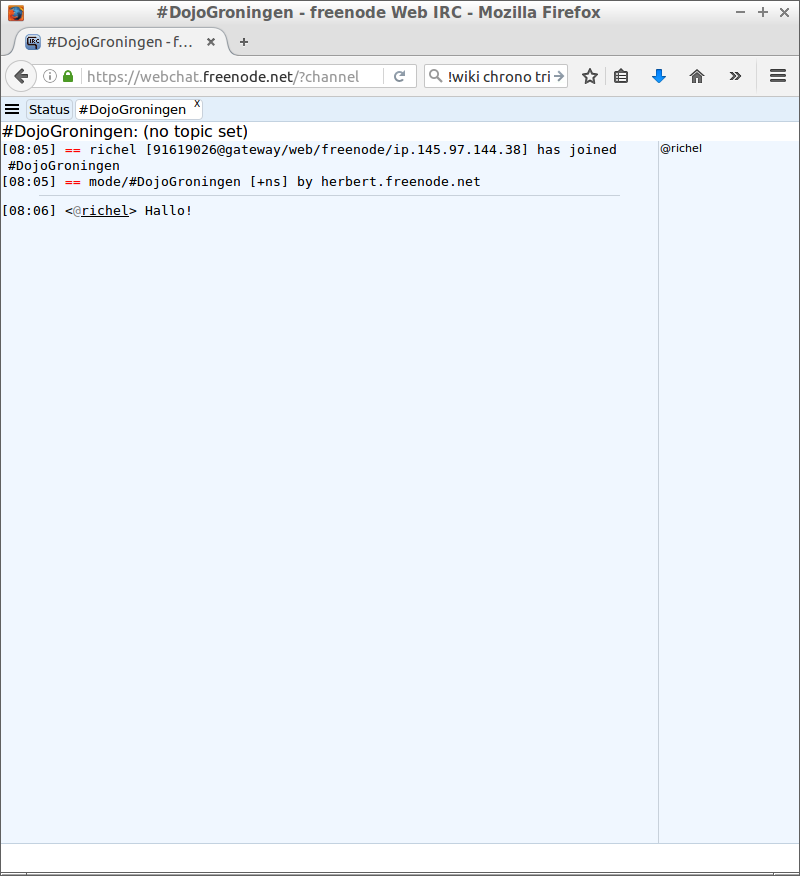

# GitHub chat

In deze les gaan we de chatroom van de cursus in.

## Wat is een chatroom?

Er zijn meer soorten chatrooms. 
In deze les gebruiken we een IRC chatroom.
IRC bestaat sinds 1986 en wordt nog veel gebruikt. 
Elke hackerspace heeft wel een eigen IRC chatroom (dit noemen we ook een 'IRC kanaal'). 
Een IRC chatroom is net een echt gesprek met een groepje mensen: je weet niet wat er is gezegd voordat je met ze sprak, en je weet niet wat ze zeggen als je weer weggaat.
Er zijn wel IRC chatrooms die wel de gesprekken bewaren.

## Gedragsregels

Een paar van [https://wiki.debian.org/IRC/Netiquette](https://wiki.debian.org/IRC/Netiquette):

 * Wees behulpzaam
 * Praat over het thema, in ons geval programmeren
 * Probeer mee te doen met het gesprek, inplaats van nieuwe gesprekken te starten
 * Stel jezelf voor als je mee doet in een gesprek en nieuw bent
 * 'Don't feed the trolls'. Help de mensen die de sfeer verpesten niet hierbij: blijf altijd vriendelijk 
 * Heb plezier

## Website

Ga naar de GitHub van de cursus, [https://github.com/richelbilderbeek/Dojo](https://github.com/richelbilderbeek/Dojo). Klik op `irc: #dojoGroningen`

## IRC inloggen

 * Vul bij `Nickname` je bijnaam in
 * Klik op `I am not a robot`

Some krijg je een vraag, zoals hier:

Beantwoord de vraag.

Klik dan op `Connect`

## IRC server login

Eerst komt er een scherm met veel tekst: 

Wacht tot dit scherm voorbij is

## IRC chatroom

Je komt nu in de chatroom:

Rechts kun je een lijst zien van iedereen die in deze kamer aanwezig is.

Onderin kun je je tekst typen:

De tekst verschijnt bij iedereen meteen op hun scherm.
