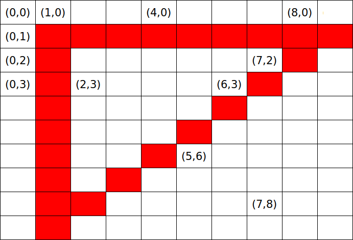
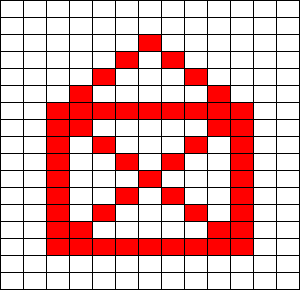

# Line

Zonder lijnen kun je bijna geen games maken.
Een van de allereerste successgames, Asteroids,
bestond vooral uit lijnen:


Je kunt een lijn tekenen met een boel puntjes,
maar de `line` functie werkt gemakkelijker.

In deze les gaan we leren 

 * hoe je lijnen tekent

Kun je nog geen puntjes tekenen? Ga dan 
[naar de les waarin je puntjes leert tekenen](../Point/README.md)

## Lijnen

Een lijn bestaat uit pixels.
Om een lijn te tekenen, 
moet je een beginpixel en eindpixel kiezen.
Processing tekent dan zelf de pixels ertussenin.

## Een lijn tekenen

Op het plaatje staat een lijn die van (1,2) naar (3,0) gaat:


In Processing programmer je dat zo:

```c++
void setup()
{
  size(5,4);
}

void draw()
{
  line(1,2,3,0);
}
```

## Opdracht 

 1. Type de code over. Kun je de lijn zien?
 2. Laat de lijn nu gaan van (1,2) naar (3,2). Wat zie je?
 3. Draai de eerste lijn nu om: van (3,0) naar (1,2). Wat zie je?

## Oplossing

 1. De lijn kun je wel zien. Hij is dikker dan drie puntjes
 2. De lijn moet worden getekent met `line(1,2,3,2)`. De lijn is nu wel mooi dun
 3. De lijn moet worden getekent met `line(3,0,1,2)`. De lijn is weer dik


## Een kruis tekenen

Op het plaatje staat een kruis:


In Processing programmer je dat zo *ongeveer* zo:

```c++
void setup()
{
  size(30,20);
}

void draw()
{
  line(0,4,20,4);
  line(4,1,3,8);
}
```

## Opdracht 

 1. Type de code over. Welke `line` tekent het liggende streepje? Welke `line` tekent het neergaande streepje?
 2. Maak het kruis mooi. Maak het scherm net zo groot als op het plaatje

## Oplossing

 1. De eerste lijn is het liggende streepje. 
 2. 

```c++
void setup()
{
  size(8,9);
}

void draw()
{
  line(0,4,6,4);
  line(3,1,3,7);
}
```

## Een driehoek tekenen

Lijnen kunnen ook samen vorm worden.

Plaatje `Een driehoek` laat een driehoek zien:



De driehoek heeft drie hoeken met drie coordinaten.

## Opdrachten

 1. Wat zijn de drie coordinaten van de punten van de driehoek?
 2. Teken de driehoek na. Maak het scherm de juiste grootte


## Oplossing

 1. (1,1), (9,1) en (1,9)
 2. Hier de code:


```c++
void setup()
{
  size(8,9);
}

void draw()
{
  line(1,1,9,1);
  line(1,1,1,9);
  line(1,9,9,1);
}
```

## Eindopdracht
 


Hierboven staat een tekening van een huisje. 
Maak deze tekening na in Processing. Je hebt acht lijnen nodig!
Hij wordt niet zo mooi als op het plaatje, omdat de schuine lijnen niet mooi zijn.


