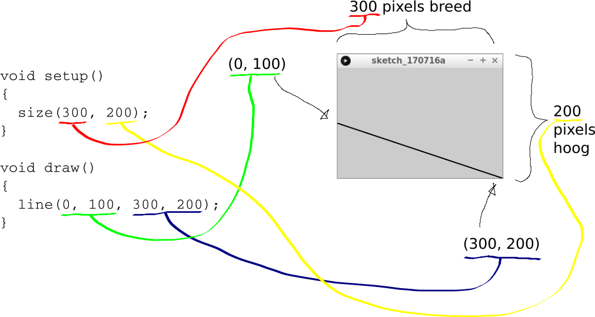
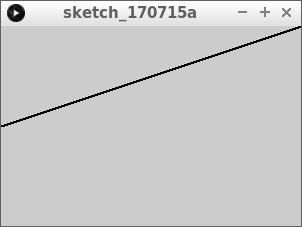
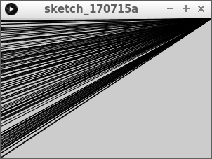
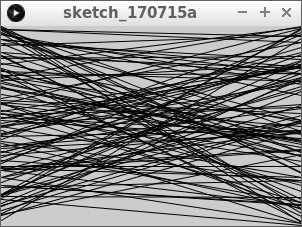
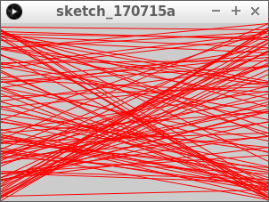
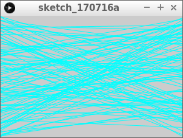
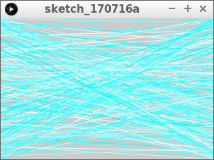

# `line` en `stroke`


In deze les gaan we leren hoe je gekleurde lijnen tekent.

## Opdracht 1

Run deze code:

```c++
void setup()
{
  size(300, 200);
}

void draw()
{
  line(0, 100, 300, 200);
}
```

 | 
:----------------:|:----------------------------------------: 
`line(0, 100, 300, 200);`|'Lieve computer, teken een lijn van `(0, 100)` naar `(300, 200)`.'

 | `(100, 200)` is de pixel die 100 pixels naar links en 200 pixels onder de linkerbovenhoek van het scherm zit 
:-------------:|:----------------------------------------: 

## Oplossing 1



## Opdracht 2



Laat de lijn niet naar de rechteronderhoek, maar naar de rechterbovenhoek gaan.

## Oplossing 2

```c++
void setup()
{
  size(300, 200);
}

void draw()
{
  line(0, 100, 300, 0);
}
```

## Opdracht 3

Laat de lijn niet links in het midden, maar linksonder beginnen


## Oplossing 3

```c++
void setup()
{
  size(300, 200);
}

void draw()
{
  line(0, 200, 300, 0);
}
```

## Opdracht 4

Laat de lijn van linksonder naar rechtsboven gaan, maar gebruik nu `width` en `height`

## Oplossing 4

```c++
void setup()
{
  size(300, 200);
}

void draw()
{
  line(0, height, width, 0);
}
```

## Opdracht 5



Laat de lijn links op een willekeurige hoogte beginnen. Dit doe je met `random`

## Oplossing 5

```c++
void setup()
{
  size(300, 200);
}

void draw()
{
  line(0, random(height), width, 0);
}
```

## Opdracht 6



Laat de lijn nu ook rechts op een willekeurige hoogte eindigen.

## Oplossing 6

```c++
void setup()
{
  size(300, 200);
}

void draw()
{
  line(0, random(height), width, random(height));
}
```

## Opdracht 7



Zet voor `line` de regel `stroke(255, 0, 0);`

## Oplossing

```c++
void setup()
{
  size(300, 200);
}

void draw()
{
  stroke(255, 0, 0);
  line(0, random(height), width, random(height));
}
```

 | 
:----------------:|:----------------------------------------: 
`stroke(255, 0, 0);`|'Lieve computer, geef de lijnen de kleur rood.'
`stroke(255, 0, 0);`|'Lieve computer, geef de lijnen de kleur vol rood, zonder groen en zonder blauw.'

## Opdracht 8




Maak de lijnen nu cyaan. Kijk naar figuur `Kleurencirkel` hoe je die maakt

## Oplossing

```c++
void setup()
{
  size(300, 200);
}

void draw()
{
  stroke(0, 255, 255);
  line(0, random(height), width, random(height));
}
```

 | 
:----------------:|:----------------------------------------: 
`stroke(0, 255, 255);`|'Lieve computer, geef de lijnen de kleur cyaan.'
`stroke(0, 255, 255);`|'Lieve computer, geef de lijnen de kleur zonder rood, vol groen en vol blauw.'


## Opdracht 9



Laat nu de roodwaarde een willeukeurig getal van 0 tot 256 worden.


## Oplossing 9

```c++
void setup()
{
  size(300, 200);
}

void draw()
{
  stroke(random(256), 255, 255);
  line(0, random(height), width, random(height));
}
```

## Eindopdracht


Laat de lijnen nu op willekeurige plekken beginnen en eindigen. De lijnkleur moet
ook willekeurig zijn.
