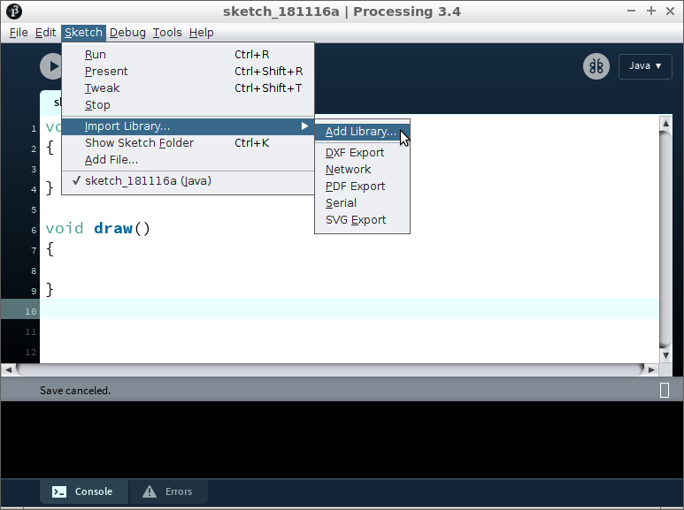
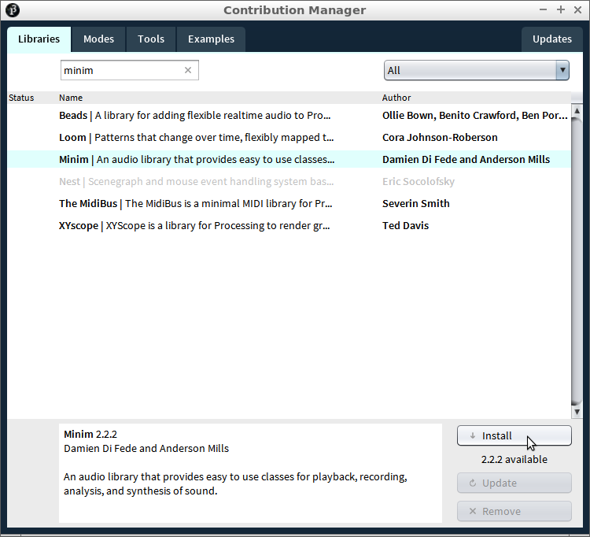
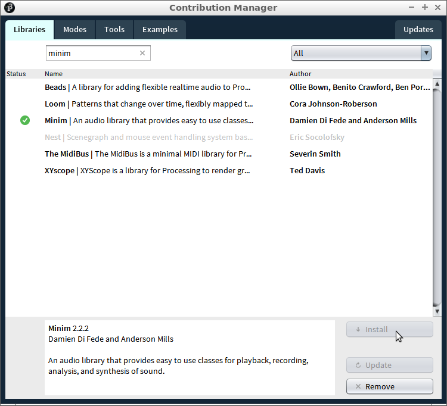

# Minim 0: Minim installeren

In deze les gaan we Minim installeren.
Met Minim kun je muziek afspelen.

\pagebreak

## installeren

  1. In Processing, klik op 'Sketch | Import Library | Add Library'
 


 | 
:-------------:|:----------------------------------------: 
Library|Bibliotheek
Import|Ophalen
Add|Doe erbij

\pagebreak

  2. Zoek op 'Minim', selecteer Minim, en klik 'Install'



\pagebreak

  3. Minim is geinstalleerd!



\pagebreak

  4. Run deze code:

```c++
import ddf.minim.*;

Minim minim;

void setup()
{
  minim = new Minim(this);
}

void draw()
{
  fill(0, 0, 0);
  text("Gelukt!", 10, 20);
}
```

Als de code runt, is het je gelukt!


