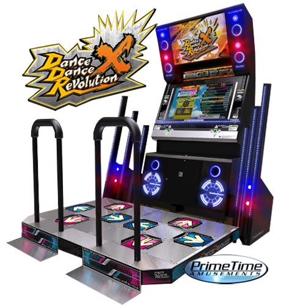
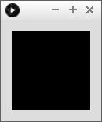
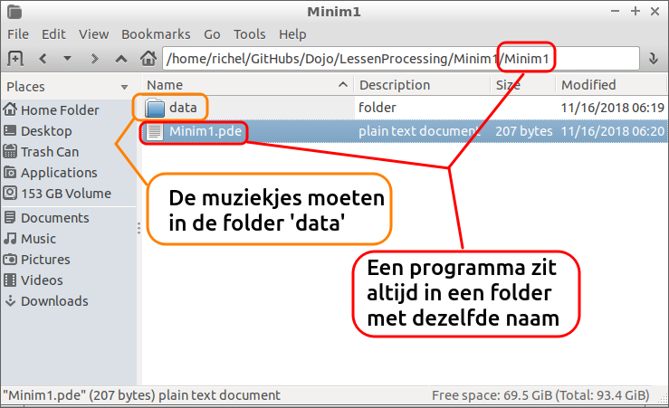

# Minim 1: achtergrondmuziek

In deze les gaan we met Minim een muziekje laten afspelen!



\pagebreak

## Minim 1: opdracht 1

Save deze code. Run deze code. Wat zie je?
   
```c++
import ddf.minim.*;
Minim minim;
AudioPlayer player;

void setup()
{
  minim = new Minim(this);
  player = minim.loadFile("mijn_muziekje.mp3");
  player.play();
}

void draw()
{
  text("Gelukt!", 10, 20);
}
```

\pagebreak

## Minim 1: oplossing 1

Je krijgt een error!



 | De computer zegt dat hij het muziek niet kan vinden!
:-------------:|:----------------------------------------: 

\pagebreak

## Minim 1: opdracht 2

Download een MP3 van internet, bijvoorbeeld op [https://github.com/richelbilderbeek/Dojo/blob/master/LessenProcessing/Minim1/mijn_muziekje.mp3](https://github.com/richelbilderbeek/Dojo/blob/master/LessenProcessing/Minim1/mijn_muziekje.mp3).

Stop dit bestand in een subfolder van waar je code staat, met de naam `data`.

Hier zie je een plaatje waarop staat waar de bestanden moeten staan:



 * De sketch heet `Minim1.pde`. Daarom staat deze in de map `Minim1`
 * De sketch heeft een folder `data`. Hierin staat het plaatje, `mijn_muziekje.mp3`

Zet de bestanden op de goede plek en run het programma. 

\pagebreak

## Minim 1: opdracht 2

Laat de muziek opnieuw afspelen als je op 'r' (van 'Rewind') drukt.

## Minim 1: oplossing 2

```c++
//...

void draw()
{
  if (keyPressed)
  {
    if (key == 'r') 
    {
      player.rewind();
    }
  }
}
```

## Minim 1: opdracht 3

Laat de muziek pauzeren als je op 'p' (van 'Pauze') drukt.

```c++
//...

void draw()
{
  //...
  if (keyPressed)
  {
    // ...
    if (key == 'p') 
    {
      player.pause();
    } 
  }
}
```

## Minim 1: eindopdracht 3

 * Bij het opstarten, mag er geen muziek spelen
 * Laat de muziek starten als je op 's' (van 'Start') drukt
