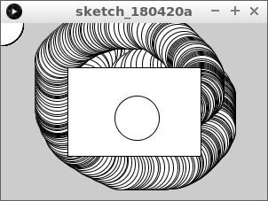
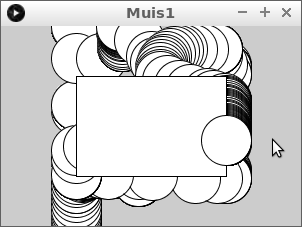
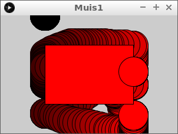
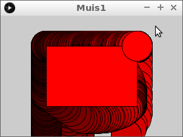
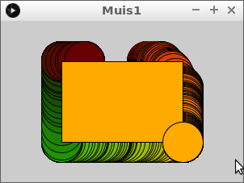

# Muis positie

De muis kun je gebruiken om een spel te besturen.

```
Plaatje van Terminator 2 the arcade game rail shooter
```

## Intro

Type deze code over en kijk wat er gebeurt:

```c++
void setup()
{
  size(300, 200);
}

void draw() 
{
  rect(width / 4, height / 4, width / 2, height / 2);
  ellipse(mouseX, mouseY, 50, 50);
}
```



## Opdracht 1

Zorg ervoor dat de cirkel, ook al is de muis helemaal links, toch
met het midden in de rechthoek blijft.

Tips:

 * Je hebt een variabele nodig. Noem deze `x` of iets originelers
 * Je hebt een `if` statement nodig
 * In woorden: geef `x` de waarde van `mouseX`. Als `x` te klein is, zet deze dan op het laagste


   
## Oplossing

```c++
float x = 0;

void setup()
{
  size(300, 200);
  x = width / 2;
}

void draw() 
{
  rect(width / 4, height / 4, width / 2, height / 2);
  x = mouseX;
  if (x < width / 4) x = width / 4;
  ellipse(x, mouseY, 50, 50);
}
```

## Opdracht 2

Zorg ervoor dat de cirkel, ook al is de muis helemaal rechts, toch
met het midden in de rechthoek blijft.

Tips:

 * De rechterkant van de rechthoek zit op `width * 3 / 4`


   
## Oplossing 2

```c++
float x = 0;

void setup()
{
  size(300, 200);
  x = width / 2;
}

void draw() 
{
  rect(width / 4, height / 4, width / 2, height / 2);
  x = mouseX;
  if (x < width * 1 / 4) x = width * 1 / 4;
  if (x > width * 3 / 4) x = width * 3 / 4;
  ellipse(x, mouseY, 50, 50);
}
```

## Opdracht 3

Zorg dat de `fill` een roodwaarde krijgt van `mouseX`. De
groen en blauwwaarden blijven nul.


   
## Oplossing 3

```c++
float x = 0;

void setup()
{
  size(300, 200);
  x = width / 2;
}

void draw() 
{
  fill(mouseX, 0, 0);
  rect(width / 4, height / 4, width / 2, height / 2);
  x = mouseX;
  if (x < width * 1 / 4) x = width * 1 / 4;
  if (x > width * 3 / 4) x = width * 3 / 4;
  ellipse(x, mouseY, 50, 50);
}
```

## Opdracht 4

Zorg ervoor dat de cirkel, ook al is de muis helemaal boven, toch
met het midden in de rechthoek blijft.

Tips:

 * Je hebt een variabele nodig. Noem deze `y` of iets originelers
 * Je hebt een `if` statement nodig
 * In woorden: geef `y` de waarde van `mouseY`. Als `y` te klein is, zet deze dan op het laagste




## Eindopdracht



 * Zorg ervoor dat de cirkel, ook al is de muis helemaal onder, toch
   met het midden in de rechthoek blijft.
 * Zorg dat de `fill` een roodwaarde krijgt van `mouseX`
   en een groenwaarde van `mouseY`. De
   blauwwaarde blijft nul.
