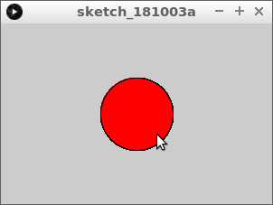

# Muis binnen cirkel

In deze les gaan we leren hoe je kunt kijken of de muiscursor binnen een cirkel valt

\pagebreak

## Muis binnen cirkel: opdracht 1

Type deze code over:

```c++
void setup()
{
  size(300, 200);
}

void draw()
{
  fill(255, 255, 255);
  if (dist(mouseX, mouseY, 150, 100) < 40)
  {
    fill(255, 0, 0);  
  }
  ellipse(150, 100, 80, 80);  
}
```

Wat zie je? Wanneer wordt de cirkel rood?

\pagebreak

## Muis binnen cirkel: oplossing 1

De cirkel wordt rood als je de muiscursor 
in de cirkel beweegt.



\pagebreak

## Muis binnen cirkel: opdracht 2

Maak een variabele aan (bovenaan): `float cirkel_midden_x = 150;`.
Vervang de andere `150`-en in de code door `cirkel_midden_x`.

\pagebreak

## Muis binnen cirkel: oplossing 2

```c++
float cirkel_midden_x = 150;

void setup()
{
  size(300, 200);
}

void draw()
{
  fill(255, 255, 255);
  if (dist(mouseX, mouseY, cirkel_midden_x, 100) < 40)
  {
    fill(255, 0, 0);  
  }
  ellipse(cirkel_midden_x, 100, 80, 80);  
}
```

\pagebreak

## Muis binnen cirkel: opdracht 3

Voeg de volgende regel toe aan de `setup` functie:

```c++
cirkel_midden_x = random(width);
```

Wat zie je? Start het programma meerdere keren!

\pagebreak

## Muis binnen cirkel: oplossing 3

```c++
float cirkel_midden_x = 150;

void setup()
{
  size(300, 200);
  cirkel_midden_x = random(width);
}

void draw()
{
  fill(255, 255, 255);
  if (dist(mouseX, mouseY, cirkel_midden_x, 100) < 40)
  {
    fill(255, 0, 0);  
  }
  ellipse(cirkel_midden_x, 100, 80, 80);  
}
```

\pagebreak

## Muis binnen cirkel: opdracht 4

Maak een nieuwe variabele aan: `cirkel_midden_y`. 
In `setup` krijgt deze een willekeurig getal tot `height`.
`cirkel_midden_y` vervangt de `100`s.

## Muis binnen cirkel: oplossing 4

```c++
float cirkel_midden_x = 150;
float cirkel_midden_y = 100;

void setup()
{
  size(300, 200);
  cirkel_midden_x = random(width);
  cirkel_midden_y = random(height);
}

void draw()
{
  fill(255, 255, 255);
  if (dist(mouseX, mouseY, cirkel_midden_x, cirkel_midden_y) < 40)
  {
    fill(255, 0, 0);  
  }
  ellipse(cirkel_midden_x, cirkel_midden_y, 80, 80);  
}
```

\pagebreak

## Muis binnen cirkel: opdracht 5

Maak een nieuwe variabele aan: `cirkel_doorsnede`. 
In `setup` krijgt deze een willekeurig getal tot `150`.
`cirkel_doorsnede` vervangt de `80`s.

Wat gaat er mis?

## Muis binnen cirkel: oplossing 5

```c++
float cirkel_midden_x = 150;
float cirkel_midden_y = 100;
float cirkel_doorsnede = 100;

void setup()
{
  size(300, 200);
  cirkel_midden_x = random(width);
  cirkel_midden_y = random(height);
  cirkel_doorsnede = random(150);
}

void draw()
{
  fill(255, 255, 255);
  if (dist(mouseX, mouseY, cirkel_midden_x, cirkel_midden_y) < 40)
  {
    fill(255, 0, 0);  
  }
  ellipse(cirkel_midden_x, cirkel_midden_y, cirkel_doorsnede, cirkel_doorsnede);  
}
```

\pagebreak

## Muis binnen cirkel: eindopdracht

Maak een nieuwe variabele aan: `cirkel_straal`. 
In `setup` wordt deze `cirkel_doorsnede / 2`.
`cirkel_straal` vervangt de `40`s.
