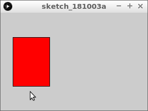
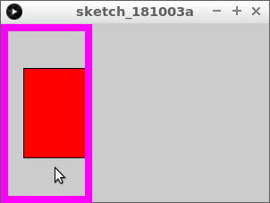

# Muis binnen vierkant

In deze les gaan we leren hoe je kunt kijken of de muiscursor binnen een vierkant valt

\pagebreak

## Muis binnen vierkant: opdracht 1

Type deze code over:

```c++
void setup()
{
  size(300, 200);
}

void draw()
{
  fill(255, 255, 255);
  if (mouseX > 25)
  {
    fill(255, 0, 0);  
  }
  rect(25, 50, 75, 100);  
}
```

Wat zie je? Wanneer wordt het vierkant rood?

\pagebreak

## Muis binnen vierkant: oplossing 1

Het vierkant wordt rood als je de muiscursor 
meer dan 25 pixels naar rechts beweegt.



\pagebreak

## Muis binnen vierkant: opdracht 2

Verander de code zo dat het vierkant rood wordt als je met de muis
links bent van de rechterkant van het vierkant.



 | 
:-------------:|:----------------------------------------: 
`if (x < 200) { }`|'Lieve computer, als `x` kleiner is dan 200, doe dan wat tussen accolades staat.'

\pagebreak

## Muis binnen vierkant: oplossing 2

```c++
void setup()
{
  size(300, 200);
}

void draw()
{
  fill(255, 255, 255);
  if (mouseX < 100)
  {
    fill(255, 0, 0);  
  }
  rect(25, 50, 75, 100);  
}
```

## Muis binnen vierkant: opdracht 3

We gaan nu de `if` statements combineren!

Vervang de `if` die je nu hebt door dit:

```c++
  if (mouseX > 25 && mouseX < 100)
  {
    fill(255, 0, 0);  
  }
```

 | De `&&` lees je als 'en'
:-------------:|:----------------------------------------: 

\pagebreak

## Muis binnen vierkant: oplossing 3

```c++
void setup()
{
  size(300, 200);
}

void draw()
{
  fill(255, 255, 255);
  if (mouseX > 25 && mouseX < 100)
  {
    fill(255, 0, 0);  
  }
  rect(25, 50, 75, 100);  
}
```

## Muis binnen vierkant: opdracht 4

Maak nu het vierkant rood als de muiscursor onder de bovenkant van het vierkant is.


\pagebreak

## Muis binnen vierkant: oplossing 4

```c++
void setup()
{
  size(300, 200);
}

void draw()
{
  fill(255, 255, 255);
  if (mouseY > 50)
  {
    fill(255, 0, 0);  
  }
  rect(25, 50, 75, 100);  
}
```

## Muis binnen vierkant: Eindopdracht

Maak het vierkant rood als de muiscursor in het vierkant is.
