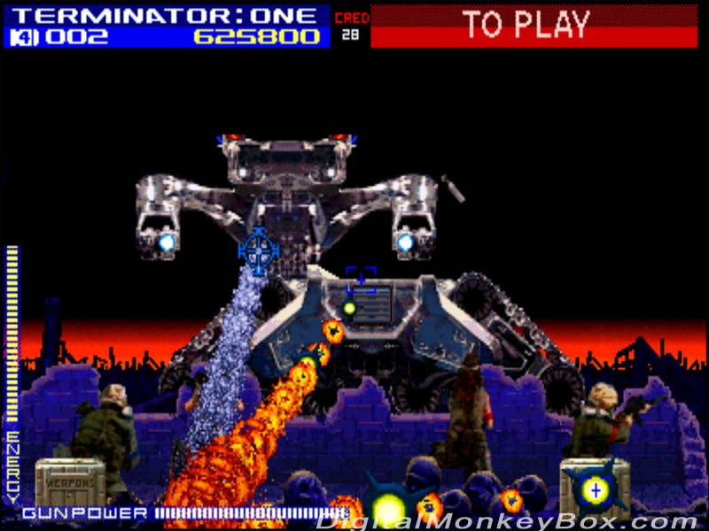
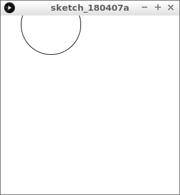

# Muis 2: Terminator II

In deze les leren we hoe kunnen reageren op een muisklik. 



## Intro



Type deze code over:

```c++
float vijand_x = 0;
float vijand_y = 0;

float vijand_d = 100; //Diameter

void setup()
{
  size(300, 300);
  vijand_x = width / 2;
  vijand_y = height / 2;
}

// Deze functie meet of de muis op de vijand staat
boolean is_muis_op_vijand()
{
  final float dx = mouseX - vijand_x;
  final float dy = mouseY - vijand_y;
  return sqrt((dx * dx) + (dy * dy)) < vijand_d / 2;
}

void draw()
{
  background(255, 255, 255);
  ellipse(vijand_x, vijand_y, vijand_d, vijand_d); 
  if (mousePressed)
  {
    if (is_muis_op_vijand())
    {
      vijand_x = random(width);
      vijand_y = random(height);
    }
  }
}
```

Klik met de muis op de vijand en zie wat er gebeurt.

## Opdracht 1


