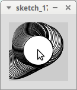
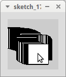
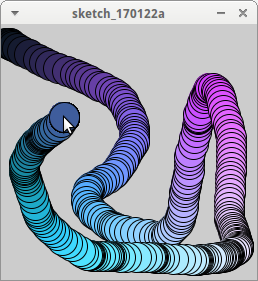

# Muis positie

De muis kan nuttig zijn om een spel te besturen.


## Een cirkel

Hier zie je hoe je een cirkel onder de muiscursor zet:

```
int rechts = -100;
int omlaag = -100;

void setup()
{
  size(100, 100);
}

void draw() 
{
  ellipse(rechts, omlaag, 50, 50);
}

void mouseMoved() 
{
  rechts = mouseX;
  omlaag = mouseY;
}
```



## Opdrachten

 * Waarom wordt bovenaan de variabelen `rechts` en `omlaag` op min honderd gezet? Als het het niet weet, begin dan met beiden op nul te zetten
 * Hoeveel functies heeft deze code? Hoe heten deze?
 * Wat betekent `mouseMoved`?
 * Verander de code zo, dat de cirkel horizontaal in spiegelbeeld beweegt. Tip: `rechts` is dan `100` min de `mouseX`
 * Verander de code zo, dat de cirkel ook verticaal in spiegelbeeld beweegt. Tip: `omlaag` is dan `100` min de `mouseY`

## Oplossingen

 * Hierdoor wordt de eerste cirkel buiten het scherm getekend. Anders wordt de eerste cirkel in de linkerbovenhoek in de linkerbovenhoek
   getekend 
 * De code heeft drie functies. Die functies heten `setup`, `draw` en `mouseMoved`
 * `mouseMoved` betekent 'muis bewoog'
 * Verander `rechts = mouseX;` naar `rechts = 100 - mouseX;`
 * Verander `omlaag = mouseY;` naar `omlaag = 100 - mouseY;`

## Een vierkant

Hier zie je hoe je een vierkant onder de muiscursor zet:

```
int rechts = -100;
int omlaag = -100;

void setup()
{
  size(100, 100);
}

void draw() 
{
  rect(rechts, omlaag, 40, 40);
}

void mouseMoved() 
{
  rechts = mouseX - 20;
  omlaag = mouseY - 20;
}
```



## Opdrachten

 * Waarom wordt in `mouseMoved` twintig afgehaald van `mouseX` en `mouseY`? Als het het niet weet, begin dan met beiden op tien te zetten
 * Maak het vierkant tachtig pixels breed en veertig pixels hoog. Laat dan deze rechthoek met het midden onder de muiscursor staan 


## Oplossingen

 * Bij de functie `rect` is de coordinaat die van de linkerbovenhoek. Door van `mouseX` en `mouseY` twintig af te halen, schuif je het vierkant naar linksboven, zodat de muiscursus boven het midden van het vierkant komt te liggen. Waarom twintig? Omdat het vierkant veertig pixels breed en hoog is: twintig is de helft van veertig

```
int rechts = -100;
int omlaag = -100;

void setup()
{
  size(100, 100);
}

void draw() 
{
  rect(rechts, omlaag, 80, 40);
}

void mouseMoved() 
{
  rechts = mouseX - 40;
  omlaag = mouseY - 20;
}
```

## Kleur

We kunnen `mouseX` en `mouseY` ook voor andere dingen gebruiken. 
Dit gebeurt niet vaak in echte games, maar voor een kunstwerk is dit wel mooi.

```
int rechts = -100;
int omlaag = -100;
int rood = 0;
int groen = 0;
int blauw = 0;

void setup()
{
  size(256, 256);
}

void draw() 
{
  fill(rood, groen, blauw);
  ellipse(rechts, omlaag, 30, 30);
}

void mouseMoved() 
{
  rechts = mouseX;
  omlaag = mouseY;
  rood = mouseX;
  groen = mouseY;
  blauw = mouseX + mouseY;
}
```



## Opdrachten

 * 1. Waarom is de grootte van het scherm gezet op 256 pixels breed en hoog? Tip: wat is de maximale rood, groen en blauwwaarde van een kleur? Pro: waarom is de grootte van het scherm niet 255 pixels breed en hoog? 
 * 2. Hoe verandert de roodwaarde als je met de muis naar rechts beweegt?
 * 3. Hoe verandert de roodwaarde als je met de muis omlaag beweegt?
 * 4. Hoe verandert de groenwaarde als je met de muis naar rechts beweegt?
 * 5. Hoe verandert de groenwaarde als je met de muis omlaag beweegt?
 * 6. Hoe verandert de blauwwaarde als je met de muis naar rechts beweegt?
 * 7. Hoe verandert de blauwwaarde als je met de muis omlaag beweegt?
 * 8. Verander de code zo, dat de blauwwaarde altijd nul is
 * 9. Verander de code zo, dat de blauwwaarde de X coordinaat is van de muis *min* de Y coordinaat van de muis

## Oplossingen

 * 1. Kleurwaarden gaan van 0 tot 256. Dus moet de muis coordinaten hebben van 0 tot 256. Een scherm met grootte 256 heeft
   pixels met coordinaten van 0 tot 256.
 * 2. Hoe meer naar rechts, hoe hoger `mouseX` wordt en hoe roder de cirkel wordt
 * 3. Dit maakt niet uit: de roodwaarde wordt alleen door `mouseX` bepaalt
 * 4. Dit maakt niet uit: de groenwaarde wordt alleen door `mouseY` bepaalt
 * 5. Hoe meer naar onder, hoe hoger `mouseY` wordt en hoe groener de cirkel wordt
 * 6. Hoe meer naar rechts, hoe hoger `mouseX + mouseY` wordt en hoe blauwer de cirkel wordt
 * 7. Hoe meer naar onder, hoe hoger `mouseX + mouseY` wordt en hoe blauwer de cirkel wordt
 * 8. Verander `blauw = mouseX + mouseY;` naar `blauw = 0;`
 * 9. Verander `blauw = mouseX + mouseY;` naar `blauw = mouseX - mouseY;`

## Eindopdracht

We gaan een soort yin-yang kunstwerk maken:

 * Onder de muiscursus wordt een cirkel getekend
 * Horizontaal in spiegelbeeld van de muiscursus wordt een vierkant getekend
 * Hoe maar de cursor naar rechts is, hoe witter de cirkel wordt
 * Hoe maar de cursor naar rechts is, hoe zwarter de cirkel wordt
 * Tip: wit heeft een kleurwaarde van `(255,255,255)`

Hier zie je een plaatje:


