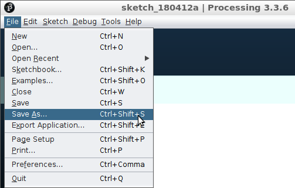

# Saven en laden

In deze les gaan we een programma opslaan en laden.

## Opdracht

Type deze code in in Processing:

```c++
// Hallo
```

Save dan je code met 'File | Save As' (of met `CTRL+SHIFT+S`). 
Geef het programma de naam `mijn_game`.



 * Windows gebruikt de `/Mijn Documenten/Processing` map
 * Lubuntu gebruikt de `/sketchbook` map


Sluit nu Processing af.

Start Processing weer op. 

Laad je code dan met 'File | Open' (of met `CTRL+O`).


Als je nu je code weer ziet, is het je gelukt!

