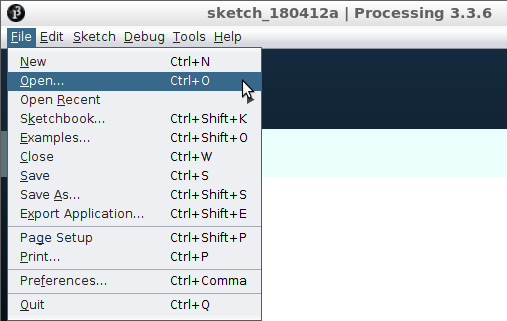

# Saven en laden

In deze les gaan we een programma opslaan en laden.

## Opdracht

 1. Type deze code in in Processing:

```c++
// Hallo
```

 2. Save je code met 'File | Save As' (of met `CTRL+SHIFT+S`). Geef het programma de naam `mijn_game`.


 * Windows gebruikt de `/Mijn Documenten/Processing` map
 * Lubuntu gebruikt de `/sketchbook` map


 3. Sluit nu Processing af.

 4. Start Processing weer op. 

 5. Laad je code dan met 'File | Open' (of met `CTRL+O`).




Als je nu je code weer ziet, is het je gelukt!

