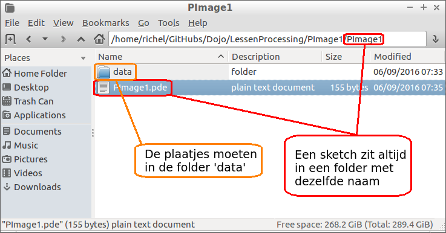

# PImage les 1

In deze les gaan we met een plaatje werken.


## Een plaatje vinden

Op de GitHub van de cursus hebben we een aantal goede plaatjes verzameld.

Er zijn twee manieren de plaatjes te downloaden:
 
 * Ga naar [https://github.com/richelbilderbeek/Dojo/tree/master/Sprites](https://github.com/richelbilderbeek/Dojo/tree/master/Sprites). Klik dan op de naam van een plaatje. Nu kun je het plaatje zien. Klik met de rechtermuisknop op het plaatje en kies 'Afbeelding opslaan als'/'Save image as'
 * Je kunt alle plaatjes in een keer downloaden. Download de cursus als zip hier: [https://github.com/richelbilderbeek/Dojo/archive/master.zip ](https://github.com/richelbilderbeek/Dojo/archive/master.zip). Kies 'Alles uitpakken'/'Extract all' om het zipje uit te pakken. In de folder 'Sprites' staan de plaatjes

In dit voorbeeld gebruik ik dit plaatje van Mario:


## Code

De code om Mario op de muis cursor te laten zien is simpel:

```
PImage plaatje;

void setup() {
  size(640, 360);
  plaatje = loadImage("mario.png");
}

void draw() {
  background(0);
  image(plaatje, mouseX, mouseY);
}
```

 * `PImage plaatje`: onthoud een `PImage` met de naam `plaatje`. Let op: `PImage` begint met twee hoofdletters
 * `void setup() {}`: de setup functie, de computer voert een keer alles tussen de accolades uit
 * `size(640, 360)`: maak een scherm van 640 pixels breed en 360 pixels hoog
 * `plaatje = loadImage("mario.png")`. Laat `plaatje` de afbeelding van Mario krijgen, door het bestand `mario.png` te laden
 * `void draw() {}`: de draw functie, de computer voert steeds alles tussen de accolades uit
 * `background(0)`: maak de achtergrond zwart
 * `image(plaatje, mouseX, mouseY)`: teken (de linkerbovenhoek van) het plaatje `plaatje` op de plek waar de muiscursus is.

Dit werkt niet meteen, omdat de bestanden op de juiste plek moeten staan.

## Bestanden op de juiste plek

Hier zie je een plaatje waarop staat waar de bestanden moeten staan:



 * De sketch heet `PImage1.pde`. Daarom staat deze in de map `PImage1`. Deze kan je in Processing vinden onder `Schets` -> `Toon Schets Map`
 * De sketch heeft een folder `data`. Hierin staat het plaatje, `mario.png`

## Opdracht

 * Krijg bovenstaand voorbeeld werkend
 * Maak een eigen programma met een ander plaatje

## Eindopdracht

 * Maak een programma dat twee verschillende plaatjes gebruikt
