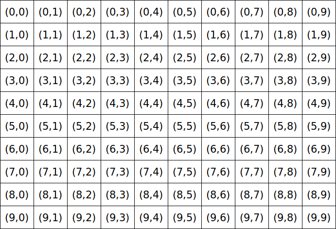
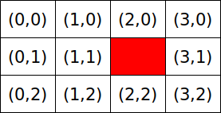
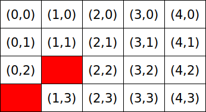

# Point

Processing is een programmeertaal ontwikkeld voor kunstenaars
en erg geschikt om games en mooie dingen mee te maken.

In deze les gaan we leren 

 * wat pixels zijn
 * hoe de pixels op een beeldscherm zitten
 * hoe je puntjes tekent

## Pixels

```
Pixel = een vierkantje op je beeldscherm
```

Pixels zijn de vierkantjes waaruit je beeldscherm is opgebouwd.
Hoe meer pixels je scherm heeft, hoe scherper het beeld eruit ziet.
Dat zie je goed bij oude games: die hebben minder pixels:

</img>

## Coordinaten

Elke pixel op je beeldscherm heeft een soort adres. Dit
adres noemen we een coordinaat. Een coordinaat bestaat uit
twee getallen. 

```
Coordinaat = een plek
```

Van een coordinaat zijn de twee getallen:

 * eerste getal: hoeveel pixels naar rechts
 * tweede getal: hoeveel pixels naar onder

De pixel linksbovenin heeft als coordinaat `(0,0)` (spreek uit 'nul komma nul').
Dat klopt: je gaat nul naar rechts, dan nul naar onder!

Plaatje `Keiveel coordinaten` laat keiveel coordinaten zien.



## Een puntje tekenen

We gaan een puntje tekenen op (2,1). We maken het scherm 4 pixels breed en 3 pixels hoog.

Dat ziet er als tekening zo uit:



Hier zie je de code:


```c++
void setup()
{
  size(4, 3);
}

void draw()
{
  point(2, 1);
}
```

## Opdrachten

 1. Type de code over en run het programma. Zie je de pixel zitten?
 2. Wat is de coodinaat boven (2,1)?
 3. Wat is de coodinaat rechts van (2,1)?
 4. Wat is de coodinaat onder (2,1)?
 5. Wat is de coodinaat links van (2,1)?

## Oplossingen

 1. Je kunt een heel klein zwart puntje zien
 2. (2,0)
 3. (3,1)
 4. (2,2)
 5. (1,1)

## Twee puntje tekenen

We gaan een puntje tekenen op (0,3) en (1,2). We maken het scherm 5 pixels breed en 4 pixels hoog.

Dat ziet er als tekening zo uit:



Hier zie je de code:


```c++
void setup()
{
  size(5, 4);
}

void draw()
{
  point(0, 3);
  point(1, 2);
}
```

## Opdrachten

 1. Type de code over en run het programma. Zie je de pixels zitten?
 2. Maak de lijn af door twee nieuwe pixels te tekenen

## Oplossingen

 1. Je kunt twee hele kleine zwart puntjes zien
 2. Hier de code:

```c++
void setup()
{
  size(5, 4);
}

void draw()
{
  point(0, 3);
  point(1, 2);
  point(2, 1);
  point(3, 0);
}
```

## Een korte lijn tekenen


Op de tekening `Een korte lijn` zie je drie pixels die rood zijn gekleurd.

Programmeer deze lijn na. Maak ook het scherm net zo groot als op de tekenening.

## Oplossing

```c++
void setup()
{
  size(4, 4);
}

void draw()
{
  point(3, 0);
  point(3, 1);
  point(3, 2);
}
```

## Een 'i' tekenen

Plaatje `Een i` laat de pixels zien van een letter 'i':


Teken deze 'i' na. Maak ook het scherm groot genoeg

## Een hartje tekenen

Plaatje `I hartje` laat de pixels zien van de letter 'i' en een hartje:
 
[I hartje](PointPixelCoordinatenIhartje.png)

Teken deze 'i' en het hartje. Maak ook het scherm groot genoeg

## Eindopdracht

Schrijf in pixels de tekst 'I hartje P':

[Point eindopdracht](PointPixelCoordinatenIhartjeP.png)
