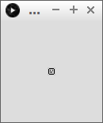

# Point

Processing is een programmeertaal ontwikkeld voor kunstenaars
en erg geschikt om games en mooie dingen mee te maken.

In deze les gaan we leren 

 * wat pixels zijn
 * hoe de pixels op een beeldscherm zitten
 * hoe je puntjes tekent

Zo gaat het eruit zien:



## Pixels

Pixels zijn de vierkantjes waaruit je beeldscherm is opgebouwd.
Je schermresolutie is het aantal pixels dat je scherm breed en hoog is.
Hoe meer pixels je scherm heeft, hoe scherper je beeldscherm eruit ziet

Vroeger hadden computers een lage resolutie. Daarom zien oude
spellen er wat blokkiger uit:


## Vragen

 * Wat is de resolutie van jouw beeldscherm?
 * Als een beeldscherm een resolutie heeft van 320 bij 200 pixels, hoeveel pixels heeft deze dan?

## Hoe zitten pixels op je beeldscherm

Elke pixel op je beeldscherm heeft een soort postcode. Deze
postcode noemen we een coordinaat. Een coordinaat bestaat uit
twee getallen. Dit zijn de coordinaten van alle pixels
van een beelscherm van vijf bij vijf pixels:

 

Je ziet dat de laagste coordinaat `(0,0)` (zeg: 'nul komma nul') is.
`(0,0)` zit in de linkerbovenhoek van je beeldscherm. Dan zie je dat
het eerste getal is hoeveel pixels naar recht hiervan is. Zo zit `(1,0)` 
rechts van `(0,0)`. Het tweede getal is hoeveel pixels je onder `(0,0)`
zit. Zo zit `(0,1)` onder `(0,0)`. 

Op deze manier kun je elke pixel op je beeldscherm vinden.

## Vragen

 * Welke coordinaten heb je nodig om een horizontale lijn te tekenen, die
   door `(0,0)` gaat en drie pixels lang is?
 * Welke coordinaten heb je nodig om een vertical lijn te tekenen, die
   door `(1,0)` gaat en drie pixels hoog is?
 * Welke coordinaten heb je nodig om een diagonale lijn te tekenen, die
   door `(0,0)` gaat en drie pixels lang is?
 * Welke coordinaten heb je nodig om een vierkantje te tekenen, die
   door `(0,0)` gaat, twee pixels breed en twee pixels breed is?

## Puntjes tekenen

Dit is de programmeercode die je nodig hebt:

```
void setup()
{
  size(10,10);  
}

void draw() 
{
  //   0123456789
  // 0 ..........
  // 1 ..XXXXXX..
  // 2 .X......X.
  // 3 .X.X..X.X.
  // 4 .X......X.
  // 5 .X.X.X..X.
  // 6 .X..X...X.
  // 7 .X......X.
  // 8 ..XXXXXX..
  // 9 ..........

  
  // Bovenkant hoofd
  point(2,1);  
  point(3,1);  
  point(4,1);  
  point(5,1);  
  point(6,1);  
  point(7,1);  

  // Rechterkant hoofd
  point(8,2);  
  point(8,3);  
  point(8,4);  
  point(8,5);  
  point(8,6);  
  point(8,7);  

  // Onderkant hoofd
  point(2,8);  
  point(3,8);  
  point(4,8);  
  point(5,8);  
  point(6,8);  
  point(7,8);  

  // Linkerkant hoofd
  point(1,2);  
  point(1,3);  
  point(1,4);  
  point(1,5);  
  point(1,6);  
  point(1,7);  

  // Ogen
  point(3,3);
  point(6,3);

  // Mond
  point(3,5);
  point(4,6);
  point(5,5);

}
```

Dit is wat de code doet:

 * `void setup() {}`: de setup functie, de computer voert een keer alles tussen de accolades uit
 * `size(10, 10)`: maak een scherm van 10 pixels breed en 10 pixels hoog
 * `;`: de puntkomma geeft in Processing het einde aan van een zin. Dit is
   ongeveer hetzelfde met een punt in schrijftaal.
 * `void draw() {}`: de draw functie, de computer voert steeds alles tussen de accolades uit
 * `//`: commentaar: de rest van de regel wordt niet gelezen door de 
   computer. Hier kun je dingen neerzetten die speciaal bedoelt zijn 
   voor mensen, zoals jezelf. In dit programma zie je dat het poppetje is
   getekent in commentaar, met de coordinaten aan de zijkant. Ook zie je
   dat de programmeur zegt wat er getekend wordt: zo kun je de fouten sneller
   vinden  
 * `point(2,1)`: teken een puntje op coordinaat (2,1).

## Vragen

 * Start Processing. Kopieer deze code en run het programma
 * Laat de smiley een pixel breeder lachen
 * Draai de lach verticaal om, zodat de smiley sip gaat kijken
 * Geef de smiley punk haar door drie pixels bovenop het hoofd erbij te tekenen
 * Geef de smiley een sik van een pixel
