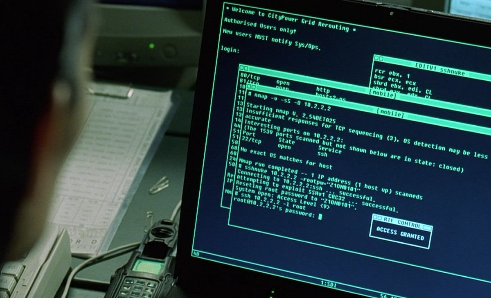
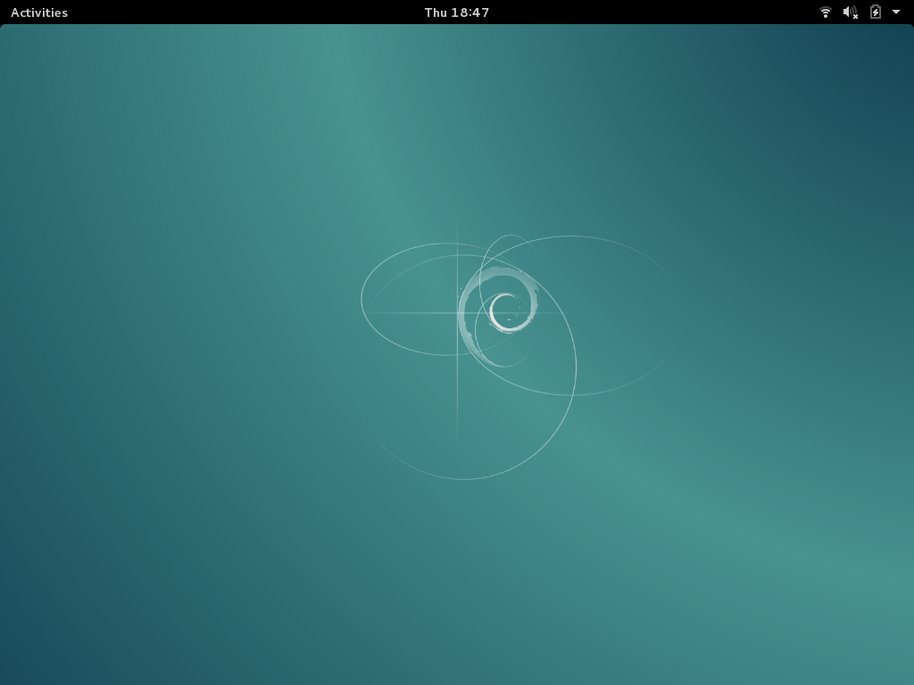
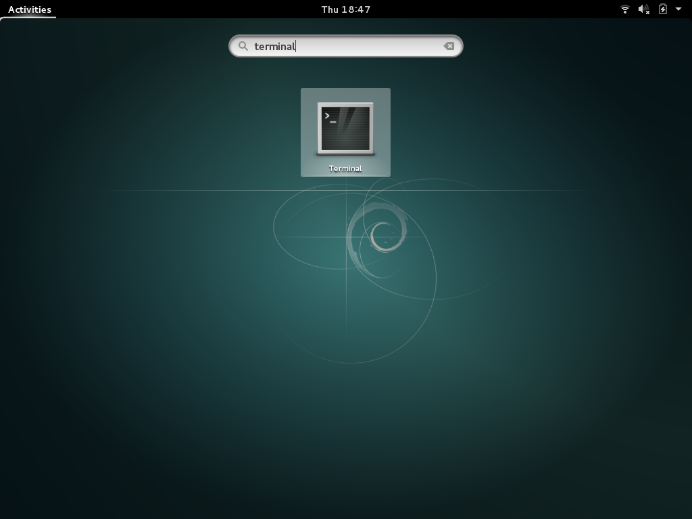
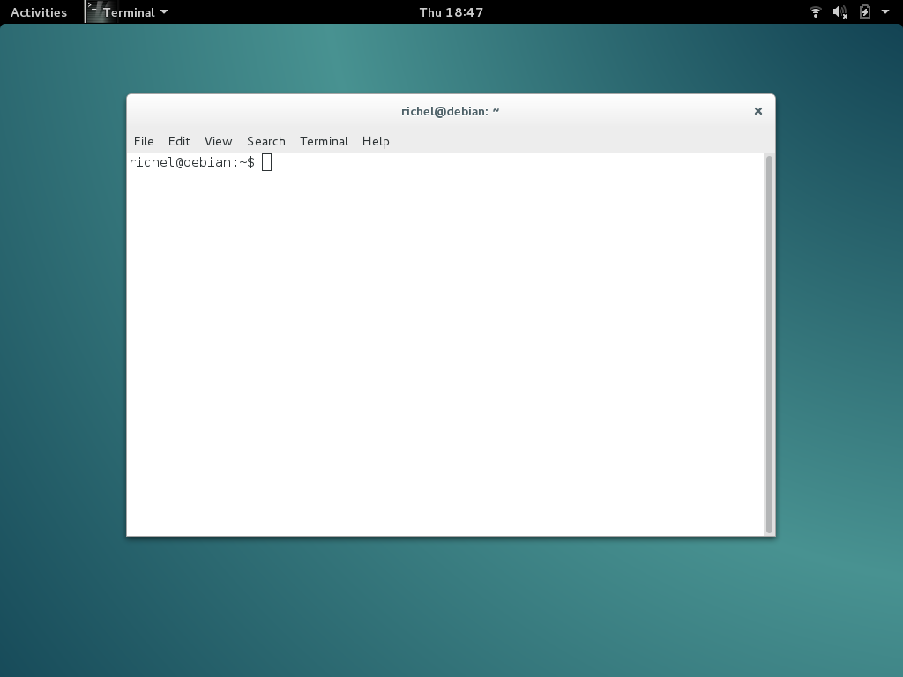

# Processing opstarten op cursuslaptop

We programmeren in Processing.
Processing is een programma.
Dit programma moeten we dus eerst opstarten.

## Terminal starten

Eerst moeten we een terminal starten.



Wij hebben twee soorten laptops:

  * Debian (spreek uit 'Debie-jen')
  * Lubuntu (spreek uit 'Loe-boen-toe')



Start een Terminal:

 * Debian: druk op de `WIN` toets (deze zit linskonder, tussen CTRL en ALT). Type dan 'terminal' en dan ENTER 
 * Lubuntu: druk op `CTRL + ALT + T`







## Processing starten

In de terminal, type:


```
cd Programs/processing-3.2.1
```

En type dan:

```
./processing
```

Klaar!

## Processing slimmer starten
 
Je hoeft niet alles helemaal te typen.
Een terminal kan je ook helpen.
Als je in een terminal op Tab drukt, maakt deze het woord af.

In de terminal, type:

```
cd Progr
```

en druk dan op 'Tab'.

Nu wordt staat er op je scherm:

```
cd Programs/
```

Maak ervan

```
cd Programs/pr
```

en druk dan op 'Tab'.

Nu staat er:

```
cd Programs/processing-3.2.1
```

druk dan op `Enter`.

Doe nu:

```
./p
```

en druk dan op `Tab`. Nu staat er:

```
./processing
```

Druk op `Enter`.

Klaar!


## Updaten

Het kan gebeuren dat er een venster komt met een Update. Het venster vraagt
of je een nieuwe versie van Processing wilt installeren. Klik op 'No'. 'No' 
is Engels voor 'nee'.


## Eindppdracht
 
 * Start Processing helemaal zonder hulp


