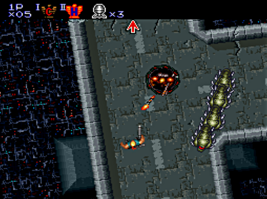
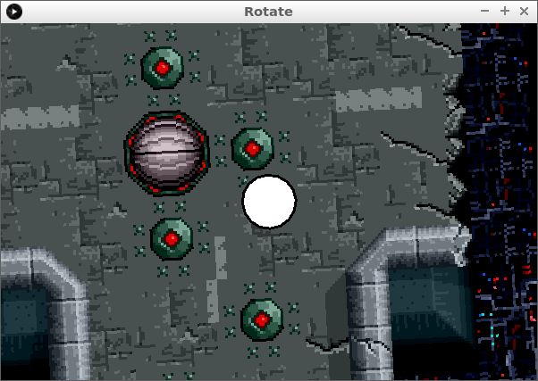

# `rotate`



## Intro



```c++
PImage plaatje;

float x = 1150;
float y = 900;
float hoek = 0;
final float schaal = 3;
final float loopsnelheid = 5;
final float draaisnelheid = 0.1;

void setup() 
{
  size(600, 400);
  plaatje = loadImage("Contra3Stage2Map.png");
  noSmooth();
  x = 1150;
  y = 900;
}

void draw() 
{
  background(0, 0, 0);
  scale(schaal);
  //Zorg dat het midden van het scherm het draaipunt wordt
  translate(width / schaal / 2 , height / schaal /2);
  rotate(hoek);
  translate(-x,-y);
  image(plaatje, 0, 0);
  ellipse(x, y, 20, 20);
  if (keyPressed)
  {
    if (key == 'a') hoek = hoek + draaisnelheid;
    if (key == 'd') hoek = hoek - draaisnelheid;
    if (key == 'w') 
    {
      y = y - (cos(hoek) * loopsnelheid);
      x = x - (sin(hoek) * loopsnelheid);
    }
    if (key == 's')
    {
      y = y + (cos(hoek) * loopsnelheid);
      x = x + (sin(hoek) * loopsnelheid);
    }
  }
}
```

## Eindopdracht

?