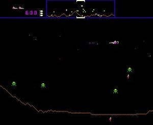
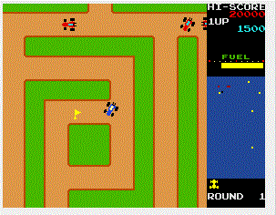
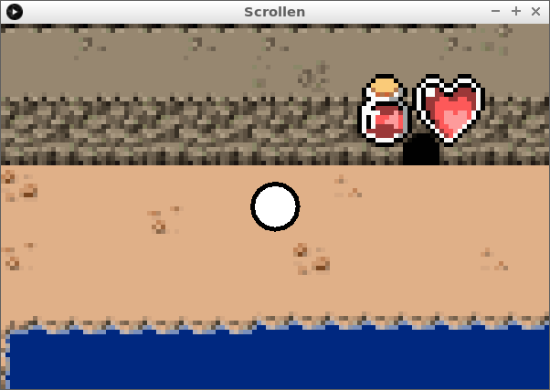

# Scrollen




## Intro



```c++
PImage plaatje;

float x = 200;
float y = 160;
final float schaal = 5; //Hoeveel is de kaart ingezoomd?

void setup() 
{
  size(600, 400);
  plaatje = loadImage("kaart.png");
  noSmooth();
}

void draw() 
{
  background(255, 255, 255);
  scale(schaal);
  translate(-x,-y);
  image(plaatje, 0, 0);
  if (keyPressed)
  {
    if (key == 'a') x = x - 1;
    if (key == 'd') x = x + 1;
    if (key == 'w') y = y - 1;
    if (key == 's') y = y + 1;
  }
  ellipse(x + (width / schaal / 2), y + (height / schaal / 2), 10, 10);
}
```

## Eindopdracht

?