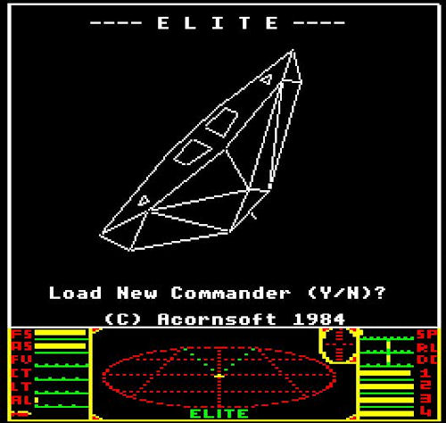
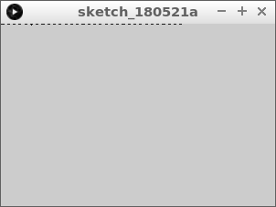
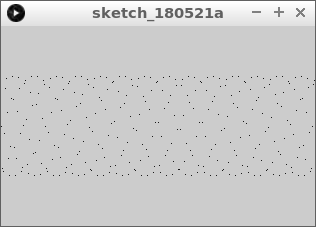
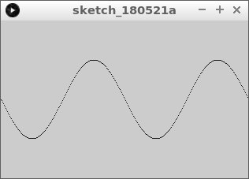
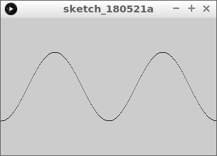
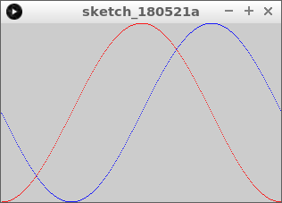

# Sinus en cosinus 1: tekenen.

In deze les gaan we een sinus en cosinus tekenen.



\pagebreak

## Sinus en cosinus 1: opdracht 1 

Type deze code over:

```c++
float x = 0;

void setup()
{
  size(314, 200);
}

void draw()
{
  final float y = sin(x);
  point(x, y);
  x = x + 1;  
}
```

Wat zie je?

 | 314 is ongeveer honderd keer het getal pi
:-------------:|:----------------------------------------: 

\pagebreak

## Sinus en cosinus 1: oplossing 1 



Je ziet een soort stippellijn aan de bovenkant.

\pagebreak

## Sinus en cosinus 1: opdracht 2

 * Verplaats de stippellijn omlaag. Doe dit door by `y` de halve hoogte op te tellen 

 | Tip: het is slim om ronde haakjes om `height / 2` te zetten`
:-------------:|:----------------------------------------: 


\pagebreak

## Sinus en cosinus 1: oplossing 2 

```c++
float x = 0;

void setup()
{
  size(314, 200);
}

void draw()
{
  final float y = sin(x) + (height / 2);
  point(x, y);
  x = x + 1;  
}
```

 | Door de haakjes weet de computer de volgorde van een berekening
:-------------:|:----------------------------------------: 

 | Een sinus heeft de vorm van een golf die slingert tussen -1 en 1
:-------------:|:----------------------------------------: 

\pagebreak

## Sinus en cosinus 1: opdracht 3

 * Vervang `sin(x)` door `(sin(x) * 50)`



 | Haakjes zijn belangrijk!
:-------------:|:----------------------------------------: 

\pagebreak

## Sinus en cosinus 1: oplossing 3

Je ziet nu een patroon.


```c++
float x = 0;

void setup()
{
  size(314, 200);
}

void draw()
{
  final float y = (sin(x) * 50) + (height / 2);
  point(x, y);
  x = x + 1;  
}
```

 | Het is een rommel, omdat we ongeveer 100 sinussen door elkaar tekenen
:-------------:|:----------------------------------------: 

 | `* 50` zorgt ervoor dat de sinus vijtig keer vergroot wordt
:-------------:|:----------------------------------------: 

## Sinus en cosinus 1: opdracht 4

 * Vervang `sin(x)` door `sin(x / 100)`




\pagebreak

## Sinus en cosinus 1: oplossing 4

Je ziet nu een golf: een sinus!.


```c++
float x = 0;

void setup()
{
  size(314, 200);
}

void draw()
{
  final float y = (sin(x / 25) * 50) + (height / 2);
  point(x, y);
  x = x + 1;  
}
```

## Sinus en cosinus 1: opdracht 5

 * Vervang `sin(x)` door `cos(x)`




\pagebreak

## Sinus en cosinus 1: oplossing 5

Je ziet nu een golf: een sinus!.


```c++
float x = 0;

void setup()
{
  size(314, 200);
}

void draw()
{
  final float y = (sin(x / 25) * 50) + (height / 2);
  point(x, y);
  x = x + 1;  
}
```


 | `x / 25` zorgt ervoor dat we 25x rustiger door de sinus gaan
:-------------:|:----------------------------------------: 

\pagebreak

## Sinus en cosinus 1: Eindopdracht

 * Teken zowel de sinus als cosinus
 * Zorg dat elke golf een keer op en neer gaat
 * Teken de cosinus rood, de sinus blauw


