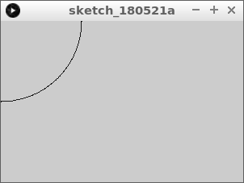
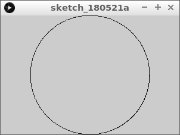
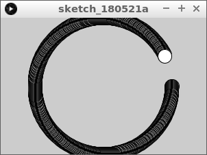
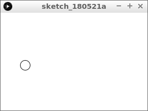
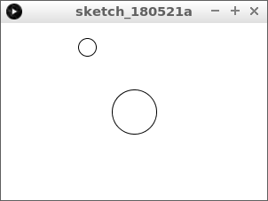

# Sinus en cosinus 2: tekenen.

In deze les gaan we een sinus en cosinus gebruiken om een maan om een planeet te laten slingeren.

\pagebreak

## Sinus en cosinus 2: opdracht 1 

Type deze code over:

```c++
float hoek = 0;

void setup()
{
  size(300, 200);
}

void draw()
{
  final float x = cos(hoek) * 100;
  final float y = sin(hoek) * 100;
  point(x, y);
  hoek = hoek + 0.01;  
}
```

Wat zie je?

\pagebreak

## Sinus en cosinus 2: oplossing 1 



Je ziet een kwart cirkel in de linkerbovenhoek.

\pagebreak

## Sinus en cosinus 2: opdracht 2

 * Verplaats de cirkel naar het midden'
 * Doe dit door by `y` de halve hoogte op te tellen 
 * Doe dit door by `x` de halve breedte op te tellen 

 | Tip: het is slim om ronde haakjes om `height / 2` te zetten`
:-------------:|:----------------------------------------: 



\pagebreak

## Sinus en cosinus 2: oplossing 2 

```c++
float hoek = 0;

void setup()
{
  size(300, 200);
}

void draw()
{
  final float x = cos(hoek) * 100 + (width / 2);
  final float y = sin(hoek) * 100 + (height / 2);
  point(x, y);
  hoek = hoek + 0.01;  
}
```

 | Door de haakjes weet de computer de volgorde van een berekening
:-------------:|:----------------------------------------: 

 | Een sinus en cosinus samen kunnen een cirkel tekenen
:-------------:|:----------------------------------------: 

\pagebreak

## Sinus en cosinus 2: opdracht 3

 * Teken een cirkel in plaats van een punt. De cirkel moet 20 pixels breed zijn, en 20 pixels hoog



\pagebreak

## Sinus en cosinus 2: oplossing 3

Je ziet nu een patroon.


```c++
float hoek = 0;

void setup()
{
  size(300, 200);
}

void draw()
{
  final float x = cos(hoek) * 100 + (width / 2);
  final float y = sin(hoek) * 100 + (height / 2);
  ellipse(x, y, 20, 20);
  hoek = hoek + 0.01;  
}
```

## Sinus en cosinus 2: opdracht 4

 * Zorg dat de bal geen streep meer achterlaat
 * Gebruik hiervoor een witte achtergrond



 | Tip: gebruik `background`
:-------------:|:----------------------------------------: 


\pagebreak

## Sinus en cosinus 2: Eindopdracht

 * Teken ook een cirkel in het midden, met een breedte en hoogte van 50 pixels
 * Laat de bewegende cirkel tegen de klok ingaan
 * Zorg dat de bewegende cirkel niet meer half het scherm uit gaat. Doe dit,
   door de afstand met het midden kleiner te maken


