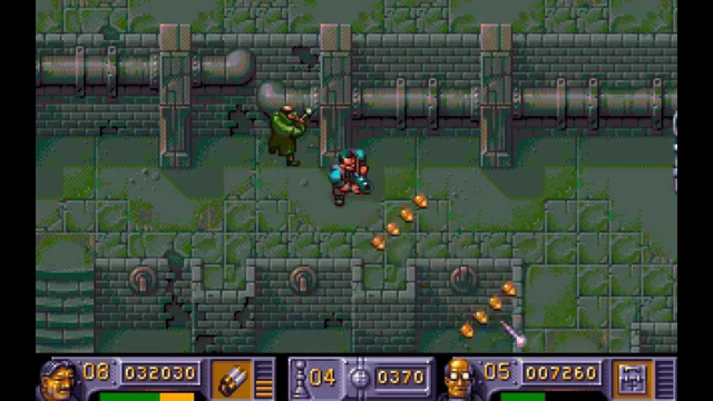
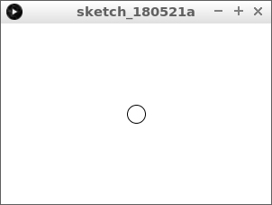
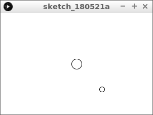
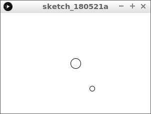
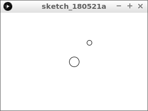
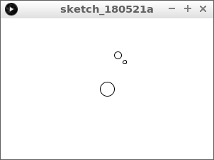
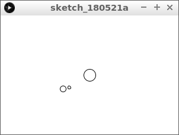

# Sinus en cosinus 3: zonnestelsel

In deze les gaan we een sinus en cosinus gebruiken om een zonnestelsel te maken



\pagebreak

## Sinus en cosinus 3: opdracht 1 

Type deze code over:

```c++
void setup()
{
  size(300, 200);
}

void draw()
{
  background(255, 255, 255);
  final float x_zon = width / 2;
  final float y_zon = height / 2;
  ellipse(x_zon, y_zon, 20, 20);
}
```

Wat zie je?

\pagebreak

## Sinus en cosinus 3: oplossing 1 



Je ziet een cirkel in het midden: de zon!

\pagebreak

## Sinus en cosinus 3: opdracht 2

 * Maak twee nieuwe variabelen: `x_aarde` en `y_aarde` (binnen de `draw` functie)
 * De waarde van `x_aarde` is de waarde van `x_zon` plus 50
 * De waarde van `y_aarde` is de waarde van `y_zon` plus 50
 * Teken de Aarde als een cirkel met een breedte en hoogte van 10 pixels 




\pagebreak

## Sinus en cosinus 3: oplossing 2 

```c++
void setup()
{
  size(300, 200);
}

void draw()
{
  background(255, 255, 255);
  final float x_zon = width / 2;
  final float y_zon = height / 2;
  ellipse(x_zon, y_zon, 20, 20);
  final float x_aarde = x_zon + 50;
  final float y_aarde = y_zon + 50;
  ellipse(x_aarde, y_aarde, 10, 10);
}
```

\pagebreak

## Sinus en cosinus 3: opdracht 3

 * Maak een nieuwe variabele `hoek_aarde`, zet deze helemaal bovenaan
 * Maak `hoek_aarde` meer aan het eind van de `draw` functie. Gebruik een waarde zoals `0.01`
 * Maak `x_aarde` nu `x_zon` plus vijftig keer de sinus van `hoek_aarde` 

Wat zie je?

\pagebreak

## Sinus en cosinus 3: oplossing 3

Je ziet nu de Aarde heen en weer gaan



```c++
float hoek_aarde = 0;

void setup()
{
  size(300, 200);
}

void draw()
{
  background(255, 255, 255);
  final float x_zon = width / 2;
  final float y_zon = height / 2;
  ellipse(x_zon, y_zon, 20, 20);
  final float x_aarde = x_zon + (50 * sin(hoek_aarde));
  final float y_aarde = y_zon + 50;
  ellipse(x_aarde, y_aarde, 10, 10);
  hoek_aarde += 0.01;
}
```

\pagebreak

## Sinus en cosinus 3: opdracht 4

 * Zorg dat de Aarde nu om de zon heen gaat
 * Maak `y_aarde` nu `y_zon` plus vijftig keer de cosinus van `hoek_aarde` 




\pagebreak

## Sinus en cosinus 3: opdracht 5

 * Maak twee nieuwe variabelen: `x_maan` en `y_maan` (binnen de `draw` functie)
 * De waarde van `x_maan` is de waarde van `x_aarde` plus 10
 * De waarde van `y_maan` is de waarde van `y_aarde` plus 10
 * Teken de maan als een cirkel met een breedte en hoogte van 5 pixels 



\pagebreak

## Sinus en cosinus 3: Eindopdracht

Laat de maan om de aarde cirkelen!

 * Maak een nieuwe variabele `hoek_maan`, zet deze helemaal bovenaan
 * Maak `hoek_maan` meer aan het eind van de `draw` functie. Gebruik een waarde zoals `0.1`
 * Maak `x_maan` nu `x_aarde` plus tien keer de sinus van `hoek_aarde` 
 * Hetzelfde voor `y_maan`


